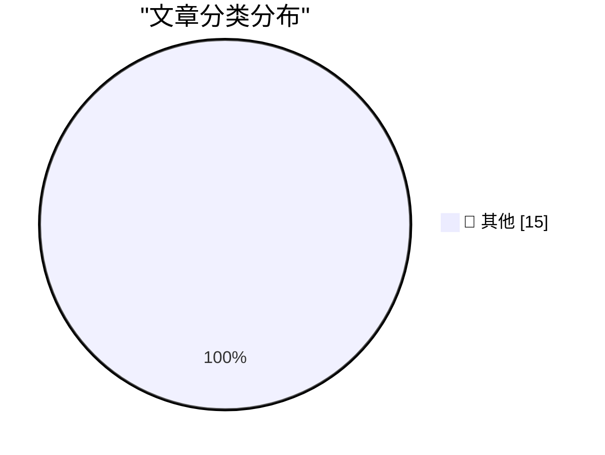

# 📰 AI 博客每日精选 — 2026-03-26

> 来自 Karpathy 推荐的 92 个顶级技术博客，AI 精选 Top 15

## 🏆 今日必读

🥇 **datasette-files-s3 0.1a1**

[datasette-files-s3 0.1a1](https://simonwillison.net/2026/Mar/25/datasette-files-s3/#atom-everything) — simonwillison.net · 12 小时前 · 📝 其他

> datasette-files-s3 0.1a1

🥈 **Thoughts on slowing the fuck down**

[Thoughts on slowing the fuck down](https://simonwillison.net/2026/Mar/25/thoughts-on-slowing-the-fuck-down/#atom-everything) — simonwillison.net · 12 小时前 · 📝 其他

> Thoughts on slowing the fuck down

🥉 **datasette-llm 0.1a1**

[datasette-llm 0.1a1](https://simonwillison.net/2026/Mar/25/datasette-llm/#atom-everything) — simonwillison.net · 13 小时前 · 📝 其他

> datasette-llm 0.1a1

---

## 📊 数据概览

| 扫描源 | 抓取文章 | 时间范围 | 精选 |
|:---:|:---:|:---:|:---:|
| 83/92 | 2424 篇 → 34 篇 | 48h | **15 篇** |

### 分类分布

---

## 📝 其他

### 1. datasette-files-s3 0.1a1

[datasette-files-s3 0.1a1](https://simonwillison.net/2026/Mar/25/datasette-files-s3/#atom-everything) — **simonwillison.net** · 12 小时前 · ⭐ 15/30

> datasette-files-s3 0.1a1

---

### 2. Thoughts on slowing the fuck down

[Thoughts on slowing the fuck down](https://simonwillison.net/2026/Mar/25/thoughts-on-slowing-the-fuck-down/#atom-everything) — **simonwillison.net** · 12 小时前 · ⭐ 15/30

> Thoughts on slowing the fuck down

---

### 3. datasette-llm 0.1a1

[datasette-llm 0.1a1](https://simonwillison.net/2026/Mar/25/datasette-llm/#atom-everything) — **simonwillison.net** · 13 小时前 · ⭐ 15/30

> datasette-llm 0.1a1

---

### 4. LiteLLM Hack: Were You One of the 47,000?

[LiteLLM Hack: Were You One of the 47,000?](https://simonwillison.net/2026/Mar/25/litellm-hack/#atom-everything) — **simonwillison.net** · 17 小时前 · ⭐ 15/30

> LiteLLM Hack: Were You One of the 47,000?

---

### 5. Auto mode for Claude Code

[Auto mode for Claude Code](https://simonwillison.net/2026/Mar/24/auto-mode-for-claude-code/#atom-everything) — **simonwillison.net** · 1 天前 · ⭐ 15/30

> Auto mode for Claude Code

---

### 6. Package Managers Need to Cool Down

[Package Managers Need to Cool Down](https://simonwillison.net/2026/Mar/24/package-managers-need-to-cool-down/#atom-everything) — **simonwillison.net** · 1 天前 · ⭐ 15/30

> Package Managers Need to Cool Down

---

### 7. Quoting Christopher Mims

[Quoting Christopher Mims](https://simonwillison.net/2026/Mar/24/christopher-mims/#atom-everything) — **simonwillison.net** · 1 天前 · ⭐ 15/30

> Quoting Christopher Mims

---

### 8. Malicious litellm_init.pth in litellm 1.82.8 — credential stealer

[Malicious litellm_init.pth in litellm 1.82.8 — credential stealer](https://simonwillison.net/2026/Mar/24/malicious-litellm/#atom-everything) — **simonwillison.net** · 1 天前 · ⭐ 15/30

> Malicious litellm_init.pth in litellm 1.82.8 — credential stealer

---

### 9. Using FireWire on a Raspberry Pi

[Using FireWire on a Raspberry Pi](https://www.jeffgeerling.com/blog/2026/firewire-on-a-raspberry-pi/) — **jeffgeerling.com** · 1 天前 · ⭐ 15/30

> Using FireWire on a Raspberry Pi

---

### 10. Engineers do get promoted for writing simple code

[Engineers do get promoted for writing simple code](https://seangoedecke.com/simple-work-gets-rewarded/) — **seangoedecke.com** · 10 小时前 · ⭐ 15/30

> Engineers do get promoted for writing simple code

---

### 11. ‘A List of Chain Restaurants Whose Names Contain Unusual Structures’

[‘A List of Chain Restaurants Whose Names Contain Unusual Structures’](https://onefoottsunami.com/2026/03/18/a-list-of-chain-restaurants-whose-names-contain-unusual-structures/) — **daringfireball.net** · 14 小时前 · ⭐ 15/30

> ‘A List of Chain Restaurants Whose Names Contain Unusual Structures’

---

### 12. Improved Analytics in App Store Connect

[Improved Analytics in App Store Connect](https://developer.apple.com/news/?id=hh6v4b55) — **daringfireball.net** · 15 小时前 · ⭐ 15/30

> Improved Analytics in App Store Connect

---

### 13. Claude Can Now Take Control of Your Mac

[Claude Can Now Take Control of Your Mac](https://claude.com/blog/dispatch-and-computer-use) — **daringfireball.net** · 1 天前 · ⭐ 15/30

> Claude Can Now Take Control of Your Mac

---

### 14. WSJ: ‘OpenAI Plans Launch of Desktop “Superapp”’

[WSJ: ‘OpenAI Plans Launch of Desktop “Superapp”’](https://www.wsj.com/tech/openai-plans-launch-of-desktop-superapp-to-refocus-simplify-user-experience-9e19931d?st=25wiu1) — **daringfireball.net** · 1 天前 · ⭐ 15/30

> WSJ: ‘OpenAI Plans Launch of Desktop “Superapp”’

---

### 15. OpenAI Is Closing Sora

[OpenAI Is Closing Sora](https://x.com/soraofficialapp/status/2036546752535470382) — **daringfireball.net** · 1 天前 · ⭐ 15/30

> OpenAI Is Closing Sora

---

*生成于 2026-03-26 10:41 | 扫描 83 源 → 获取 2424 篇 → 精选 15 篇*
*基于 [Hacker News Popularity Contest 2025](https://refactoringenglish.com/tools/hn-popularity/) RSS 源列表，由 [Andrej Karpathy](https://x.com/karpathy) 推荐*
*由「懂点儿AI」制作，欢迎关注同名微信公众号获取更多 AI 实用技巧 💡*
