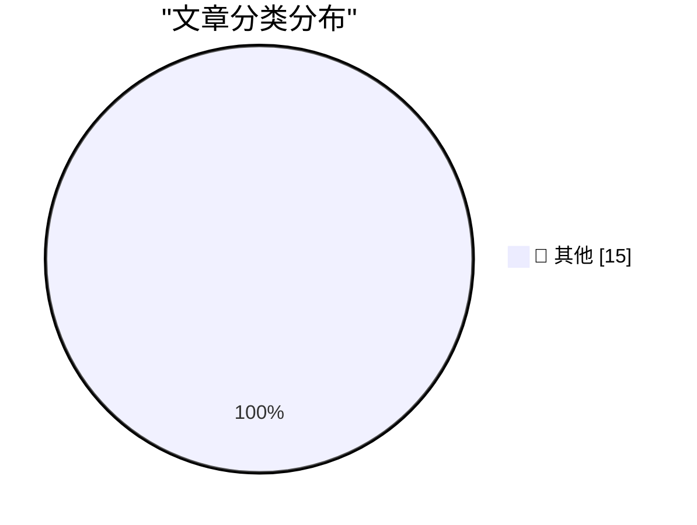

# 📰 AI 博客每日精选 — 2026-02-22

> 来自 Karpathy 推荐的 92 个顶级技术博客，AI 精选 Top 15

## 🏆 今日必读

🥇 **How I think about Codex**

[How I think about Codex](https://simonwillison.net/2026/Feb/22/how-i-think-about-codex/#atom-everything) — simonwillison.net · 1 小时前 · 📝 其他

> How I think about Codex

🥈 **Quoting Thibault Sottiaux**

[Quoting Thibault Sottiaux](https://simonwillison.net/2026/Feb/21/thibault-sottiaux/#atom-everything) — simonwillison.net · 1 天前 · 📝 其他

> Quoting Thibault Sottiaux

🥉 **Andrej Karpathy talks about "Claws"**

[Andrej Karpathy talks about "Claws"](https://simonwillison.net/2026/Feb/21/claws/#atom-everything) — simonwillison.net · 1 天前 · 📝 其他

> Andrej Karpathy talks about "Claws"

---

## 📊 数据概览

| 扫描源 | 抓取文章 | 时间范围 | 精选 |
|:---:|:---:|:---:|:---:|
| 83/92 | 2403 篇 → 19 篇 | 48h | **15 篇** |

### 分类分布

---

## 📝 其他

### 1. How I think about Codex

[How I think about Codex](https://simonwillison.net/2026/Feb/22/how-i-think-about-codex/#atom-everything) — **simonwillison.net** · 1 小时前 · ⭐ 15/30

> How I think about Codex

---

### 2. Quoting Thibault Sottiaux

[Quoting Thibault Sottiaux](https://simonwillison.net/2026/Feb/21/thibault-sottiaux/#atom-everything) — **simonwillison.net** · 1 天前 · ⭐ 15/30

> Quoting Thibault Sottiaux

---

### 3. Andrej Karpathy talks about "Claws"

[Andrej Karpathy talks about "Claws"](https://simonwillison.net/2026/Feb/21/claws/#atom-everything) — **simonwillison.net** · 1 天前 · ⭐ 15/30

> Andrej Karpathy talks about "Claws"

---

### 4. Adding TILs, releases, museums, tools and research to my blog

[Adding TILs, releases, museums, tools and research to my blog](https://simonwillison.net/2026/Feb/20/beats/#atom-everything) — **simonwillison.net** · 1 天前 · ⭐ 15/30

> Adding TILs, releases, museums, tools and research to my blog

---

### 5. Taalas serves Llama 3.1 8B at 17,000 tokens/second

[Taalas serves Llama 3.1 8B at 17,000 tokens/second](https://simonwillison.net/2026/Feb/20/taalas/#atom-everything) — **simonwillison.net** · 1 天前 · ⭐ 15/30

> Taalas serves Llama 3.1 8B at 17,000 tokens/second

---

### 6. ‘Starkiller’ Phishing Service Proxies Real Login Pages, MFA

[‘Starkiller’ Phishing Service Proxies Real Login Pages, MFA](https://krebsonsecurity.com/2026/02/starkiller-phishing-service-proxies-real-login-pages-mfa/) — **krebsonsecurity.com** · 1 天前 · ⭐ 15/30

> ‘Starkiller’ Phishing Service Proxies Real Login Pages, MFA

---

### 7. Nvidia was only invited to invest

[Nvidia was only invited to invest](https://idiallo.com/byte-size/nvidia-was-only-invited-to-invest?src=feed) — **idiallo.com** · 17 小时前 · ⭐ 15/30

> Nvidia was only invited to invest

---

### 8. How close are we to a vision for 2010?

[How close are we to a vision for 2010?](https://shkspr.mobi/blog/2026/02/how-close-are-we-to-a-vision-for-2010/) — **shkspr.mobi** · 4 小时前 · ⭐ 15/30

> How close are we to a vision for 2010?

---

### 9. OpenBenches at FOSDEM

[OpenBenches at FOSDEM](https://shkspr.mobi/blog/2026/02/openbenches-at-fosdem/) — **shkspr.mobi** · 1 天前 · ⭐ 15/30

> OpenBenches at FOSDEM

---

### 10. 10,000,000th Fibonacci number

[10,000,000th Fibonacci number](https://www.johndcook.com/blog/2026/02/21/f10000000/) — **johndcook.com** · 16 小时前 · ⭐ 15/30

> 10,000,000th Fibonacci number

---

### 11. Computing big, certified Fibonacci numbers

[Computing big, certified Fibonacci numbers](https://www.johndcook.com/blog/2026/02/21/big-certified-fibonacci/) — **johndcook.com** · 23 小时前 · ⭐ 15/30

> Computing big, certified Fibonacci numbers

---

### 12. Wrapping Code Comments

[Wrapping Code Comments](https://matklad.github.io/2026/02/21/wrapping-code-comments.html) — **matklad.github.io** · 1 天前 · ⭐ 15/30

> Wrapping Code Comments

---

### 13. The Orality Theory of Everything

[The Orality Theory of Everything](https://www.theatlantic.com/ideas/2026/02/social-media-literacy-crisis/686076/?utm_source=feed) — **derekthompson.org** · 5 小时前 · ⭐ 15/30

> The Orality Theory of Everything

---

### 14. Track Zelda release anniversaries in your calendar

[Track Zelda release anniversaries in your calendar](https://evanhahn.com/zelda-anniversary-calendar/) — **evanhahn.com** · 1 天前 · ⭐ 15/30

> Track Zelda release anniversaries in your calendar

---

### 15. The unbearable weight of cruft

[The unbearable weight of cruft](https://www.joanwestenberg.com/the-unbearable-weight-of-cruft/) — **joanwestenberg.com** · 1 天前 · ⭐ 15/30

> The unbearable weight of cruft

---

*生成于 2026-02-22 17:30 | 扫描 83 源 → 获取 2403 篇 → 精选 15 篇*
*基于 [Hacker News Popularity Contest 2025](https://refactoringenglish.com/tools/hn-popularity/) RSS 源列表，由 [Andrej Karpathy](https://x.com/karpathy) 推荐*
*由「懂点儿AI」制作，欢迎关注同名微信公众号获取更多 AI 实用技巧 💡*
