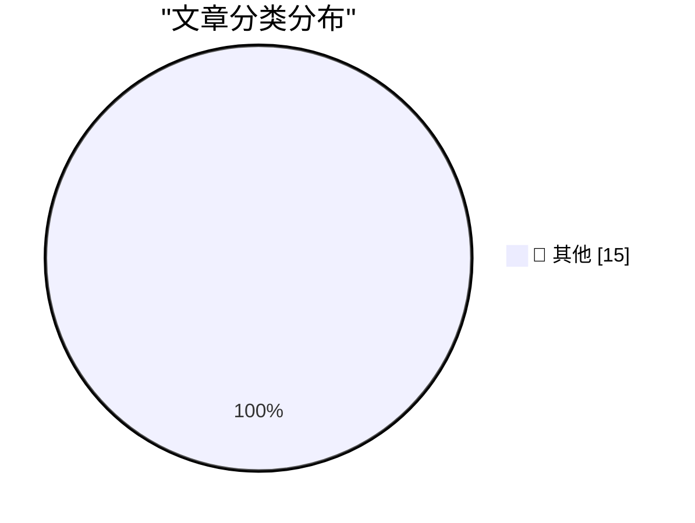

# 📰 AI 博客每日精选 — 2026-03-16

> 来自 Karpathy 推荐的 92 个顶级技术博客，AI 精选 Top 15

## 🏆 今日必读

🥇 **What is agentic engineering?**

[What is agentic engineering?](https://simonwillison.net/guides/agentic-engineering-patterns/what-is-agentic-engineering/#atom-everything) — simonwillison.net · 13 小时前 · 📝 其他

> What is agentic engineering?

🥈 **Quoting Jannis Leidel**

[Quoting Jannis Leidel](https://simonwillison.net/2026/Mar/14/jannis-leidel/#atom-everything) — simonwillison.net · 1 天前 · 📝 其他

> Quoting Jannis Leidel

🥉 **My fireside chat about agentic engineering at the Pragmatic Summit**

[My fireside chat about agentic engineering at the Pragmatic Summit](https://simonwillison.net/2026/Mar/14/pragmatic-summit/#atom-everything) — simonwillison.net · 1 天前 · 📝 其他

> My fireside chat about agentic engineering at the Pragmatic Summit

---

## 📊 数据概览

| 扫描源 | 抓取文章 | 时间范围 | 精选 |
|:---:|:---:|:---:|:---:|
| 83/92 | 2403 篇 → 28 篇 | 48h | **15 篇** |

### 分类分布

---

## 📝 其他

### 1. What is agentic engineering?

[What is agentic engineering?](https://simonwillison.net/guides/agentic-engineering-patterns/what-is-agentic-engineering/#atom-everything) — **simonwillison.net** · 13 小时前 · ⭐ 15/30

> What is agentic engineering?

---

### 2. Quoting Jannis Leidel

[Quoting Jannis Leidel](https://simonwillison.net/2026/Mar/14/jannis-leidel/#atom-everything) — **simonwillison.net** · 1 天前 · ⭐ 15/30

> Quoting Jannis Leidel

---

### 3. My fireside chat about agentic engineering at the Pragmatic Summit

[My fireside chat about agentic engineering at the Pragmatic Summit](https://simonwillison.net/2026/Mar/14/pragmatic-summit/#atom-everything) — **simonwillison.net** · 1 天前 · ⭐ 15/30

> My fireside chat about agentic engineering at the Pragmatic Summit

---

### 4. CHM Live: Apple at 50

[CHM Live: Apple at 50](https://www.youtube.com/live/eCSNJgI2LFI) — **daringfireball.net** · 13 小时前 · ⭐ 15/30

> CHM Live: Apple at 50

---

### 5. Finalist 3.6

[Finalist 3.6](https://www.finalist.works/finalist-36/) — **daringfireball.net** · 18 小时前 · ⭐ 15/30

> Finalist 3.6

---

### 6. ‘This Is Not the Computer for You’

[‘This Is Not the Computer for You’](https://samhenri.gold/blog/20260312-this-is-not-the-computer-for-you/?ref=birchtree.me) — **daringfireball.net** · 18 小时前 · ⭐ 15/30

> ‘This Is Not the Computer for You’

---

### 7. Blaming AI for Layoffs: ‘It Plays Better’

[Blaming AI for Layoffs: ‘It Plays Better’](https://www.resume.org/the-great-turnover-9-in-10-companies-plan-to-hire-in-2026-yet-6-in-10-will-have-layoffs-2/) — **daringfireball.net** · 19 小时前 · ⭐ 15/30

> Blaming AI for Layoffs: ‘It Plays Better’

---

### 8. Horace Dediu on Apple Sitting Out the AI Spending Race

[Horace Dediu on Apple Sitting Out the AI Spending Race](https://asymco.com/2026/03/10/the-most-brilliant-move-in-corporate-history/) — **daringfireball.net** · 20 小时前 · ⭐ 15/30

> Horace Dediu on Apple Sitting Out the AI Spending Race

---

### 9. Reuters: ‘Meta Planning Sweeping Layoffs as AI Costs Mount’

[Reuters: ‘Meta Planning Sweeping Layoffs as AI Costs Mount’](https://www.reuters.com/business/world-at-work/meta-planning-sweeping-layoffs-ai-costs-mount-2026-03-14/) — **daringfireball.net** · 20 小时前 · ⭐ 15/30

> Reuters: ‘Meta Planning Sweeping Layoffs as AI Costs Mount’

---

### 10. Matt Mullenweg Documents a Dastardly Clever Apple Account Phishing Scam

[Matt Mullenweg Documents a Dastardly Clever Apple Account Phishing Scam](https://ma.tt/2026/03/gone-almost-phishin/) — **daringfireball.net** · 1 天前 · ⭐ 15/30

> Matt Mullenweg Documents a Dastardly Clever Apple Account Phishing Scam

---

### 11. iFixit’s MacBook Neo Teardown

[iFixit’s MacBook Neo Teardown](https://www.ifixit.com/News/116152/macbook-neo-is-the-most-repairable-macbook-in-14-years) — **daringfireball.net** · 1 天前 · ⭐ 15/30

> iFixit’s MacBook Neo Teardown

---

### 12. PC Makers Are Not Ready for the MacBook Neo

[PC Makers Are Not Ready for the MacBook Neo](https://www.theverge.com/report/894090/macbook-neo-pc-windows-laptop-competition-asus-footinmouth) — **daringfireball.net** · 1 天前 · ⭐ 15/30

> PC Makers Are Not Ready for the MacBook Neo

---

### 13. Ars Technica Fires Reporter Benj Edwards After He Published Story With AI-Fabricated Quotes

[Ars Technica Fires Reporter Benj Edwards After He Published Story With AI-Fabricated Quotes](https://futurism.com/artificial-intelligence/ars-technica-fires-reporter-ai-quotes) — **daringfireball.net** · 1 天前 · ⭐ 15/30

> Ars Technica Fires Reporter Benj Edwards After He Published Story With AI-Fabricated Quotes

---

### 14. Lil Finder Guy

[Lil Finder Guy](https://basicappleguy.com/basicappleblog/lil-finder-guy) — **daringfireball.net** · 1 天前 · ⭐ 15/30

> Lil Finder Guy

---

### 15. Shower Thought: Git Teleportation

[Shower Thought: Git Teleportation](https://idiallo.com/byte-size/git-teleportation?src=feed) — **idiallo.com** · 11 小时前 · ⭐ 15/30

> Shower Thought: Git Teleportation

---

*生成于 2026-03-16 12:03 | 扫描 83 源 → 获取 2403 篇 → 精选 15 篇*
*基于 [Hacker News Popularity Contest 2025](https://refactoringenglish.com/tools/hn-popularity/) RSS 源列表，由 [Andrej Karpathy](https://x.com/karpathy) 推荐*
*由「懂点儿AI」制作，欢迎关注同名微信公众号获取更多 AI 实用技巧 💡*
