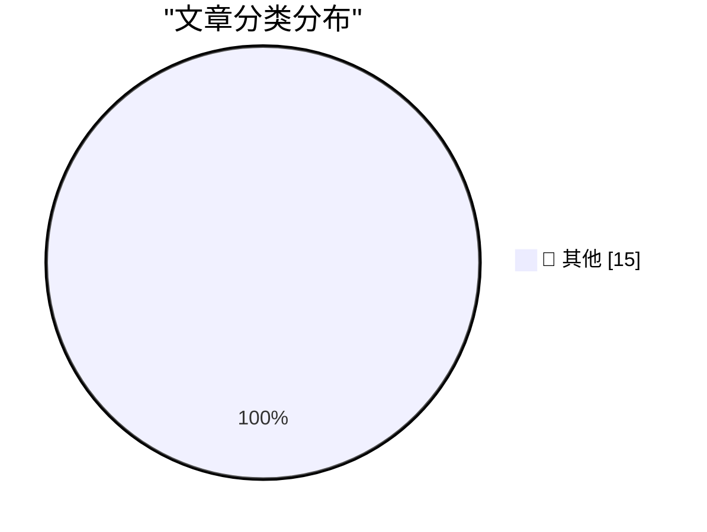

# 📰 AI 博客每日精选 — 2026-04-21

> 来自 Karpathy 推荐的 92 个顶级技术博客，AI 精选 Top 15

## 🏆 今日必读

🥇 **SQL functions in Google Sheets to fetch data from Datasette**

[SQL functions in Google Sheets to fetch data from Datasette](https://simonwillison.net/2026/Apr/20/datasette-sql/#atom-everything) — simonwillison.net · 1 天前 · 📝 其他

> SQL functions in Google Sheets to fetch data from Datasette

🥈 **Claude Token Counter, now with model comparisons**

[Claude Token Counter, now with model comparisons](https://simonwillison.net/2026/Apr/20/claude-token-counts/#atom-everything) — simonwillison.net · 1 天前 · 📝 其他

> Claude Token Counter, now with model comparisons

🥉 **Headless everything for personal AI**

[Headless everything for personal AI](https://simonwillison.net/2026/Apr/19/headless-everything/#atom-everything) — simonwillison.net · 1 天前 · 📝 其他

> Headless everything for personal AI

---

## 📊 数据概览

| 扫描源 | 抓取文章 | 时间范围 | 精选 |
|:---:|:---:|:---:|:---:|
| 83/92 | 2440 篇 → 26 篇 | 48h | **15 篇** |

### 分类分布

---

## 📝 其他

### 1. SQL functions in Google Sheets to fetch data from Datasette

[SQL functions in Google Sheets to fetch data from Datasette](https://simonwillison.net/2026/Apr/20/datasette-sql/#atom-everything) — **simonwillison.net** · 1 天前 · ⭐ 15/30

> SQL functions in Google Sheets to fetch data from Datasette

---

### 2. Claude Token Counter, now with model comparisons

[Claude Token Counter, now with model comparisons](https://simonwillison.net/2026/Apr/20/claude-token-counts/#atom-everything) — **simonwillison.net** · 1 天前 · ⭐ 15/30

> Claude Token Counter, now with model comparisons

---

### 3. Headless everything for personal AI

[Headless everything for personal AI](https://simonwillison.net/2026/Apr/19/headless-everything/#atom-everything) — **simonwillison.net** · 1 天前 · ⭐ 15/30

> Headless everything for personal AI

---

### 4. ★ Another Day Has Come

[★ Another Day Has Come](https://daringfireball.net/2026/04/another_day_has_come) — **daringfireball.net** · 6 小时前 · ⭐ 15/30

> ★ Another Day Has Come

---

### 5. DF Paraphernalia: T-Shirts and Hoodies Are Back

[DF Paraphernalia: T-Shirts and Hoodies Are Back](https://store.daringfireball.net/) — **daringfireball.net** · 13 小时前 · ⭐ 15/30

> DF Paraphernalia: T-Shirts and Hoodies Are Back

---

### 6. ‘Community Letter From Tim’

[‘Community Letter From Tim’](https://www.apple.com/community-letter-from-tim/) — **daringfireball.net** · 13 小时前 · ⭐ 15/30

> ‘Community Letter From Tim’

---

### 7. Apple: ‘Tim Cook to Become Apple Executive Chairman; John Ternus to Become Apple CEO’

[Apple: ‘Tim Cook to Become Apple Executive Chairman; John Ternus to Become Apple CEO’](https://www.apple.com/newsroom/2026/04/tim-cook-to-become-apple-executive-chairman-john-ternus-to-become-apple-ceo/) — **daringfireball.net** · 14 小时前 · ⭐ 15/30

> Apple: ‘Tim Cook to Become Apple Executive Chairman; John Ternus to Become Apple CEO’

---

### 8. Apple’s Annual Environmental Progress Report

[Apple’s Annual Environmental Progress Report](https://www.apple.com/newsroom/2026/04/apple-accelerates-progress-with-highest-ever-recycled-material-in-its-products/) — **daringfireball.net** · 17 小时前 · ⭐ 15/30

> Apple’s Annual Environmental Progress Report

---

### 9. Jessica Chastain Says Apple TV Will Finally Release ‘The Savant’

[Jessica Chastain Says Apple TV Will Finally Release ‘The Savant’](https://variety.com/2026/tv/columns/jessica-chastain-apple-tv-finally-release-the-savant-after-postponement-charlie-kirk-assassination-1236725384/) — **daringfireball.net** · 1 天前 · ⭐ 15/30

> Jessica Chastain Says Apple TV Will Finally Release ‘The Savant’

---

### 10. WorkOS FGA: The Authorization Layer for AI Agents

[WorkOS FGA: The Authorization Layer for AI Agents](https://workos.com/blog/agents-need-authorization-not-just-authentication?utm_source=daringfireball&amp;utm_medium=newsletter&amp;utm_campaign=q22026) — **daringfireball.net** · 1 天前 · ⭐ 15/30

> WorkOS FGA: The Authorization Layer for AI Agents

---

### 11. Advice from a millionaire

[Advice from a millionaire](https://idiallo.com/blog/advice-from-a-millionaire?src=feed) — **idiallo.com** · 22 小时前 · ⭐ 15/30

> Advice from a millionaire

---

### 12. Pluralistic: Comrade Trump (20 Apr 2026)

[Pluralistic: Comrade Trump (20 Apr 2026)](https://pluralistic.net/2026/04/20/praxis/) — **pluralistic.net** · 18 小时前 · ⭐ 15/30

> Pluralistic: Comrade Trump (20 Apr 2026)

---

### 13. Book Review: Up - A scientist's guide to the magic above us by Dr Lucy Rogers ★★★★★

[Book Review: Up - A scientist's guide to the magic above us by Dr Lucy Rogers ★★★★★](https://shkspr.mobi/blog/2026/04/book-review-up-a-scientists-guide-to-the-magic-above-us-by-dr-lucy-rogers/) — **shkspr.mobi** · 23 小时前 · ⭐ 15/30

> Book Review: Up - A scientist's guide to the magic above us by Dr Lucy Rogers ★★★★★

---

### 14. Reprojecting Dual Fisheye Videos to Equirectangular (LG 360)

[Reprojecting Dual Fisheye Videos to Equirectangular (LG 360)](https://shkspr.mobi/blog/2026/04/reprojecting-dual-fisheye-videos-to-equirectangular-lg-360/) — **shkspr.mobi** · 1 天前 · ⭐ 15/30

> Reprojecting Dual Fisheye Videos to Equirectangular (LG 360)

---

### 15. How did code handle 24-bit-per-pixel formats when using video cards with bank-switched memory?

[How did code handle 24-bit-per-pixel formats when using video cards with bank-switched memory?](https://devblogs.microsoft.com/oldnewthing/20260420-00/?p=112245) — **devblogs.microsoft.com/oldnewthing** · 20 小时前 · ⭐ 15/30

> How did code handle 24-bit-per-pixel formats when using video cards with bank-switched memory?

---

*生成于 2026-04-21 10:57 | 扫描 83 源 → 获取 2440 篇 → 精选 15 篇*
*基于 [Hacker News Popularity Contest 2025](https://refactoringenglish.com/tools/hn-popularity/) RSS 源列表，由 [Andrej Karpathy](https://x.com/karpathy) 推荐*
*由「懂点儿AI」制作，欢迎关注同名微信公众号获取更多 AI 实用技巧 💡*
