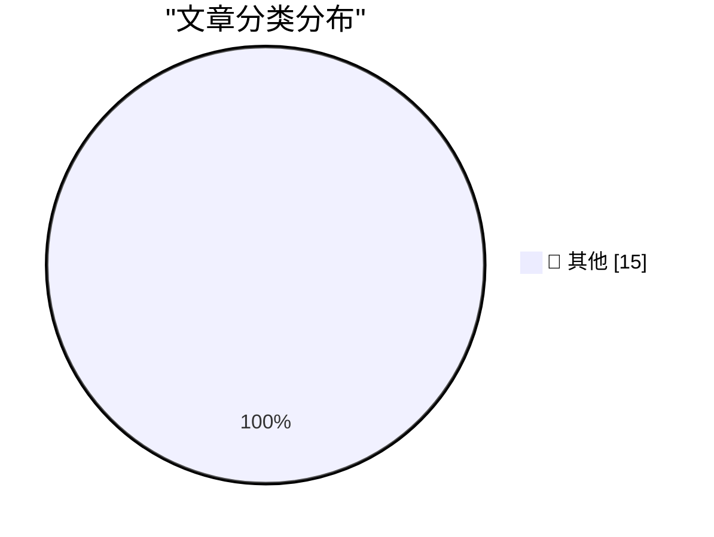

# 📰 AI 博客每日精选 — 2026-04-01

> 来自 Karpathy 推荐的 92 个顶级技术博客，AI 精选 Top 15

## 🏆 今日必读

🥇 **datasette-extract 0.3a0**

[datasette-extract 0.3a0](https://simonwillison.net/2026/Apr/1/datasette-extract/#atom-everything) — simonwillison.net · 7 小时前 · 📝 其他

> datasette-extract 0.3a0

🥈 **datasette-enrichments-llm 0.2a0**

[datasette-enrichments-llm 0.2a0](https://simonwillison.net/2026/Apr/1/datasette-enrichments-llm/#atom-everything) — simonwillison.net · 7 小时前 · 📝 其他

> datasette-enrichments-llm 0.2a0

🥉 **datasette-llm-usage 0.2a0**

[datasette-llm-usage 0.2a0](https://simonwillison.net/2026/Apr/1/datasette-llm-usage/#atom-everything) — simonwillison.net · 7 小时前 · 📝 其他

> datasette-llm-usage 0.2a0

---

## 📊 数据概览

| 扫描源 | 抓取文章 | 时间范围 | 精选 |
|:---:|:---:|:---:|:---:|
| 81/92 | 2383 篇 → 53 篇 | 48h | **15 篇** |

### 分类分布

---

## 📝 其他

### 1. datasette-extract 0.3a0

[datasette-extract 0.3a0](https://simonwillison.net/2026/Apr/1/datasette-extract/#atom-everything) — **simonwillison.net** · 7 小时前 · ⭐ 15/30

> datasette-extract 0.3a0

---

### 2. datasette-enrichments-llm 0.2a0

[datasette-enrichments-llm 0.2a0](https://simonwillison.net/2026/Apr/1/datasette-enrichments-llm/#atom-everything) — **simonwillison.net** · 7 小时前 · ⭐ 15/30

> datasette-enrichments-llm 0.2a0

---

### 3. datasette-llm-usage 0.2a0

[datasette-llm-usage 0.2a0](https://simonwillison.net/2026/Apr/1/datasette-llm-usage/#atom-everything) — **simonwillison.net** · 7 小时前 · ⭐ 15/30

> datasette-llm-usage 0.2a0

---

### 4. datasette-llm 0.1a5

[datasette-llm 0.1a5](https://simonwillison.net/2026/Apr/1/datasette-llm/#atom-everything) — **simonwillison.net** · 7 小时前 · ⭐ 15/30

> datasette-llm 0.1a5

---

### 5. Quoting Soohoon Choi

[Quoting Soohoon Choi](https://simonwillison.net/2026/Apr/1/soohoon-choi/#atom-everything) — **simonwillison.net** · 8 小时前 · ⭐ 15/30

> Quoting Soohoon Choi

---

### 6. Supply Chain Attack on Axios Pulls Malicious Dependency from npm

[Supply Chain Attack on Axios Pulls Malicious Dependency from npm](https://simonwillison.net/2026/Mar/31/supply-chain-attack-on-axios/#atom-everything) — **simonwillison.net** · 11 小时前 · ⭐ 15/30

> Supply Chain Attack on Axios Pulls Malicious Dependency from npm

---

### 7. datasette-llm 0.1a4

[datasette-llm 0.1a4](https://simonwillison.net/2026/Mar/31/datasette-llm/#atom-everything) — **simonwillison.net** · 13 小时前 · ⭐ 15/30

> datasette-llm 0.1a4

---

### 8. llm-all-models-async 0.1

[llm-all-models-async 0.1](https://simonwillison.net/2026/Mar/31/llm-all-models-async/#atom-everything) — **simonwillison.net** · 13 小时前 · ⭐ 15/30

> llm-all-models-async 0.1

---

### 9. llm 0.30

[llm 0.30](https://simonwillison.net/2026/Mar/31/llm/#atom-everything) — **simonwillison.net** · 14 小时前 · ⭐ 15/30

> llm 0.30

---

### 10. llm-echo 0.4

[llm-echo 0.4](https://simonwillison.net/2026/Mar/31/llm-echo/#atom-everything) — **simonwillison.net** · 17 小时前 · ⭐ 15/30

> llm-echo 0.4

---

### 11. llm-echo 0.3

[llm-echo 0.3](https://simonwillison.net/2026/Mar/31/llm-echo-2/#atom-everything) — **simonwillison.net** · 19 小时前 · ⭐ 15/30

> llm-echo 0.3

---

### 12. datasette-files 0.1a3

[datasette-files 0.1a3](https://simonwillison.net/2026/Mar/30/datasette-files/#atom-everything) — **simonwillison.net** · 1 天前 · ⭐ 15/30

> datasette-files 0.1a3

---

### 13. Quoting Georgi Gerganov

[Quoting Georgi Gerganov](https://simonwillison.net/2026/Mar/30/georgi-gerganov/#atom-everything) — **simonwillison.net** · 1 天前 · ⭐ 15/30

> Quoting Georgi Gerganov

---

### 14. datasette-llm 0.1a3

[datasette-llm 0.1a3](https://simonwillison.net/2026/Mar/30/datasette-llm/#atom-everything) — **simonwillison.net** · 1 天前 · ⭐ 15/30

> datasette-llm 0.1a3

---

### 15. Mr. Chatterbox is a (weak) Victorian-era ethically trained model you can run on your own computer

[Mr. Chatterbox is a (weak) Victorian-era ethically trained model you can run on your own computer](https://simonwillison.net/2026/Mar/30/mr-chatterbox/#atom-everything) — **simonwillison.net** · 1 天前 · ⭐ 15/30

> Mr. Chatterbox is a (weak) Victorian-era ethically trained model you can run on your own computer

---

*生成于 2026-04-01 10:45 | 扫描 81 源 → 获取 2383 篇 → 精选 15 篇*
*基于 [Hacker News Popularity Contest 2025](https://refactoringenglish.com/tools/hn-popularity/) RSS 源列表，由 [Andrej Karpathy](https://x.com/karpathy) 推荐*
*由「懂点儿AI」制作，欢迎关注同名微信公众号获取更多 AI 实用技巧 💡*
