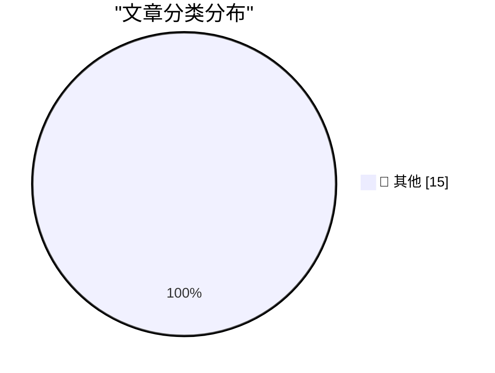

# 📰 AI 博客每日精选 — 2026-03-20

> 来自 Karpathy 推荐的 92 个顶级技术博客，AI 精选 Top 15

## 🏆 今日必读

🥇 **Thoughts on OpenAI acquiring Astral and uv/ruff/ty**

[Thoughts on OpenAI acquiring Astral and uv/ruff/ty](https://simonwillison.net/2026/Mar/19/openai-acquiring-astral/#atom-everything) — simonwillison.net · 18 小时前 · 📝 其他

> Thoughts on OpenAI acquiring Astral and uv/ruff/ty

🥈 **Autoresearching Apple's "LLM in a Flash" to run Qwen 397B locally**

[Autoresearching Apple's "LLM in a Flash" to run Qwen 397B locally](https://simonwillison.net/2026/Mar/18/llm-in-a-flash/#atom-everything) — simonwillison.net · 1 天前 · 📝 其他

> Autoresearching Apple's "LLM in a Flash" to run Qwen 397B locally

🥉 **Snowflake Cortex AI Escapes Sandbox and Executes Malware**

[Snowflake Cortex AI Escapes Sandbox and Executes Malware](https://simonwillison.net/2026/Mar/18/snowflake-cortex-ai/#atom-everything) — simonwillison.net · 1 天前 · 📝 其他

> Snowflake Cortex AI Escapes Sandbox and Executes Malware

---

## 📊 数据概览

| 扫描源 | 抓取文章 | 时间范围 | 精选 |
|:---:|:---:|:---:|:---:|
| 83/92 | 2422 篇 → 35 篇 | 48h | **15 篇** |

### 分类分布

---

## 📝 其他

### 1. Thoughts on OpenAI acquiring Astral and uv/ruff/ty

[Thoughts on OpenAI acquiring Astral and uv/ruff/ty](https://simonwillison.net/2026/Mar/19/openai-acquiring-astral/#atom-everything) — **simonwillison.net** · 18 小时前 · ⭐ 15/30

> Thoughts on OpenAI acquiring Astral and uv/ruff/ty

---

### 2. Autoresearching Apple's "LLM in a Flash" to run Qwen 397B locally

[Autoresearching Apple's "LLM in a Flash" to run Qwen 397B locally](https://simonwillison.net/2026/Mar/18/llm-in-a-flash/#atom-everything) — **simonwillison.net** · 1 天前 · ⭐ 15/30

> Autoresearching Apple's "LLM in a Flash" to run Qwen 397B locally

---

### 3. Snowflake Cortex AI Escapes Sandbox and Executes Malware

[Snowflake Cortex AI Escapes Sandbox and Executes Malware](https://simonwillison.net/2026/Mar/18/snowflake-cortex-ai/#atom-everything) — **simonwillison.net** · 1 天前 · ⭐ 15/30

> Snowflake Cortex AI Escapes Sandbox and Executes Malware

---

### 4. Feds Disrupt IoT Botnets Behind Huge DDoS Attacks

[Feds Disrupt IoT Botnets Behind Huge DDoS Attacks](https://krebsonsecurity.com/2026/03/feds-disrupt-iot-botnets-behind-huge-ddos-attacks/) — **krebsonsecurity.com** · 10 小时前 · ⭐ 15/30

> Feds Disrupt IoT Botnets Behind Huge DDoS Attacks

---

### 5. StopTheMadness Pro and StopTheScript Extensions for Safari

[StopTheMadness Pro and StopTheScript Extensions for Safari](https://mastodon.social/@lapcatsoftware/116252960395480568) — **daringfireball.net** · 14 小时前 · ⭐ 15/30

> StopTheMadness Pro and StopTheScript Extensions for Safari

---

### 6. Actual Headline in the Actual New York Times: ‘Trump Jokes About Pearl Harbor in Meeting With Japan’s Leader’

[Actual Headline in the Actual New York Times: ‘Trump Jokes About Pearl Harbor in Meeting With Japan’s Leader’](https://www.nytimes.com/2026/03/19/us/politics/trump-japan-pearl-harbor-oval-office-takaichi.html?unlocked_article_code=1.UVA.zau0.UZ5WnBjtPHot) — **daringfireball.net** · 14 小时前 · ⭐ 15/30

> Actual Headline in the Actual New York Times: ‘Trump Jokes About Pearl Harbor in Meeting With Japan’s Leader’

---

### 7. ‘Everyone but Trump Understands What He’s Done’

[‘Everyone but Trump Understands What He’s Done’](https://www.theatlantic.com/ideas/2026/03/trump-iran-war-allies/686423/?gift=aQyUJR7AIw1mJWdQ6Ed6yGfvOucd9Oa8W54yMDTtr2I) — **daringfireball.net** · 15 小时前 · ⭐ 15/30

> ‘Everyone but Trump Understands What He’s Done’

---

### 8. The Day Mark Simonson Discovered Type Design

[The Day Mark Simonson Discovered Type Design](https://www.marksimonson.com/notebook/view/the-day-i-discovered-type-design/) — **daringfireball.net** · 16 小时前 · ⭐ 15/30

> The Day Mark Simonson Discovered Type Design

---

### 9. Google’s New Sideloading Restrictions for Android Include a 24-Hour Waiting Period

[Google’s New Sideloading Restrictions for Android Include a 24-Hour Waiting Period](https://www.androidauthority.com/google-android-sideloading-unverified-apps-new-rules-3650343/) — **daringfireball.net** · 16 小时前 · ⭐ 15/30

> Google’s New Sideloading Restrictions for Android Include a 24-Hour Waiting Period

---

### 10. Hacker News Discussion on Shubham Bose’s ‘The 49MB Web Page’

[Hacker News Discussion on Shubham Bose’s ‘The 49MB Web Page’](https://news.ycombinator.com/item?id=47390945) — **daringfireball.net** · 17 小时前 · ⭐ 15/30

> Hacker News Discussion on Shubham Bose’s ‘The 49MB Web Page’

---

### 11. ★ AppleScript: ‘Save MarsEdit Document to Text File’

[★ AppleScript: ‘Save MarsEdit Document to Text File’](https://daringfireball.net/2026/03/applescript_save_marsedit_document_to_text_file) — **daringfireball.net** · 18 小时前 · ⭐ 15/30

> ★ AppleScript: ‘Save MarsEdit Document to Text File’

---

### 12. The Talk Show: ‘The Pogue Feature’

[The Talk Show: ‘The Pogue Feature’](https://daringfireball.net/thetalkshow/2026/03/18/ep-443) — **daringfireball.net** · 1 天前 · ⭐ 15/30

> The Talk Show: ‘The Pogue Feature’

---

### 13. ★ ‘Your Frustration Is the Product’

[★ ‘Your Frustration Is the Product’](https://daringfireball.net/2026/03/your_frustration_is_the_product) — **daringfireball.net** · 1 天前 · ⭐ 15/30

> ★ ‘Your Frustration Is the Product’

---

### 14. How to Identify Your Apple Keyboard Layout by Country or Region

[How to Identify Your Apple Keyboard Layout by Country or Region](https://support.apple.com/en-us/102743) — **daringfireball.net** · 1 天前 · ⭐ 15/30

> How to Identify Your Apple Keyboard Layout by Country or Region

---

### 15. Jony Ive on Redesigning the Christie’s Rostrum

[Jony Ive on Redesigning the Christie’s Rostrum](https://www.youtube.com/watch?v=HLXDxx06_EM) — **daringfireball.net** · 1 天前 · ⭐ 15/30

> Jony Ive on Redesigning the Christie’s Rostrum

---

*生成于 2026-03-20 11:22 | 扫描 83 源 → 获取 2422 篇 → 精选 15 篇*
*基于 [Hacker News Popularity Contest 2025](https://refactoringenglish.com/tools/hn-popularity/) RSS 源列表，由 [Andrej Karpathy](https://x.com/karpathy) 推荐*
*由「懂点儿AI」制作，欢迎关注同名微信公众号获取更多 AI 实用技巧 💡*
