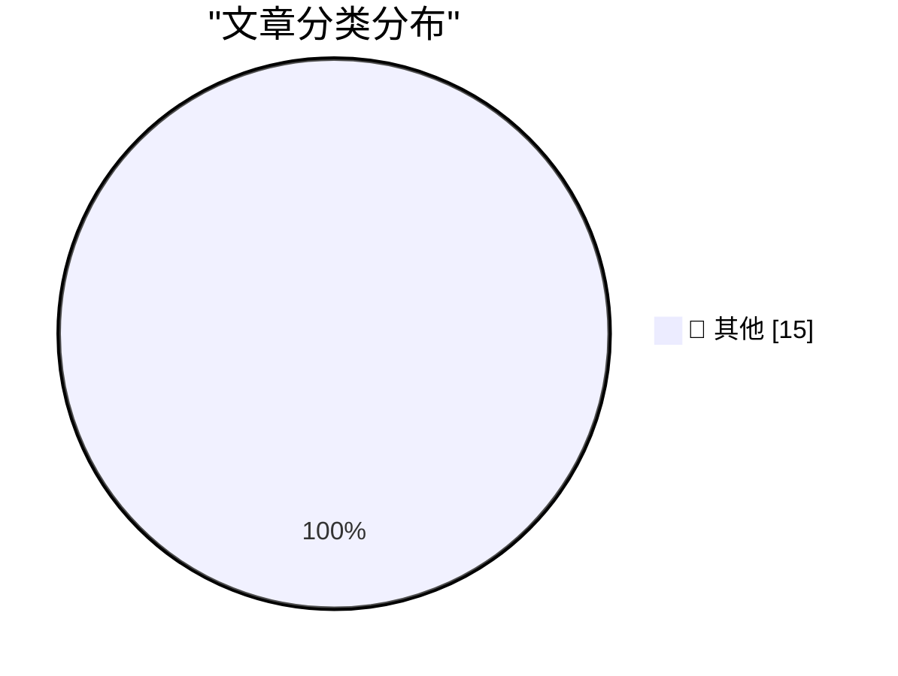

# 📰 AI 博客每日精选 — 2026-04-10

> 来自 Karpathy 推荐的 92 个顶级技术博客，AI 精选 Top 15

## 🏆 今日必读

🥇 **GitHub Repo Size**

[GitHub Repo Size](https://simonwillison.net/2026/Apr/9/github-repo-size/#atom-everything) — simonwillison.net · 13 小时前 · 📝 其他

> GitHub Repo Size

🥈 **asgi-gzip 0.3**

[asgi-gzip 0.3](https://simonwillison.net/2026/Apr/9/asgi-gzip/#atom-everything) — simonwillison.net · 1 天前 · 📝 其他

> asgi-gzip 0.3

🥉 **Meta's new model is Muse Spark, and meta.ai chat has some interesting tools**

[Meta's new model is Muse Spark, and meta.ai chat has some interesting tools](https://simonwillison.net/2026/Apr/8/muse-spark/#atom-everything) — simonwillison.net · 1 天前 · 📝 其他

> Meta's new model is Muse Spark, and meta.ai chat has some interesting tools

---

## 📊 数据概览

| 扫描源 | 抓取文章 | 时间范围 | 精选 |
|:---:|:---:|:---:|:---:|
| 83/92 | 2436 篇 → 37 篇 | 48h | **15 篇** |

### 分类分布

---

## 📝 其他

### 1. GitHub Repo Size

[GitHub Repo Size](https://simonwillison.net/2026/Apr/9/github-repo-size/#atom-everything) — **simonwillison.net** · 13 小时前 · ⭐ 15/30

> GitHub Repo Size

---

### 2. asgi-gzip 0.3

[asgi-gzip 0.3](https://simonwillison.net/2026/Apr/9/asgi-gzip/#atom-everything) — **simonwillison.net** · 1 天前 · ⭐ 15/30

> asgi-gzip 0.3

---

### 3. Meta's new model is Muse Spark, and meta.ai chat has some interesting tools

[Meta's new model is Muse Spark, and meta.ai chat has some interesting tools](https://simonwillison.net/2026/Apr/8/muse-spark/#atom-everything) — **simonwillison.net** · 1 天前 · ⭐ 15/30

> Meta's new model is Muse Spark, and meta.ai chat has some interesting tools

---

### 4. Quoting Giles Turnbull

[Quoting Giles Turnbull](https://simonwillison.net/2026/Apr/8/giles-turnbull/#atom-everything) — **simonwillison.net** · 1 天前 · ⭐ 15/30

> Quoting Giles Turnbull

---

### 5. MacOS Seemingly Crashes After 49 Days of Uptime — a ‘Feature’ Perhaps Exclusive to Tahoe

[MacOS Seemingly Crashes After 49 Days of Uptime — a ‘Feature’ Perhaps Exclusive to Tahoe](https://sixcolors.com/link/2026/04/macs-crash-after-49-days-of-uptime/) — **daringfireball.net** · 12 小时前 · ⭐ 15/30

> MacOS Seemingly Crashes After 49 Days of Uptime — a ‘Feature’ Perhaps Exclusive to Tahoe

---

### 6. Adobe Diddles With Your /etc/hosts File

[Adobe Diddles With Your /etc/hosts File](https://old.reddit.com/r/webdev/comments/1sb6hzk/adobe_wrote_to_my_hosts_file_ive_never_had_an_app/oe1ap9h/) — **daringfireball.net** · 14 小时前 · ⭐ 15/30

> Adobe Diddles With Your /etc/hosts File

---

### 7. Lickspittle of the Week: Todd Blanche

[Lickspittle of the Week: Todd Blanche](https://politicalwire.com/2026/04/09/extra-bonus-quote-of-the-day-1022/) — **daringfireball.net** · 17 小时前 · ⭐ 15/30

> Lickspittle of the Week: Todd Blanche

---

### 8. Anthropic’s New Claude Mythos Is So Good at Finding and Exploiting Vulnerabilities That They’re Not Releasing It to the Public

[Anthropic’s New Claude Mythos Is So Good at Finding and Exploiting Vulnerabilities That They’re Not Releasing It to the Public](https://red.anthropic.com/2026/mythos-preview/) — **daringfireball.net** · 1 天前 · ⭐ 15/30

> Anthropic’s New Claude Mythos Is So Good at Finding and Exploiting Vulnerabilities That They’re Not Releasing It to the Public

---

### 9. What Are You Trying to Say?

[What Are You Trying to Say?](https://idiallo.com/blog/what-are-you-trying-to-say?src=feed) — **idiallo.com** · 22 小时前 · ⭐ 15/30

> What Are You Trying to Say?

---

### 10. Pluralistic: Canny Valley and Creative Commons (10 Apr 2026)

[Pluralistic: Canny Valley and Creative Commons (10 Apr 2026)](https://pluralistic.net/2026/04/10/canny-valley/) — **pluralistic.net** · 45 分钟前 · ⭐ 15/30

> Pluralistic: Canny Valley and Creative Commons (10 Apr 2026)

---

### 11. Pluralistic: Cindy Cohn's "Privacy's Defender" (09 Apr 2026)

[Pluralistic: Cindy Cohn's "Privacy's Defender" (09 Apr 2026)](https://pluralistic.net/2026/04/09/bernstein-2/) — **pluralistic.net** · 23 小时前 · ⭐ 15/30

> Pluralistic: Cindy Cohn's "Privacy's Defender" (09 Apr 2026)

---

### 12. Pluralistic: Process knowledge (08 Apr 2026)

[Pluralistic: Process knowledge (08 Apr 2026)](https://pluralistic.net/2026/04/08/process-knowledge-vs-bosses/) — **pluralistic.net** · 1 天前 · ⭐ 15/30

> Pluralistic: Process knowledge (08 Apr 2026)

---

### 13. Book Review: Small Comfort by Ia Genberg ★★☆☆☆

[Book Review: Small Comfort by Ia Genberg ★★☆☆☆](https://shkspr.mobi/blog/2026/04/book-review-small-comfort-by-ia-genberg/) — **shkspr.mobi** · 23 小时前 · ⭐ 15/30

> Book Review: Small Comfort by Ia Genberg ★★☆☆☆

---

### 14. Theatre Review: Avenue Q ★★★★★

[Theatre Review: Avenue Q ★★★★★](https://shkspr.mobi/blog/2026/04/theatre-review-avenue-q/) — **shkspr.mobi** · 1 天前 · ⭐ 15/30

> Theatre Review: Avenue Q ★★★★★

---

### 15. I quit drinking for a year

[I quit drinking for a year](https://dynomight.net/drinking/) — **dynomight.net** · 1 天前 · ⭐ 15/30

> I quit drinking for a year

---

*生成于 2026-04-10 10:42 | 扫描 83 源 → 获取 2436 篇 → 精选 15 篇*
*基于 [Hacker News Popularity Contest 2025](https://refactoringenglish.com/tools/hn-popularity/) RSS 源列表，由 [Andrej Karpathy](https://x.com/karpathy) 推荐*
*由「懂点儿AI」制作，欢迎关注同名微信公众号获取更多 AI 实用技巧 💡*
