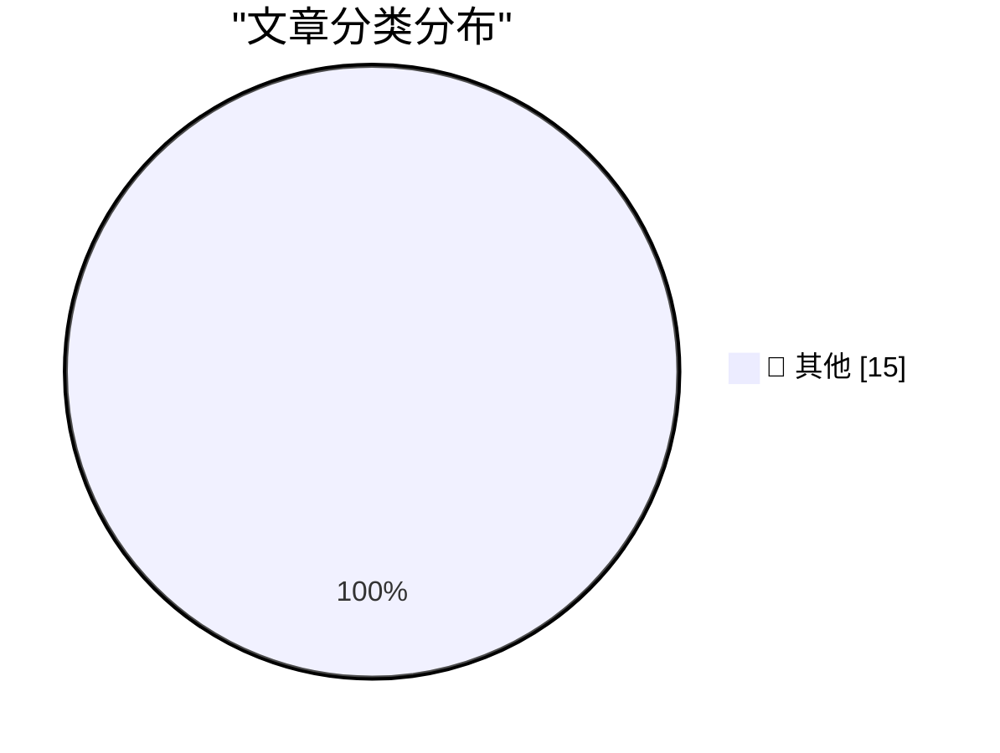

# 📰 AI 博客每日精选 — 2026-04-18

> 来自 Karpathy 推荐的 92 个顶级技术博客，AI 精选 Top 15

## 🏆 今日必读

🥇 **Adding a new content type to my blog-to-newsletter tool**

[Adding a new content type to my blog-to-newsletter tool](https://simonwillison.net/guides/agentic-engineering-patterns/adding-a-new-content-type/#atom-everything) — simonwillison.net · 7 小时前 · 📝 其他

> Adding a new content type to my blog-to-newsletter tool

🥈 **Join us at PyCon US 2026 in Long Beach - we have new AI and security tracks this year**

[Join us at PyCon US 2026 in Long Beach - we have new AI and security tracks this year](https://simonwillison.net/2026/Apr/17/pycon-us-2026/#atom-everything) — simonwillison.net · 10 小时前 · 📝 其他

> Join us at PyCon US 2026 in Long Beach - we have new AI and security tracks this year

🥉 **datasette 1.0a28**

[datasette 1.0a28](https://simonwillison.net/2026/Apr/17/datasette/#atom-everything) — simonwillison.net · 1 天前 · 📝 其他

> datasette 1.0a28

---

## 📊 数据概览

| 扫描源 | 抓取文章 | 时间范围 | 精选 |
|:---:|:---:|:---:|:---:|
| 82/92 | 2409 篇 → 35 篇 | 48h | **15 篇** |

### 分类分布

---

## 📝 其他

### 1. Adding a new content type to my blog-to-newsletter tool

[Adding a new content type to my blog-to-newsletter tool](https://simonwillison.net/guides/agentic-engineering-patterns/adding-a-new-content-type/#atom-everything) — **simonwillison.net** · 7 小时前 · ⭐ 15/30

> Adding a new content type to my blog-to-newsletter tool

---

### 2. Join us at PyCon US 2026 in Long Beach - we have new AI and security tracks this year

[Join us at PyCon US 2026 in Long Beach - we have new AI and security tracks this year](https://simonwillison.net/2026/Apr/17/pycon-us-2026/#atom-everything) — **simonwillison.net** · 10 小时前 · ⭐ 15/30

> Join us at PyCon US 2026 in Long Beach - we have new AI and security tracks this year

---

### 3. datasette 1.0a28

[datasette 1.0a28](https://simonwillison.net/2026/Apr/17/datasette/#atom-everything) — **simonwillison.net** · 1 天前 · ⭐ 15/30

> datasette 1.0a28

---

### 4. llm-anthropic 0.25

[llm-anthropic 0.25](https://simonwillison.net/2026/Apr/16/llm-anthropic/#atom-everything) — **simonwillison.net** · 1 天前 · ⭐ 15/30

> llm-anthropic 0.25

---

### 5. Qwen3.6-35B-A3B on my laptop drew me a better pelican than Claude Opus 4.7

[Qwen3.6-35B-A3B on my laptop drew me a better pelican than Claude Opus 4.7](https://simonwillison.net/2026/Apr/16/qwen-beats-opus/#atom-everything) — **simonwillison.net** · 1 天前 · ⭐ 15/30

> Qwen3.6-35B-A3B on my laptop drew me a better pelican than Claude Opus 4.7

---

### 6. Apple’s Developer Guidelines for Ratings and Review Prompts

[Apple’s Developer Guidelines for Ratings and Review Prompts](https://developer.apple.com/design/human-interface-guidelines/ratings-and-reviews#Best-practices) — **daringfireball.net** · 9 小时前 · ⭐ 15/30

> Apple’s Developer Guidelines for Ratings and Review Prompts

---

### 7. Follow-Up Regarding App Store Reviews, Which Are Definitely Busted

[Follow-Up Regarding App Store Reviews, Which Are Definitely Busted](https://daringfireball.net/linked/2026/04/16/app-store-reviews-are-busted) — **daringfireball.net** · 9 小时前 · ⭐ 15/30

> Follow-Up Regarding App Store Reviews, Which Are Definitely Busted

---

### 8. App Store Reviews Are Busted

[App Store Reviews Are Busted](https://blog.terrygodier.com/2026/04/13/app-store-reviews-are-busted.html) — **daringfireball.net** · 1 天前 · ⭐ 15/30

> App Store Reviews Are Busted

---

### 9. Freecash Was More Like Scamcash

[Freecash Was More Like Scamcash](https://techcrunch.com/2026/04/14/how-the-rewards-app-freecash-scammed-its-way-to-the-top-of-the-app-stores/) — **daringfireball.net** · 1 天前 · ⭐ 15/30

> Freecash Was More Like Scamcash

---

### 10. Colliding With Reality, Indeed

[Colliding With Reality, Indeed](https://www.nytimes.com/2026/04/15/us/politics/trump-iran-war.html?unlocked_article_code=1.bVA.EB30.mygpleorcQhg&amp;smid=url-share) — **daringfireball.net** · 1 天前 · ⭐ 15/30

> Colliding With Reality, Indeed

---

### 11. How to Format 10-Digit Phone Numbers

[How to Format 10-Digit Phone Numbers](https://www.threads.com/@apstylebook/post/DXKtXVXEh7T) — **daringfireball.net** · 1 天前 · ⭐ 15/30

> How to Format 10-Digit Phone Numbers

---

### 12. Chance Miller: ‘Netflix Ruined Its Apple TV App by Switching to a Custom Video Player’

[Chance Miller: ‘Netflix Ruined Its Apple TV App by Switching to a Custom Video Player’](https://9to5mac.com/2026/04/15/netflix-ruined-its-apple-tv-app-by-switching-to-a-custom-video-player/) — **daringfireball.net** · 1 天前 · ⭐ 15/30

> Chance Miller: ‘Netflix Ruined Its Apple TV App by Switching to a Custom Video Player’

---

### 13. Apple Pay Express Mode for Transit, When Used With a Visa Card, Is Vulnerable to Scam Tap-to-Pay Readers

[Apple Pay Express Mode for Transit, When Used With a Visa Card, Is Vulnerable to Scam Tap-to-Pay Readers](https://www.macrumors.com/2026/04/15/apple-pay-visa-transit-exploit/) — **daringfireball.net** · 1 天前 · ⭐ 15/30

> Apple Pay Express Mode for Transit, When Used With a Visa Card, Is Vulnerable to Scam Tap-to-Pay Readers

---

### 14. Bonus Thought Regarding the Name ‘iPhone Ultra’

[Bonus Thought Regarding the Name ‘iPhone Ultra’](https://daringfireball.net/linked/2026/04/14/name-of-foldable-iphone) — **daringfireball.net** · 1 天前 · ⭐ 15/30

> Bonus Thought Regarding the Name ‘iPhone Ultra’

---

### 15. Rory Goss’s Accessibility Story

[Rory Goss’s Accessibility Story](https://www.apple.com/education/college-students/success-stories/goss/) — **daringfireball.net** · 1 天前 · ⭐ 15/30

> Rory Goss’s Accessibility Story

---

*生成于 2026-04-18 10:30 | 扫描 82 源 → 获取 2409 篇 → 精选 15 篇*
*基于 [Hacker News Popularity Contest 2025](https://refactoringenglish.com/tools/hn-popularity/) RSS 源列表，由 [Andrej Karpathy](https://x.com/karpathy) 推荐*
*由「懂点儿AI」制作，欢迎关注同名微信公众号获取更多 AI 实用技巧 💡*
