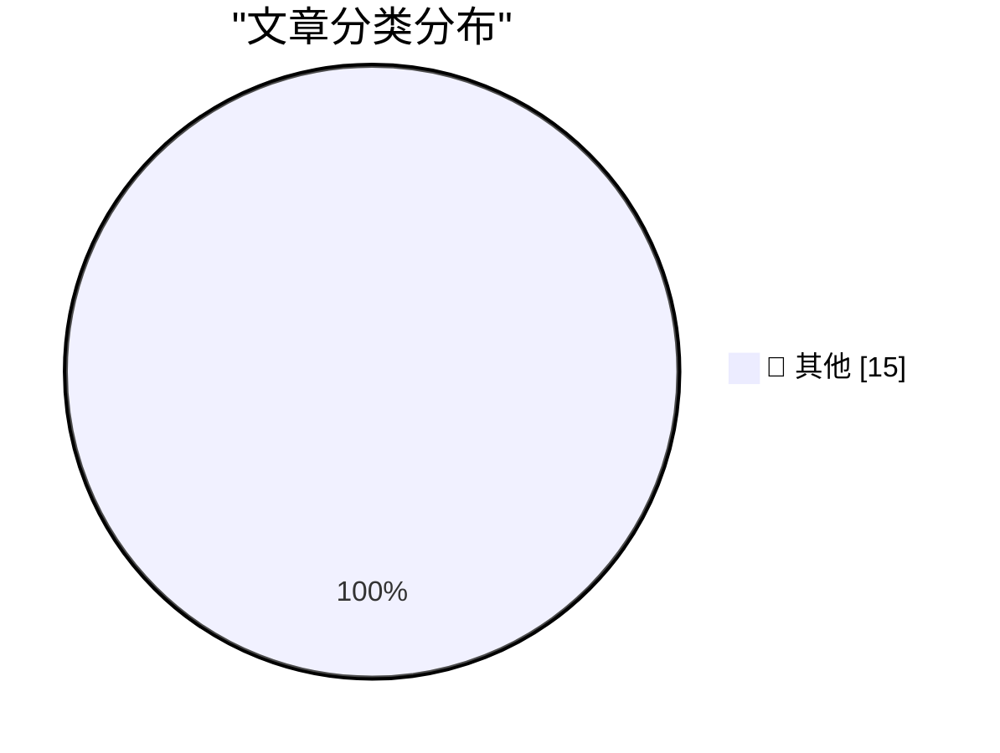

# 📰 AI 博客每日精选 — 2026-03-03

> 来自 Karpathy 推荐的 92 个顶级技术博客，AI 精选 Top 15

## 🏆 今日必读

🥇 **GIF optimization tool using WebAssembly and Gifsicle**

[GIF optimization tool using WebAssembly and Gifsicle](https://simonwillison.net/guides/agentic-engineering-patterns/gif-optimization/#atom-everything) — simonwillison.net · 19 小时前 · 📝 其他

> GIF optimization tool using WebAssembly and Gifsicle

🥈 **February sponsors-only newsletter**

[February sponsors-only newsletter](https://simonwillison.net/2026/Mar/2/february-newsletter/#atom-everything) — simonwillison.net · 20 小时前 · 📝 其他

> February sponsors-only newsletter

🥉 **I built a pint-sized Macintosh**

[I built a pint-sized Macintosh](https://www.jeffgeerling.com/blog/2026/pint-sized-macintosh-pico-micro-mac/) — jeffgeerling.com · 14 小时前 · 📝 其他

> I built a pint-sized Macintosh

---

## 📊 数据概览

| 扫描源 | 抓取文章 | 时间范围 | 精选 |
|:---:|:---:|:---:|:---:|
| 83/92 | 2400 篇 → 34 篇 | 48h | **15 篇** |

### 分类分布

---

## 📝 其他

### 1. GIF optimization tool using WebAssembly and Gifsicle

[GIF optimization tool using WebAssembly and Gifsicle](https://simonwillison.net/guides/agentic-engineering-patterns/gif-optimization/#atom-everything) — **simonwillison.net** · 19 小时前 · ⭐ 15/30

> GIF optimization tool using WebAssembly and Gifsicle

---

### 2. February sponsors-only newsletter

[February sponsors-only newsletter](https://simonwillison.net/2026/Mar/2/february-newsletter/#atom-everything) — **simonwillison.net** · 20 小时前 · ⭐ 15/30

> February sponsors-only newsletter

---

### 3. I built a pint-sized Macintosh

[I built a pint-sized Macintosh](https://www.jeffgeerling.com/blog/2026/pint-sized-macintosh-pico-micro-mac/) — **jeffgeerling.com** · 14 小时前 · ⭐ 15/30

> I built a pint-sized Macintosh

---

### 4. Expert Beginners and Lone Wolves will dominate this early LLM era

[Expert Beginners and Lone Wolves will dominate this early LLM era](https://www.jeffgeerling.com/blog/2026/expert-beginners-and-lone-wolves-dominate-llm-era/) — **jeffgeerling.com** · 1 天前 · ⭐ 15/30

> Expert Beginners and Lone Wolves will dominate this early LLM era

---

### 5. Giving LLMs a personality is just good engineering

[Giving LLMs a personality is just good engineering](https://seangoedecke.com/giving-llms-a-personality/) — **seangoedecke.com** · 11 小时前 · ⭐ 15/30

> Giving LLMs a personality is just good engineering

---

### 6. [Sponsor] npx workos: An AI Agent That Writes Auth Directly Into Your Codebase

[[Sponsor] npx workos: An AI Agent That Writes Auth Directly Into Your Codebase](https://workos.com/docs/authkit/cli-installer?utm_source=tldrdev&amp;utm_medium=newsletter&amp;utm_campaign=q12026) — **daringfireball.net** · 11 小时前 · ⭐ 15/30

> [Sponsor] npx workos: An AI Agent That Writes Auth Directly Into Your Codebase

---

### 7. ★ HazeOver — Mac Utility for Highlighting the Frontmost Window

[★ HazeOver — Mac Utility for Highlighting the Frontmost Window](https://daringfireball.net/2026/03/hazeover) — **daringfireball.net** · 12 小时前 · ⭐ 15/30

> ★ HazeOver — Mac Utility for Highlighting the Frontmost Window

---

### 8. Unsung Heroes: Flickr’s URLs Scheme

[Unsung Heroes: Flickr’s URLs Scheme](https://unsung.aresluna.org/unsung-heroes-flickrs-urls-scheme/) — **daringfireball.net** · 12 小时前 · ⭐ 15/30

> Unsung Heroes: Flickr’s URLs Scheme

---

### 9. ChangeTheHeaders

[ChangeTheHeaders](https://underpassapp.com/news/2025/3/4.html) — **daringfireball.net** · 14 小时前 · ⭐ 15/30

> ChangeTheHeaders

---

### 10. Welcome (Back) to Macintosh

[Welcome (Back) to Macintosh](https://take.surf/2026/03/01/welcome-back-to-macintosh) — **daringfireball.net** · 15 小时前 · ⭐ 15/30

> Welcome (Back) to Macintosh

---

### 11. SerpApi Filed Motion to Dismiss Google’s Lawsuit

[SerpApi Filed Motion to Dismiss Google’s Lawsuit](https://serpapi.com/blog/google-v-serpapi-motion-to-dismiss-why-were-in-the-right/) — **daringfireball.net** · 15 小时前 · ⭐ 15/30

> SerpApi Filed Motion to Dismiss Google’s Lawsuit

---

### 12. ‘Anthropic and Alignment’

[‘Anthropic and Alignment’](https://stratechery.com/2026/anthropic-and-alignment/) — **daringfireball.net** · 17 小时前 · ⭐ 15/30

> ‘Anthropic and Alignment’

---

### 13. WSJ: ‘Trump Administration Shuns Anthropic, Embraces OpenAI in Clash Over Guardrails’

[WSJ: ‘Trump Administration Shuns Anthropic, Embraces OpenAI in Clash Over Guardrails’](https://www.wsj.com/tech/ai/trump-will-end-government-use-of-anthropics-ai-models-ff3550d9) — **daringfireball.net** · 17 小时前 · ⭐ 15/30

> WSJ: ‘Trump Administration Shuns Anthropic, Embraces OpenAI in Clash Over Guardrails’

---

### 14. Seasonal Color Updates to Apple’s iPhone Cases and Apple Watch Bands

[Seasonal Color Updates to Apple’s iPhone Cases and Apple Watch Bands](https://www.macrumors.com/2026/03/02/iphone-cases-apple-accessories-new-colors/) — **daringfireball.net** · 17 小时前 · ⭐ 15/30

> Seasonal Color Updates to Apple’s iPhone Cases and Apple Watch Bands

---

### 15. Apple Introduces New iPad Air With M4

[Apple Introduces New iPad Air With M4](https://www.apple.com/newsroom/2026/03/apple-introduces-the-new-ipad-air-powered-by-m4/) — **daringfireball.net** · 18 小时前 · ⭐ 15/30

> Apple Introduces New iPad Air With M4

---

*生成于 2026-03-03 11:48 | 扫描 83 源 → 获取 2400 篇 → 精选 15 篇*
*基于 [Hacker News Popularity Contest 2025](https://refactoringenglish.com/tools/hn-popularity/) RSS 源列表，由 [Andrej Karpathy](https://x.com/karpathy) 推荐*
*由「懂点儿AI」制作，欢迎关注同名微信公众号获取更多 AI 实用技巧 💡*
