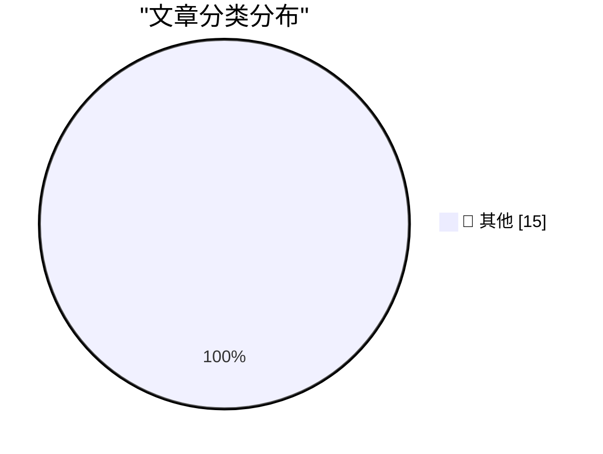

# 📰 AI 博客每日精选 — 2026-03-18

> 来自 Karpathy 推荐的 92 个顶级技术博客，AI 精选 Top 15

## 🏆 今日必读

🥇 **Quoting Ken Jin**

[Quoting Ken Jin](https://simonwillison.net/2026/Mar/17/ken-jin/#atom-everything) — simonwillison.net · 14 小时前 · 📝 其他

> Quoting Ken Jin

🥈 **GPT-5.4 mini and GPT-5.4 nano, which can describe 76,000 photos for $52**

[GPT-5.4 mini and GPT-5.4 nano, which can describe 76,000 photos for $52](https://simonwillison.net/2026/Mar/17/mini-and-nano/#atom-everything) — simonwillison.net · 16 小时前 · 📝 其他

> GPT-5.4 mini and GPT-5.4 nano, which can describe 76,000 photos for $52

🥉 **Quoting Tim Schilling**

[Quoting Tim Schilling](https://simonwillison.net/2026/Mar/17/tim-schilling/#atom-everything) — simonwillison.net · 19 小时前 · 📝 其他

> Quoting Tim Schilling

---

## 📊 数据概览

| 扫描源 | 抓取文章 | 时间范围 | 精选 |
|:---:|:---:|:---:|:---:|
| 84/92 | 2433 篇 → 41 篇 | 48h | **15 篇** |

### 分类分布

---

## 📝 其他

### 1. Quoting Ken Jin

[Quoting Ken Jin](https://simonwillison.net/2026/Mar/17/ken-jin/#atom-everything) — **simonwillison.net** · 14 小时前 · ⭐ 15/30

> Quoting Ken Jin

---

### 2. GPT-5.4 mini and GPT-5.4 nano, which can describe 76,000 photos for $52

[GPT-5.4 mini and GPT-5.4 nano, which can describe 76,000 photos for $52](https://simonwillison.net/2026/Mar/17/mini-and-nano/#atom-everything) — **simonwillison.net** · 16 小时前 · ⭐ 15/30

> GPT-5.4 mini and GPT-5.4 nano, which can describe 76,000 photos for $52

---

### 3. Quoting Tim Schilling

[Quoting Tim Schilling](https://simonwillison.net/2026/Mar/17/tim-schilling/#atom-everything) — **simonwillison.net** · 19 小时前 · ⭐ 15/30

> Quoting Tim Schilling

---

### 4. Subagents

[Subagents](https://simonwillison.net/guides/agentic-engineering-patterns/subagents/#atom-everything) — **simonwillison.net** · 23 小时前 · ⭐ 15/30

> Subagents

---

### 5. Introducing Mistral Small 4

[Introducing Mistral Small 4](https://simonwillison.net/2026/Mar/16/mistral-small-4/#atom-everything) — **simonwillison.net** · 1 天前 · ⭐ 15/30

> Introducing Mistral Small 4

---

### 6. Use subagents and custom agents in Codex

[Use subagents and custom agents in Codex](https://simonwillison.net/2026/Mar/16/codex-subagents/#atom-everything) — **simonwillison.net** · 1 天前 · ⭐ 15/30

> Use subagents and custom agents in Codex

---

### 7. Quoting A member of Anthropic’s alignment-science team

[Quoting A member of Anthropic’s alignment-science team](https://simonwillison.net/2026/Mar/16/blackmail/#atom-everything) — **simonwillison.net** · 1 天前 · ⭐ 15/30

> Quoting A member of Anthropic’s alignment-science team

---

### 8. Quoting Guilherme Rambo

[Quoting Guilherme Rambo](https://simonwillison.net/2026/Mar/16/guilherme-rambo/#atom-everything) — **simonwillison.net** · 1 天前 · ⭐ 15/30

> Quoting Guilherme Rambo

---

### 9. Coding agents for data analysis

[Coding agents for data analysis](https://simonwillison.net/2026/Mar/16/coding-agents-for-data-analysis/#atom-everything) — **simonwillison.net** · 1 天前 · ⭐ 15/30

> Coding agents for data analysis

---

### 10. How coding agents work

[How coding agents work](https://simonwillison.net/guides/agentic-engineering-patterns/how-coding-agents-work/#atom-everything) — **simonwillison.net** · 1 天前 · ⭐ 15/30

> How coding agents work

---

### 11. ★ Squashing

[★ Squashing](https://daringfireball.net/2026/03/squashing) — **daringfireball.net** · 12 小时前 · ⭐ 15/30

> ★ Squashing

---

### 12. Fox Sports to Broadcast U.S.-Venezuela World Baseball Classic Final in Immersive 3D — But Not on Vision Pro

[Fox Sports to Broadcast U.S.-Venezuela World Baseball Classic Final in Immersive 3D — But Not on Vision Pro](https://x.com/mlbonfox/status/2033902946174271992?s=46) — **daringfireball.net** · 16 小时前 · ⭐ 15/30

> Fox Sports to Broadcast U.S.-Venezuela World Baseball Classic Final in Immersive 3D — But Not on Vision Pro

---

### 13. Samsung Discontinues Its Galaxy Z TriFold After Just Three Months

[Samsung Discontinues Its Galaxy Z TriFold After Just Three Months](https://www.theverge.com/tech/895879/samsung-galaxy-z-trifold-discontinued-stock-sold-out) — **daringfireball.net** · 22 小时前 · ⭐ 15/30

> Samsung Discontinues Its Galaxy Z TriFold After Just Three Months

---

### 14. Lil Finder Guy Wallpapers

[Lil Finder Guy Wallpapers](https://512pixels.net/2026/03/lil-finder-5k-wallpapers/) — **daringfireball.net** · 22 小时前 · ⭐ 15/30

> Lil Finder Guy Wallpapers

---

### 15. [Sponsor] Mux — Video API for Developers

[[Sponsor] Mux — Video API for Developers](https://www.mux.com/?utm_campaign=fireball&amp;utm_source=DF) — **daringfireball.net** · 1 天前 · ⭐ 15/30

> [Sponsor] Mux — Video API for Developers

---

*生成于 2026-03-18 12:03 | 扫描 84 源 → 获取 2433 篇 → 精选 15 篇*
*基于 [Hacker News Popularity Contest 2025](https://refactoringenglish.com/tools/hn-popularity/) RSS 源列表，由 [Andrej Karpathy](https://x.com/karpathy) 推荐*
*由「懂点儿AI」制作，欢迎关注同名微信公众号获取更多 AI 实用技巧 💡*
