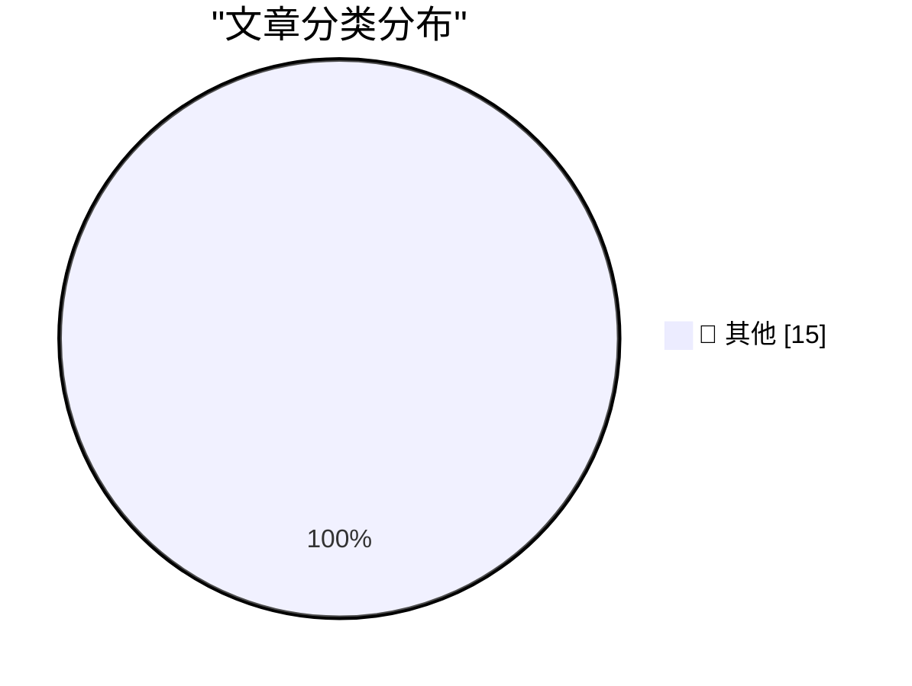

# 📰 AI 博客每日精选 — 2026-03-29

> 来自 Karpathy 推荐的 92 个顶级技术博客，AI 精选 Top 15

## 🏆 今日必读

🥇 **Quoting Matt Webb**

[Quoting Matt Webb](https://simonwillison.net/2026/Mar/28/matt-webb/#atom-everything) — simonwillison.net · 22 小时前 · 📝 其他

> Quoting Matt Webb

🥈 **datasette-showboat 0.1a2**

[datasette-showboat 0.1a2](https://simonwillison.net/2026/Mar/27/datasette-showboat/#atom-everything) — simonwillison.net · 1 天前 · 📝 其他

> datasette-showboat 0.1a2

🥉 **Quoting Richard Fontana**

[Quoting Richard Fontana](https://simonwillison.net/2026/Mar/27/richard-fontana/#atom-everything) — simonwillison.net · 1 天前 · 📝 其他

> Quoting Richard Fontana

---

## 📊 数据概览

| 扫描源 | 抓取文章 | 时间范围 | 精选 |
|:---:|:---:|:---:|:---:|
| 83/92 | 2413 篇 → 33 篇 | 48h | **15 篇** |

### 分类分布

---

## 📝 其他

### 1. Quoting Matt Webb

[Quoting Matt Webb](https://simonwillison.net/2026/Mar/28/matt-webb/#atom-everything) — **simonwillison.net** · 22 小时前 · ⭐ 15/30

> Quoting Matt Webb

---

### 2. datasette-showboat 0.1a2

[datasette-showboat 0.1a2](https://simonwillison.net/2026/Mar/27/datasette-showboat/#atom-everything) — **simonwillison.net** · 1 天前 · ⭐ 15/30

> datasette-showboat 0.1a2

---

### 3. Quoting Richard Fontana

[Quoting Richard Fontana](https://simonwillison.net/2026/Mar/27/richard-fontana/#atom-everything) — **simonwillison.net** · 1 天前 · ⭐ 15/30

> Quoting Richard Fontana

---

### 4. Vibe coding SwiftUI apps is a lot of fun

[Vibe coding SwiftUI apps is a lot of fun](https://simonwillison.net/2026/Mar/27/vibe-coding-swiftui/#atom-everything) — **simonwillison.net** · 1 天前 · ⭐ 15/30

> Vibe coding SwiftUI apps is a lot of fun

---

### 5. Bring back MiniDV with this Raspberry Pi FireWire HAT

[Bring back MiniDV with this Raspberry Pi FireWire HAT](https://www.jeffgeerling.com/blog/2026/minidv-with-raspberry-pi-firewire-hat/) — **jeffgeerling.com** · 1 天前 · ⭐ 15/30

> Bring back MiniDV with this Raspberry Pi FireWire HAT

---

### 6. The 2019 Intel Mac Pro’s Unfortunate Timing

[The 2019 Intel Mac Pro’s Unfortunate Timing](https://512pixels.net/2026/03/how-apple-could-have-saved-the-mac-pro/) — **daringfireball.net** · 10 小时前 · ⭐ 15/30

> The 2019 Intel Mac Pro’s Unfortunate Timing

---

### 7. Apple Should Set and Enforce Some Basic Standards for Custom Video Players on tvOS

[Apple Should Set and Enforce Some Basic Standards for Custom Video Players on tvOS](https://daringfireball.net/2024/03/quickly_toggling_closed_captions_on_apple_tv) — **daringfireball.net** · 10 小时前 · ⭐ 15/30

> Apple Should Set and Enforce Some Basic Standards for Custom Video Players on tvOS

---

### 8. ‘How Apple Became Apple: The Definitive Oral History of the Company’s Earliest Days’

[‘How Apple Became Apple: The Definitive Oral History of the Company’s Earliest Days’](https://www.fastcompany.com/91514404/apple-founding-50th-anniversary-apple-1-apple-ii-jobs-wozniak?mvgt=E5Loo3fO74zl) — **daringfireball.net** · 12 小时前 · ⭐ 15/30

> ‘How Apple Became Apple: The Definitive Oral History of the Company’s Earliest Days’

---

### 9. Netflix Wrecked Their tvOS Video Player

[Netflix Wrecked Their tvOS Video Player](https://www.pocket-lint.com/netflix-just-made-their-app-worse-and-theres-no-way-to-fix-it/) — **daringfireball.net** · 18 小时前 · ⭐ 15/30

> Netflix Wrecked Their tvOS Video Player

---

### 10. Trump Is Putting His Signature on U.S. Currency

[Trump Is Putting His Signature on U.S. Currency](https://www.nytimes.com/2026/03/26/us/politics/trump-signature-us-dollars.html) — **daringfireball.net** · 19 小时前 · ⭐ 15/30

> Trump Is Putting His Signature on U.S. Currency

---

### 11. New York Post: ‘Trump Considers Renaming Strait of Hormuz’

[New York Post: ‘Trump Considers Renaming Strait of Hormuz’](https://nypost.com/2026/03/27/us-news/trump-considers-renaming-strait-of-hormuz-after-either-america-or-himself-once-he-evicts-iran/) — **daringfireball.net** · 19 小时前 · ⭐ 15/30

> New York Post: ‘Trump Considers Renaming Strait of Hormuz’

---

### 12. Business Insider’s Subscriber Spiral

[Business Insider’s Subscriber Spiral](https://www.status.news/p/business-insider-subscription-decline-data) — **daringfireball.net** · 1 天前 · ⭐ 15/30

> Business Insider’s Subscriber Spiral

---

### 13. Apple Says It’s Not Aware of Lockdown Mode Ever Having Been Exploited

[Apple Says It’s Not Aware of Lockdown Mode Ever Having Been Exploited](https://techcrunch.com/2026/03/27/apple-says-no-one-using-lockdown-mode-has-been-hacked-with-spyware/) — **daringfireball.net** · 1 天前 · ⭐ 15/30

> Apple Says It’s Not Aware of Lockdown Mode Ever Having Been Exploited

---

### 14. Apple Announces Ads Are Coming to Apple Maps

[Apple Announces Ads Are Coming to Apple Maps](https://www.apple.com/newsroom/2026/03/introducing-apple-business-a-new-all-in-one-platform-for-businesses-of-all-sizes/) — **daringfireball.net** · 1 天前 · ⭐ 15/30

> Apple Announces Ads Are Coming to Apple Maps

---

### 15. Netflix Raises Prices Again

[Netflix Raises Prices Again](https://variety.com/2026/tv/news/why-netflix-hiked-prices-explained-chart-1236701365/) — **daringfireball.net** · 1 天前 · ⭐ 15/30

> Netflix Raises Prices Again

---

*生成于 2026-03-29 10:23 | 扫描 83 源 → 获取 2413 篇 → 精选 15 篇*
*基于 [Hacker News Popularity Contest 2025](https://refactoringenglish.com/tools/hn-popularity/) RSS 源列表，由 [Andrej Karpathy](https://x.com/karpathy) 推荐*
*由「懂点儿AI」制作，欢迎关注同名微信公众号获取更多 AI 实用技巧 💡*
