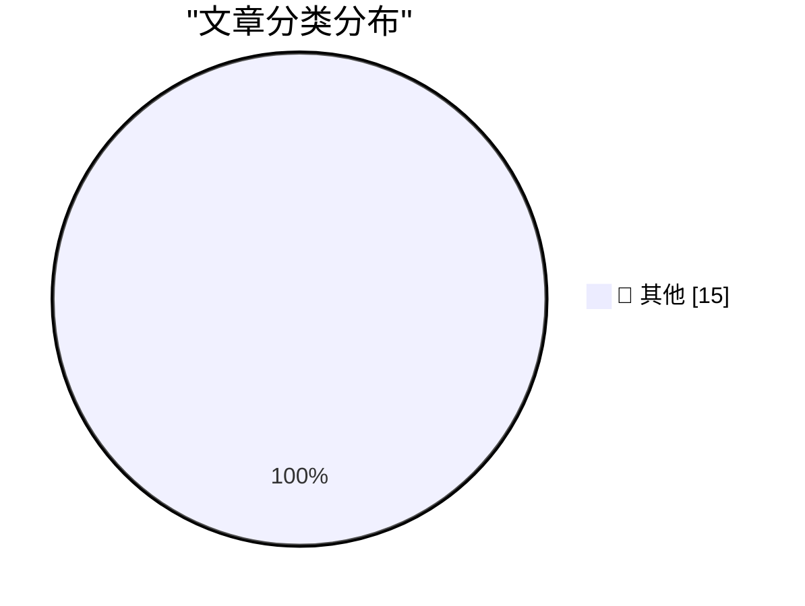

# 📰 AI 博客每日精选 — 2026-03-15

> 来自 Karpathy 推荐的 92 个顶级技术博客，AI 精选 Top 15

## 🏆 今日必读

🥇 **Quoting Jannis Leidel**

[Quoting Jannis Leidel](https://simonwillison.net/2026/Mar/14/jannis-leidel/#atom-everything) — simonwillison.net · 16 小时前 · 📝 其他

> Quoting Jannis Leidel

🥈 **My fireside chat about agentic engineering at the Pragmatic Summit**

[My fireside chat about agentic engineering at the Pragmatic Summit](https://simonwillison.net/2026/Mar/14/pragmatic-summit/#atom-everything) — simonwillison.net · 16 小时前 · 📝 其他

> My fireside chat about agentic engineering at the Pragmatic Summit

🥉 **1M context is now generally available for Opus 4.6 and Sonnet 4.6**

[1M context is now generally available for Opus 4.6 and Sonnet 4.6](https://simonwillison.net/2026/Mar/13/1m-context/#atom-everything) — simonwillison.net · 1 天前 · 📝 其他

> 1M context is now generally available for Opus 4.6 and Sonnet 4.6

---

## 📊 数据概览

| 扫描源 | 抓取文章 | 时间范围 | 精选 |
|:---:|:---:|:---:|:---:|
| 83/92 | 2417 篇 → 34 篇 | 48h | **15 篇** |

### 分类分布

---

## 📝 其他

### 1. Quoting Jannis Leidel

[Quoting Jannis Leidel](https://simonwillison.net/2026/Mar/14/jannis-leidel/#atom-everything) — **simonwillison.net** · 16 小时前 · ⭐ 15/30

> Quoting Jannis Leidel

---

### 2. My fireside chat about agentic engineering at the Pragmatic Summit

[My fireside chat about agentic engineering at the Pragmatic Summit](https://simonwillison.net/2026/Mar/14/pragmatic-summit/#atom-everything) — **simonwillison.net** · 16 小时前 · ⭐ 15/30

> My fireside chat about agentic engineering at the Pragmatic Summit

---

### 3. 1M context is now generally available for Opus 4.6 and Sonnet 4.6

[1M context is now generally available for Opus 4.6 and Sonnet 4.6](https://simonwillison.net/2026/Mar/13/1m-context/#atom-everything) — **simonwillison.net** · 1 天前 · ⭐ 15/30

> 1M context is now generally available for Opus 4.6 and Sonnet 4.6

---

### 4. Quoting Craig Mod

[Quoting Craig Mod](https://simonwillison.net/2026/Mar/13/craig-mod/#atom-everything) — **simonwillison.net** · 1 天前 · ⭐ 15/30

> Quoting Craig Mod

---

### 5. Restoring an Xserve G5: When Apple built real servers

[Restoring an Xserve G5: When Apple built real servers](https://www.jeffgeerling.com/blog/2026/restoring-xserve-g5-apple-server/) — **jeffgeerling.com** · 1 天前 · ⭐ 15/30

> Restoring an Xserve G5: When Apple built real servers

---

### 6. Big tech engineers need big egos

[Big tech engineers need big egos](https://seangoedecke.com/big-tech-needs-big-egos/) — **seangoedecke.com** · 1 天前 · ⭐ 15/30

> Big tech engineers need big egos

---

### 7. Matt Mullenweg Documents a Dastardly Clever Apple Account Phishing Scam

[Matt Mullenweg Documents a Dastardly Clever Apple Account Phishing Scam](https://ma.tt/2026/03/gone-almost-phishin/) — **daringfireball.net** · 10 小时前 · ⭐ 15/30

> Matt Mullenweg Documents a Dastardly Clever Apple Account Phishing Scam

---

### 8. iFixit’s MacBook Neo Teardown

[iFixit’s MacBook Neo Teardown](https://www.ifixit.com/News/116152/macbook-neo-is-the-most-repairable-macbook-in-14-years) — **daringfireball.net** · 12 小时前 · ⭐ 15/30

> iFixit’s MacBook Neo Teardown

---

### 9. PC Makers Are Not Ready for the MacBook Neo

[PC Makers Are Not Ready for the MacBook Neo](https://www.theverge.com/report/894090/macbook-neo-pc-windows-laptop-competition-asus-footinmouth) — **daringfireball.net** · 14 小时前 · ⭐ 15/30

> PC Makers Are Not Ready for the MacBook Neo

---

### 10. Ars Technica Fires Reporter Benj Edwards After He Published Story With AI-Fabricated Quotes

[Ars Technica Fires Reporter Benj Edwards After He Published Story With AI-Fabricated Quotes](https://futurism.com/artificial-intelligence/ars-technica-fires-reporter-ai-quotes) — **daringfireball.net** · 17 小时前 · ⭐ 15/30

> Ars Technica Fires Reporter Benj Edwards After He Published Story With AI-Fabricated Quotes

---

### 11. Lil Finder Guy

[Lil Finder Guy](https://basicappleguy.com/basicappleblog/lil-finder-guy) — **daringfireball.net** · 18 小时前 · ⭐ 15/30

> Lil Finder Guy

---

### 12. Tim Cook: ‘50 Years of Thinking Different’

[Tim Cook: ‘50 Years of Thinking Different’](https://www.apple.com/50-years-of-thinking-different/) — **daringfireball.net** · 1 天前 · ⭐ 15/30

> Tim Cook: ‘50 Years of Thinking Different’

---

### 13. NYT: ‘Meta Delays Rollout of New AI Model After Performance Concerns’

[NYT: ‘Meta Delays Rollout of New AI Model After Performance Concerns’](https://www.nytimes.com/2026/03/12/technology/meta-avocado-ai-model-delayed.html?unlocked_article_code=1.S1A.vI_6.4j717gwtFem0) — **daringfireball.net** · 1 天前 · ⭐ 15/30

> NYT: ‘Meta Delays Rollout of New AI Model After Performance Concerns’

---

### 14. Sports Programming Accounts for Almost 30 Percent of All Ad-Supported TV Viewing

[Sports Programming Accounts for Almost 30 Percent of All Ad-Supported TV Viewing](https://deadline.com/2026/03/sports-tv-viewing-advertising-nielsen-1236750721/) — **daringfireball.net** · 1 天前 · ⭐ 15/30

> Sports Programming Accounts for Almost 30 Percent of All Ad-Supported TV Viewing

---

### 15. Claim Chowder: Anthropic CEO Dario Amodei on the Percentage of Code Being Generated by AI Today

[Claim Chowder: Anthropic CEO Dario Amodei on the Percentage of Code Being Generated by AI Today](https://www.businessinsider.com/anthropic-ceo-ai-90-percent-code-3-to-6-months-2025-3) — **daringfireball.net** · 1 天前 · ⭐ 15/30

> Claim Chowder: Anthropic CEO Dario Amodei on the Percentage of Code Being Generated by AI Today

---

*生成于 2026-03-15 11:01 | 扫描 83 源 → 获取 2417 篇 → 精选 15 篇*
*基于 [Hacker News Popularity Contest 2025](https://refactoringenglish.com/tools/hn-popularity/) RSS 源列表，由 [Andrej Karpathy](https://x.com/karpathy) 推荐*
*由「懂点儿AI」制作，欢迎关注同名微信公众号获取更多 AI 实用技巧 💡*
