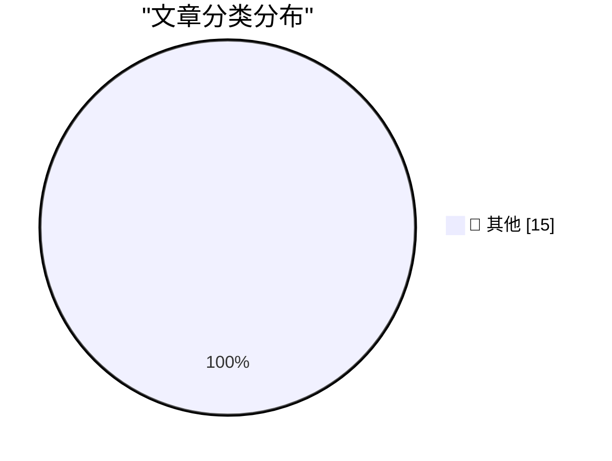

# 📰 AI 博客每日精选 — 2026-03-24

> 来自 Karpathy 推荐的 92 个顶级技术博客，AI 精选 Top 15

## 🏆 今日必读

🥇 **Streaming experts**

[Streaming experts](https://simonwillison.net/2026/Mar/24/streaming-experts/#atom-everything) — simonwillison.net · 6 小时前 · 📝 其他

> Streaming experts

🥈 **Quoting Neurotica**

[Quoting Neurotica](https://simonwillison.net/2026/Mar/23/neurotica/#atom-everything) — simonwillison.net · 12 小时前 · 📝 其他

> Quoting Neurotica

🥉 **datasette-files 0.1a2**

[datasette-files 0.1a2](https://simonwillison.net/2026/Mar/23/datasette-files/#atom-everything) — simonwillison.net · 12 小时前 · 📝 其他

> datasette-files 0.1a2

---

## 📊 数据概览

| 扫描源 | 抓取文章 | 时间范围 | 精选 |
|:---:|:---:|:---:|:---:|
| 82/92 | 2406 篇 → 40 篇 | 48h | **15 篇** |

### 分类分布

---

## 📝 其他

### 1. Streaming experts

[Streaming experts](https://simonwillison.net/2026/Mar/24/streaming-experts/#atom-everything) — **simonwillison.net** · 6 小时前 · ⭐ 15/30

> Streaming experts

---

### 2. Quoting Neurotica

[Quoting Neurotica](https://simonwillison.net/2026/Mar/23/neurotica/#atom-everything) — **simonwillison.net** · 12 小时前 · ⭐ 15/30

> Quoting Neurotica

---

### 3. datasette-files 0.1a2

[datasette-files 0.1a2](https://simonwillison.net/2026/Mar/23/datasette-files/#atom-everything) — **simonwillison.net** · 12 小时前 · ⭐ 15/30

> datasette-files 0.1a2

---

### 4. Quoting David Abram

[Quoting David Abram](https://simonwillison.net/2026/Mar/23/david-abram/#atom-everything) — **simonwillison.net** · 17 小时前 · ⭐ 15/30

> Quoting David Abram

---

### 5. Beats now have notes

[Beats now have notes](https://simonwillison.net/2026/Mar/23/beats-now-have-notes/#atom-everything) — **simonwillison.net** · 1 天前 · ⭐ 15/30

> Beats now have notes

---

### 6. Starlette 1.0 skill

[Starlette 1.0 skill](https://simonwillison.net/2026/Mar/23/starlette-1-skill/#atom-everything) — **simonwillison.net** · 1 天前 · ⭐ 15/30

> Starlette 1.0 skill

---

### 7. Experimenting with Starlette 1.0 with Claude skills

[Experimenting with Starlette 1.0 with Claude skills](https://simonwillison.net/2026/Mar/22/starlette/#atom-everything) — **simonwillison.net** · 1 天前 · ⭐ 15/30

> Experimenting with Starlette 1.0 with Claude skills

---

### 8. PCGamer Article Performance Audit

[PCGamer Article Performance Audit](https://simonwillison.net/2026/Mar/22/pcgamer-audit/#atom-everything) — **simonwillison.net** · 1 天前 · ⭐ 15/30

> PCGamer Article Performance Audit

---

### 9. JavaScript Sandboxing Research

[JavaScript Sandboxing Research](https://simonwillison.net/2026/Mar/22/javascript-sandboxing-research/#atom-everything) — **simonwillison.net** · 1 天前 · ⭐ 15/30

> JavaScript Sandboxing Research

---

### 10. DNS Lookup

[DNS Lookup](https://simonwillison.net/2026/Mar/22/dns/#atom-everything) — **simonwillison.net** · 1 天前 · ⭐ 15/30

> DNS Lookup

---

### 11. Merge State Visualizer

[Merge State Visualizer](https://simonwillison.net/2026/Mar/22/manyana/#atom-everything) — **simonwillison.net** · 1 天前 · ⭐ 15/30

> Merge State Visualizer

---

### 12. ‘CanisterWorm’ Springs Wiper Attack Targeting Iran

[‘CanisterWorm’ Springs Wiper Attack Targeting Iran](https://krebsonsecurity.com/2026/03/canisterworm-springs-wiper-attack-targeting-iran/) — **krebsonsecurity.com** · 20 小时前 · ⭐ 15/30

> ‘CanisterWorm’ Springs Wiper Attack Targeting Iran

---

### 13. [Sponsor] npx workos: From Auth Integration to Environment Management, Zero ClickOps

[[Sponsor] npx workos: From Auth Integration to Environment Management, Zero ClickOps](https://workos.com/docs/authkit/cli-installer?utm_source=daringfireball&amp;utm_medium=newsletter&amp;utm_campaign=q12026) — **daringfireball.net** · 11 小时前 · ⭐ 15/30

> [Sponsor] npx workos: From Auth Integration to Environment Management, Zero ClickOps

---

### 14. Gasoline Prices Around the World

[Gasoline Prices Around the World](https://www.globalpetrolprices.com/gasoline_prices/) — **daringfireball.net** · 15 小时前 · ⭐ 15/30

> Gasoline Prices Around the World

---

### 15. WWDC 2026: June 8–12

[WWDC 2026: June 8–12](https://www.apple.com/newsroom/2026/03/apples-worldwide-developers-conference-returns-the-week-of-june-8/) — **daringfireball.net** · 17 小时前 · ⭐ 15/30

> WWDC 2026: June 8–12

---

*生成于 2026-03-24 12:00 | 扫描 82 源 → 获取 2406 篇 → 精选 15 篇*
*基于 [Hacker News Popularity Contest 2025](https://refactoringenglish.com/tools/hn-popularity/) RSS 源列表，由 [Andrej Karpathy](https://x.com/karpathy) 推荐*
*由「懂点儿AI」制作，欢迎关注同名微信公众号获取更多 AI 实用技巧 💡*
