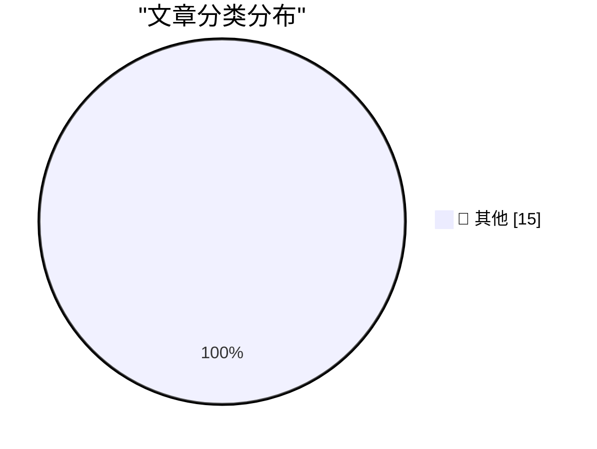

# 📰 AI 博客每日精选 — 2026-02-23

> 来自 Karpathy 推荐的 92 个顶级技术博客，AI 精选 Top 15

## 🏆 今日必读

🥇 **Red/green TDD**

[Red/green TDD](https://simonwillison.net/guides/agentic-engineering-patterns/red-green-tdd/#atom-everything) — simonwillison.net · 4 小时前 · 📝 其他

> Red/green TDD

🥈 **The Claude C Compiler: What It Reveals About the Future of Software**

[The Claude C Compiler: What It Reveals About the Future of Software](https://simonwillison.net/2026/Feb/22/ccc/#atom-everything) — simonwillison.net · 11 小时前 · 📝 其他

> The Claude C Compiler: What It Reveals About the Future of Software

🥉 **London Stock Exchange: Raspberry Pi Holdings plc**

[London Stock Exchange: Raspberry Pi Holdings plc](https://simonwillison.net/2026/Feb/22/raspberry-pi-openclaw/#atom-everything) — simonwillison.net · 12 小时前 · 📝 其他

> London Stock Exchange: Raspberry Pi Holdings plc

---

## 📊 数据概览

| 扫描源 | 抓取文章 | 时间范围 | 精选 |
|:---:|:---:|:---:|:---:|
| 83/92 | 2390 篇 → 22 篇 | 48h | **15 篇** |

### 分类分布

---

## 📝 其他

### 1. Red/green TDD

[Red/green TDD](https://simonwillison.net/guides/agentic-engineering-patterns/red-green-tdd/#atom-everything) — **simonwillison.net** · 4 小时前 · ⭐ 15/30

> Red/green TDD

---

### 2. The Claude C Compiler: What It Reveals About the Future of Software

[The Claude C Compiler: What It Reveals About the Future of Software](https://simonwillison.net/2026/Feb/22/ccc/#atom-everything) — **simonwillison.net** · 11 小时前 · ⭐ 15/30

> The Claude C Compiler: What It Reveals About the Future of Software

---

### 3. London Stock Exchange: Raspberry Pi Holdings plc

[London Stock Exchange: Raspberry Pi Holdings plc](https://simonwillison.net/2026/Feb/22/raspberry-pi-openclaw/#atom-everything) — **simonwillison.net** · 12 小时前 · ⭐ 15/30

> London Stock Exchange: Raspberry Pi Holdings plc

---

### 4. How I think about Codex

[How I think about Codex](https://simonwillison.net/2026/Feb/22/how-i-think-about-codex/#atom-everything) — **simonwillison.net** · 20 小时前 · ⭐ 15/30

> How I think about Codex

---

### 5. Insider amnesia

[Insider amnesia](https://seangoedecke.com/insider-amnesia/) — **seangoedecke.com** · 11 小时前 · ⭐ 15/30

> Insider amnesia

---

### 6. Sentry

[Sentry](https://sentry.io/resources/ios-workshop-jan-2026/?utm_source=daringfireball&amp;utm_medium=paid-display&amp;utm_campaign=general-fy27q1-evergreen&amp;utm_content=static-ad-mobilerss-trysentry) — **daringfireball.net** · 14 小时前 · ⭐ 15/30

> Sentry

---

### 7. Nvidia was only invited to invest

[Nvidia was only invited to invest](https://idiallo.com/byte-size/nvidia-was-only-invited-to-invest?src=feed) — **idiallo.com** · 1 天前 · ⭐ 15/30

> Nvidia was only invited to invest

---

### 8. Pluralistic: Deplatform yourself (23 Feb 2026)

[Pluralistic: Deplatform yourself (23 Feb 2026)](https://pluralistic.net/2026/02/23/goodharts-lawbreaker/) — **pluralistic.net** · 1 小时前 · ⭐ 15/30

> Pluralistic: Deplatform yourself (23 Feb 2026)

---

### 9. How close are we to a vision for 2010?

[How close are we to a vision for 2010?](https://shkspr.mobi/blog/2026/02/how-close-are-we-to-a-vision-for-2010/) — **shkspr.mobi** · 23 小时前 · ⭐ 15/30

> How close are we to a vision for 2010?

---

### 10. OpenBenches at FOSDEM

[OpenBenches at FOSDEM](https://shkspr.mobi/blog/2026/02/openbenches-at-fosdem/) — **shkspr.mobi** · 1 天前 · ⭐ 15/30

> OpenBenches at FOSDEM

---

### 11. Bitcoin mining difficulty

[Bitcoin mining difficulty](https://www.johndcook.com/blog/2026/02/22/bitcoin-mining-difficulty/) — **johndcook.com** · 16 小时前 · ⭐ 15/30

> Bitcoin mining difficulty

---

### 12. Exahash, Zettahash, Yottahash

[Exahash, Zettahash, Yottahash](https://www.johndcook.com/blog/2026/02/22/zettahash/) — **johndcook.com** · 17 小时前 · ⭐ 15/30

> Exahash, Zettahash, Yottahash

---

### 13. 10,000,000th Fibonacci number

[10,000,000th Fibonacci number](https://www.johndcook.com/blog/2026/02/21/f10000000/) — **johndcook.com** · 1 天前 · ⭐ 15/30

> 10,000,000th Fibonacci number

---

### 14. Computing big, certified Fibonacci numbers

[Computing big, certified Fibonacci numbers](https://www.johndcook.com/blog/2026/02/21/big-certified-fibonacci/) — **johndcook.com** · 1 天前 · ⭐ 15/30

> Computing big, certified Fibonacci numbers

---

### 15. The Orality Theory of Everything

[The Orality Theory of Everything](https://www.theatlantic.com/ideas/2026/02/social-media-literacy-crisis/686076/?utm_source=feed) — **derekthompson.org** · 23 小时前 · ⭐ 15/30

> The Orality Theory of Everything

---

*生成于 2026-02-23 11:57 | 扫描 83 源 → 获取 2390 篇 → 精选 15 篇*
*基于 [Hacker News Popularity Contest 2025](https://refactoringenglish.com/tools/hn-popularity/) RSS 源列表，由 [Andrej Karpathy](https://x.com/karpathy) 推荐*
*由「懂点儿AI」制作，欢迎关注同名微信公众号获取更多 AI 实用技巧 💡*
