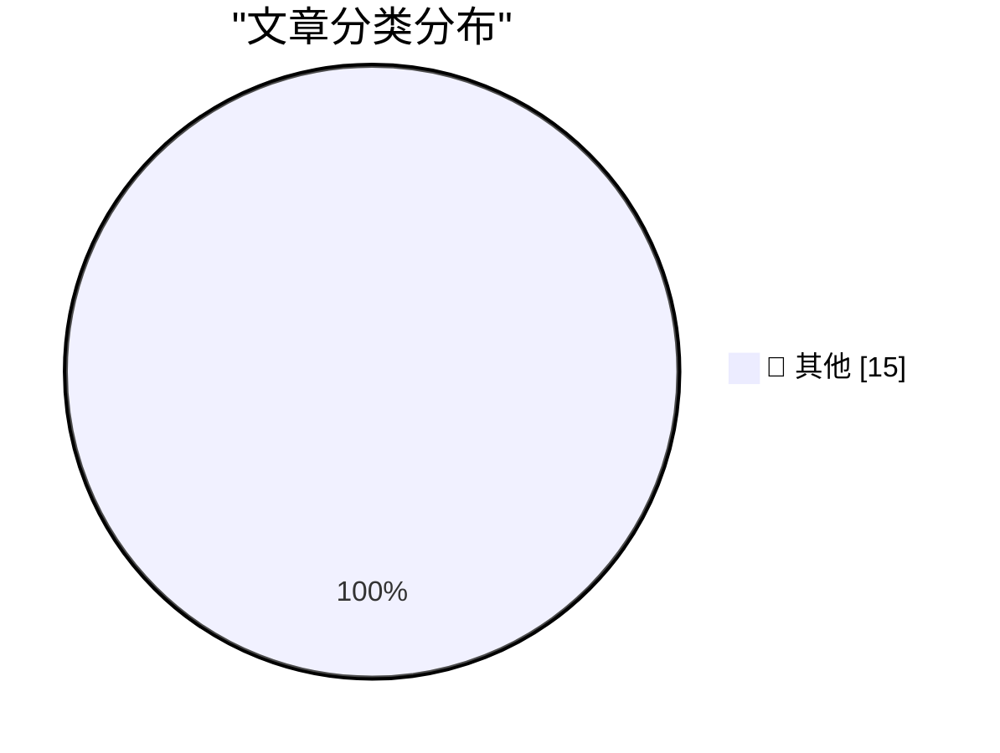

# 📰 AI 博客每日精选 — 2026-03-14

> 来自 Karpathy 推荐的 92 个顶级技术博客，AI 精选 Top 15

## 🏆 今日必读

🥇 **1M context is now generally available for Opus 4.6 and Sonnet 4.6**

[1M context is now generally available for Opus 4.6 and Sonnet 4.6](https://simonwillison.net/2026/Mar/13/1m-context/#atom-everything) — simonwillison.net · 16 小时前 · 📝 其他

> 1M context is now generally available for Opus 4.6 and Sonnet 4.6

🥈 **Quoting Craig Mod**

[Quoting Craig Mod](https://simonwillison.net/2026/Mar/13/craig-mod/#atom-everything) — simonwillison.net · 17 小时前 · 📝 其他

> Quoting Craig Mod

🥉 **Shopify/liquid: Performance: 53% faster parse+render, 61% fewer allocations**

[Shopify/liquid: Performance: 53% faster parse+render, 61% fewer allocations](https://simonwillison.net/2026/Mar/13/liquid/#atom-everything) — simonwillison.net · 1 天前 · 📝 其他

> Shopify/liquid: Performance: 53% faster parse+render, 61% fewer allocations

---

## 📊 数据概览

| 扫描源 | 抓取文章 | 时间范围 | 精选 |
|:---:|:---:|:---:|:---:|
| 84/92 | 2429 篇 → 42 篇 | 48h | **15 篇** |

### 分类分布

---

## 📝 其他

### 1. 1M context is now generally available for Opus 4.6 and Sonnet 4.6

[1M context is now generally available for Opus 4.6 and Sonnet 4.6](https://simonwillison.net/2026/Mar/13/1m-context/#atom-everything) — **simonwillison.net** · 16 小时前 · ⭐ 15/30

> 1M context is now generally available for Opus 4.6 and Sonnet 4.6

---

### 2. Quoting Craig Mod

[Quoting Craig Mod](https://simonwillison.net/2026/Mar/13/craig-mod/#atom-everything) — **simonwillison.net** · 17 小时前 · ⭐ 15/30

> Quoting Craig Mod

---

### 3. Shopify/liquid: Performance: 53% faster parse+render, 61% fewer allocations

[Shopify/liquid: Performance: 53% faster parse+render, 61% fewer allocations](https://simonwillison.net/2026/Mar/13/liquid/#atom-everything) — **simonwillison.net** · 1 天前 · ⭐ 15/30

> Shopify/liquid: Performance: 53% faster parse+render, 61% fewer allocations

---

### 4. MALUS - Clean Room as a Service

[MALUS - Clean Room as a Service](https://simonwillison.net/2026/Mar/12/malus/#atom-everything) — **simonwillison.net** · 1 天前 · ⭐ 15/30

> MALUS - Clean Room as a Service

---

### 5. Coding After Coders: The End of Computer Programming as We Know It

[Coding After Coders: The End of Computer Programming as We Know It](https://simonwillison.net/2026/Mar/12/coding-after-coders/#atom-everything) — **simonwillison.net** · 1 天前 · ⭐ 15/30

> Coding After Coders: The End of Computer Programming as We Know It

---

### 6. Quoting Les Orchard

[Quoting Les Orchard](https://simonwillison.net/2026/Mar/12/les-orchard/#atom-everything) — **simonwillison.net** · 1 天前 · ⭐ 15/30

> Quoting Les Orchard

---

### 7. Restoring an Xserve G5: When Apple built real servers

[Restoring an Xserve G5: When Apple built real servers](https://www.jeffgeerling.com/blog/2026/restoring-xserve-g5-apple-server/) — **jeffgeerling.com** · 20 小时前 · ⭐ 15/30

> Restoring an Xserve G5: When Apple built real servers

---

### 8. Can the MacBook Neo replace my M4 Air?

[Can the MacBook Neo replace my M4 Air?](https://www.jeffgeerling.com/blog/2026/macbook-neo-replace-m4-air/) — **jeffgeerling.com** · 1 天前 · ⭐ 15/30

> Can the MacBook Neo replace my M4 Air?

---

### 9. Big tech engineers need big egos

[Big tech engineers need big egos](https://seangoedecke.com/big-tech-needs-big-egos/) — **seangoedecke.com** · 10 小时前 · ⭐ 15/30

> Big tech engineers need big egos

---

### 10. Tim Cook: ‘50 Years of Thinking Different’

[Tim Cook: ‘50 Years of Thinking Different’](https://www.apple.com/50-years-of-thinking-different/) — **daringfireball.net** · 11 小时前 · ⭐ 15/30

> Tim Cook: ‘50 Years of Thinking Different’

---

### 11. NYT: ‘Meta Delays Rollout of New AI Model After Performance Concerns’

[NYT: ‘Meta Delays Rollout of New AI Model After Performance Concerns’](https://www.nytimes.com/2026/03/12/technology/meta-avocado-ai-model-delayed.html?unlocked_article_code=1.S1A.vI_6.4j717gwtFem0) — **daringfireball.net** · 17 小时前 · ⭐ 15/30

> NYT: ‘Meta Delays Rollout of New AI Model After Performance Concerns’

---

### 12. Sports Programming Accounts for Almost 30 Percent of All Ad-Supported TV Viewing

[Sports Programming Accounts for Almost 30 Percent of All Ad-Supported TV Viewing](https://deadline.com/2026/03/sports-tv-viewing-advertising-nielsen-1236750721/) — **daringfireball.net** · 18 小时前 · ⭐ 15/30

> Sports Programming Accounts for Almost 30 Percent of All Ad-Supported TV Viewing

---

### 13. Claim Chowder: Anthropic CEO Dario Amodei on the Percentage of Code Being Generated by AI Today

[Claim Chowder: Anthropic CEO Dario Amodei on the Percentage of Code Being Generated by AI Today](https://www.businessinsider.com/anthropic-ceo-ai-90-percent-code-3-to-6-months-2025-3) — **daringfireball.net** · 18 小时前 · ⭐ 15/30

> Claim Chowder: Anthropic CEO Dario Amodei on the Percentage of Code Being Generated by AI Today

---

### 14. ‘Software Bonkers’

[‘Software Bonkers’](https://craigmod.com/essays/software_bonkers/) — **daringfireball.net** · 20 小时前 · ⭐ 15/30

> ‘Software Bonkers’

---

### 15. ‘Grief and the AI Split’

[‘Grief and the AI Split’](https://blog.lmorchard.com/2026/03/11/grief-and-the-ai-split/) — **daringfireball.net** · 20 小时前 · ⭐ 15/30

> ‘Grief and the AI Split’

---

*生成于 2026-03-14 10:59 | 扫描 84 源 → 获取 2429 篇 → 精选 15 篇*
*基于 [Hacker News Popularity Contest 2025](https://refactoringenglish.com/tools/hn-popularity/) RSS 源列表，由 [Andrej Karpathy](https://x.com/karpathy) 推荐*
*由「懂点儿AI」制作，欢迎关注同名微信公众号获取更多 AI 实用技巧 💡*
