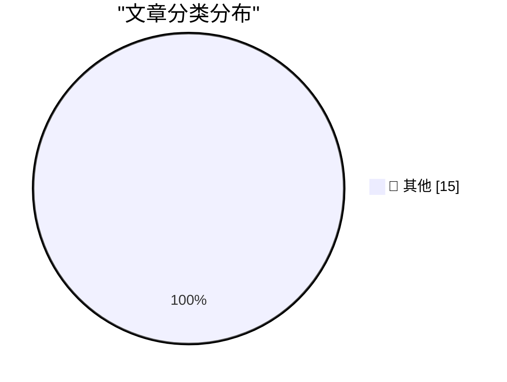

# 📰 AI 博客每日精选 — 2026-03-30

> 来自 Karpathy 推荐的 92 个顶级技术博客，AI 精选 Top 15

## 🏆 今日必读

🥇 **Pretext**

[Pretext](https://simonwillison.net/2026/Mar/29/pretext/#atom-everything) — simonwillison.net · 14 小时前 · 📝 其他

> Pretext

🥈 **Pretext — Under the Hood**

[Pretext — Under the Hood](https://simonwillison.net/2026/Mar/29/pretext-explainer/#atom-everything) — simonwillison.net · 14 小时前 · 📝 其他

> Pretext — Under the Hood

🥉 **Python Vulnerability Lookup**

[Python Vulnerability Lookup](https://simonwillison.net/2026/Mar/29/python-vulnerability-lookup/#atom-everything) — simonwillison.net · 16 小时前 · 📝 其他

> Python Vulnerability Lookup

---

## 📊 数据概览

| 扫描源 | 抓取文章 | 时间范围 | 精选 |
|:---:|:---:|:---:|:---:|
| 82/92 | 2401 篇 → 24 篇 | 48h | **15 篇** |

### 分类分布

---

## 📝 其他

### 1. Pretext

[Pretext](https://simonwillison.net/2026/Mar/29/pretext/#atom-everything) — **simonwillison.net** · 14 小时前 · ⭐ 15/30

> Pretext

---

### 2. Pretext — Under the Hood

[Pretext — Under the Hood](https://simonwillison.net/2026/Mar/29/pretext-explainer/#atom-everything) — **simonwillison.net** · 14 小时前 · ⭐ 15/30

> Pretext — Under the Hood

---

### 3. Python Vulnerability Lookup

[Python Vulnerability Lookup](https://simonwillison.net/2026/Mar/29/python-vulnerability-lookup/#atom-everything) — **simonwillison.net** · 16 小时前 · ⭐ 15/30

> Python Vulnerability Lookup

---

### 4. Quoting Matt Webb

[Quoting Matt Webb](https://simonwillison.net/2026/Mar/28/matt-webb/#atom-everything) — **simonwillison.net** · 1 天前 · ⭐ 15/30

> Quoting Matt Webb

---

### 5. WorkOS

[WorkOS](https://workos.com/docs/authkit/cli-installer?utm_source=daringfireball&amp;utm_medium=newsletter&amp;utm_campaign=q12026) — **daringfireball.net** · 14 小时前 · ⭐ 15/30

> WorkOS

---

### 6. The Talk Show: ‘You’re Going to Have the Niggles’

[The Talk Show: ‘You’re Going to Have the Niggles’](https://daringfireball.net/thetalkshow/2026/03/29/ep-444) — **daringfireball.net** · 14 小时前 · ⭐ 15/30

> The Talk Show: ‘You’re Going to Have the Niggles’

---

### 7. Version History: ‘The Macintosh’

[Version History: ‘The Macintosh’](https://www.theverge.com/podcast/903068/macintosh-1984-version-history) — **daringfireball.net** · 14 小时前 · ⭐ 15/30

> Version History: ‘The Macintosh’

---

### 8. The Verge: ‘Rank the Best Apple Products From the Last 50 Years’

[The Verge: ‘Rank the Best Apple Products From the Last 50 Years’](https://www.theverge.com/cs/tech/900477/apple-50-anniversary-rank-products) — **daringfireball.net** · 14 小时前 · ⭐ 15/30

> The Verge: ‘Rank the Best Apple Products From the Last 50 Years’

---

### 9. The 2019 Intel Mac Pro’s Unfortunate Timing

[The 2019 Intel Mac Pro’s Unfortunate Timing](https://512pixels.net/2026/03/how-apple-could-have-saved-the-mac-pro/) — **daringfireball.net** · 1 天前 · ⭐ 15/30

> The 2019 Intel Mac Pro’s Unfortunate Timing

---

### 10. Apple Should Set and Enforce Some Basic Standards for Custom Video Players on tvOS

[Apple Should Set and Enforce Some Basic Standards for Custom Video Players on tvOS](https://daringfireball.net/2024/03/quickly_toggling_closed_captions_on_apple_tv) — **daringfireball.net** · 1 天前 · ⭐ 15/30

> Apple Should Set and Enforce Some Basic Standards for Custom Video Players on tvOS

---

### 11. ‘How Apple Became Apple: The Definitive Oral History of the Company’s Earliest Days’

[‘How Apple Became Apple: The Definitive Oral History of the Company’s Earliest Days’](https://www.fastcompany.com/91514404/apple-founding-50th-anniversary-apple-1-apple-ii-jobs-wozniak?mvgt=E5Loo3fO74zl) — **daringfireball.net** · 1 天前 · ⭐ 15/30

> ‘How Apple Became Apple: The Definitive Oral History of the Company’s Earliest Days’

---

### 12. Netflix Wrecked Their tvOS Video Player

[Netflix Wrecked Their tvOS Video Player](https://www.pocket-lint.com/netflix-just-made-their-app-worse-and-theres-no-way-to-fix-it/) — **daringfireball.net** · 1 天前 · ⭐ 15/30

> Netflix Wrecked Their tvOS Video Player

---

### 13. Trump Is Putting His Signature on U.S. Currency

[Trump Is Putting His Signature on U.S. Currency](https://www.nytimes.com/2026/03/26/us/politics/trump-signature-us-dollars.html) — **daringfireball.net** · 1 天前 · ⭐ 15/30

> Trump Is Putting His Signature on U.S. Currency

---

### 14. New York Post: ‘Trump Considers Renaming Strait of Hormuz’

[New York Post: ‘Trump Considers Renaming Strait of Hormuz’](https://nypost.com/2026/03/27/us-news/trump-considers-renaming-strait-of-hormuz-after-either-america-or-himself-once-he-evicts-iran/) — **daringfireball.net** · 1 天前 · ⭐ 15/30

> New York Post: ‘Trump Considers Renaming Strait of Hormuz’

---

### 15. OpenBenches hits 40k

[OpenBenches hits 40k](https://shkspr.mobi/blog/2026/03/openbenches-hits-40k/) — **shkspr.mobi** · 1 天前 · ⭐ 15/30

> OpenBenches hits 40k

---

*生成于 2026-03-30 10:53 | 扫描 82 源 → 获取 2401 篇 → 精选 15 篇*
*基于 [Hacker News Popularity Contest 2025](https://refactoringenglish.com/tools/hn-popularity/) RSS 源列表，由 [Andrej Karpathy](https://x.com/karpathy) 推荐*
*由「懂点儿AI」制作，欢迎关注同名微信公众号获取更多 AI 实用技巧 💡*
