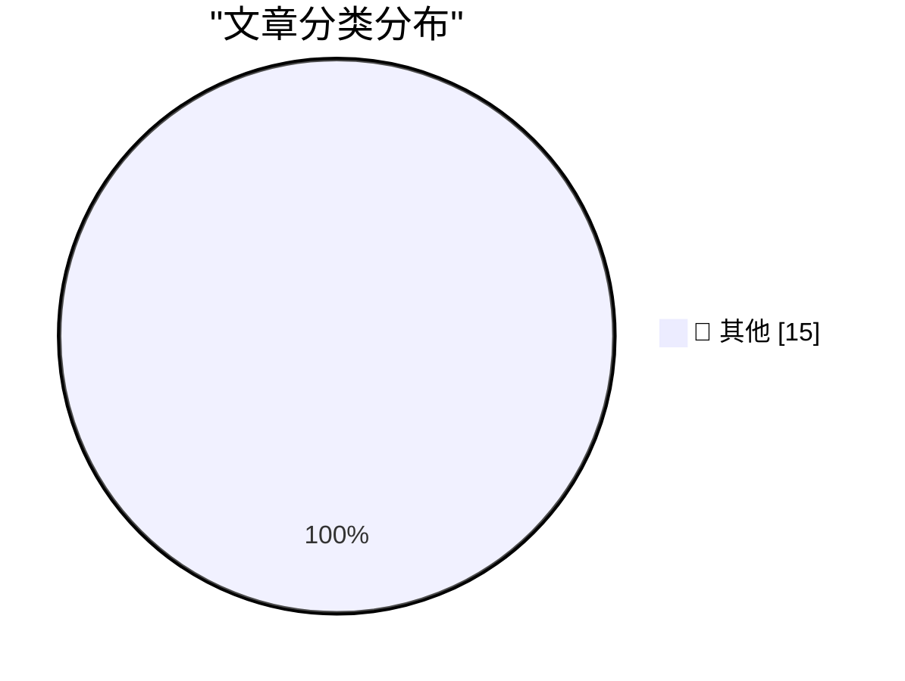

# 📰 AI 博客每日精选 — 2026-03-17

> 来自 Karpathy 推荐的 92 个顶级技术博客，AI 精选 Top 15

## 🏆 今日必读

🥇 **Introducing Mistral Small 4**

[Introducing Mistral Small 4](https://simonwillison.net/2026/Mar/16/mistral-small-4/#atom-everything) — simonwillison.net · 12 小时前 · 📝 其他

> Introducing Mistral Small 4

🥈 **Use subagents and custom agents in Codex**

[Use subagents and custom agents in Codex](https://simonwillison.net/2026/Mar/16/codex-subagents/#atom-everything) — simonwillison.net · 12 小时前 · 📝 其他

> Use subagents and custom agents in Codex

🥉 **Quoting A member of Anthropic’s alignment-science team**

[Quoting A member of Anthropic’s alignment-science team](https://simonwillison.net/2026/Mar/16/blackmail/#atom-everything) — simonwillison.net · 14 小时前 · 📝 其他

> Quoting A member of Anthropic’s alignment-science team

---

## 📊 数据概览

| 扫描源 | 抓取文章 | 时间范围 | 精选 |
|:---:|:---:|:---:|:---:|
| 84/92 | 2432 篇 → 34 篇 | 48h | **15 篇** |

### 分类分布

---

## 📝 其他

### 1. Introducing Mistral Small 4

[Introducing Mistral Small 4](https://simonwillison.net/2026/Mar/16/mistral-small-4/#atom-everything) — **simonwillison.net** · 12 小时前 · ⭐ 15/30

> Introducing Mistral Small 4

---

### 2. Use subagents and custom agents in Codex

[Use subagents and custom agents in Codex](https://simonwillison.net/2026/Mar/16/codex-subagents/#atom-everything) — **simonwillison.net** · 12 小时前 · ⭐ 15/30

> Use subagents and custom agents in Codex

---

### 3. Quoting A member of Anthropic’s alignment-science team

[Quoting A member of Anthropic’s alignment-science team](https://simonwillison.net/2026/Mar/16/blackmail/#atom-everything) — **simonwillison.net** · 14 小时前 · ⭐ 15/30

> Quoting A member of Anthropic’s alignment-science team

---

### 4. Quoting Guilherme Rambo

[Quoting Guilherme Rambo](https://simonwillison.net/2026/Mar/16/guilherme-rambo/#atom-everything) — **simonwillison.net** · 15 小时前 · ⭐ 15/30

> Quoting Guilherme Rambo

---

### 5. Coding agents for data analysis

[Coding agents for data analysis](https://simonwillison.net/2026/Mar/16/coding-agents-for-data-analysis/#atom-everything) — **simonwillison.net** · 15 小时前 · ⭐ 15/30

> Coding agents for data analysis

---

### 6. How coding agents work

[How coding agents work](https://simonwillison.net/guides/agentic-engineering-patterns/how-coding-agents-work/#atom-everything) — **simonwillison.net** · 21 小时前 · ⭐ 15/30

> How coding agents work

---

### 7. What is agentic engineering?

[What is agentic engineering?](https://simonwillison.net/guides/agentic-engineering-patterns/what-is-agentic-engineering/#atom-everything) — **simonwillison.net** · 1 天前 · ⭐ 15/30

> What is agentic engineering?

---

### 8. [Sponsor] Mux — Video API for Developers

[[Sponsor] Mux — Video API for Developers](https://www.mux.com/video-api?utm_campaign=fireball&amp;utm_source=DF) — **daringfireball.net** · 12 小时前 · ⭐ 15/30

> [Sponsor] Mux — Video API for Developers

---

### 9. ‘The Last Quiet Thing’

[‘The Last Quiet Thing’](https://www.terrygodier.com/the-last-quiet-thing) — **daringfireball.net** · 18 小时前 · ⭐ 15/30

> ‘The Last Quiet Thing’

---

### 10. Apple Introduces AirPods Max 2

[Apple Introduces AirPods Max 2](https://www.apple.com/newsroom/2026/03/apple-introduces-airpods-max-2-powered-by-h2/) — **daringfireball.net** · 18 小时前 · ⭐ 15/30

> Apple Introduces AirPods Max 2

---

### 11. ★ Apple Exclaves and the Secure Design of the MacBook Neo’s On-Screen Camera Indicator

[★ Apple Exclaves and the Secure Design of the MacBook Neo’s On-Screen Camera Indicator](https://daringfireball.net/2026/03/apple_enclaves_neo_camera_indicator) — **daringfireball.net** · 18 小时前 · ⭐ 15/30

> ★ Apple Exclaves and the Secure Design of the MacBook Neo’s On-Screen Camera Indicator

---

### 12. CHM Live: Apple at 50

[CHM Live: Apple at 50](https://www.youtube.com/live/eCSNJgI2LFI) — **daringfireball.net** · 1 天前 · ⭐ 15/30

> CHM Live: Apple at 50

---

### 13. Finalist 3.6

[Finalist 3.6](https://www.finalist.works/finalist-36/) — **daringfireball.net** · 1 天前 · ⭐ 15/30

> Finalist 3.6

---

### 14. ‘This Is Not the Computer for You’

[‘This Is Not the Computer for You’](https://samhenri.gold/blog/20260312-this-is-not-the-computer-for-you/?ref=birchtree.me) — **daringfireball.net** · 1 天前 · ⭐ 15/30

> ‘This Is Not the Computer for You’

---

### 15. Blaming AI for Layoffs: ‘It Plays Better’

[Blaming AI for Layoffs: ‘It Plays Better’](https://www.resume.org/the-great-turnover-9-in-10-companies-plan-to-hire-in-2026-yet-6-in-10-will-have-layoffs-2/) — **daringfireball.net** · 1 天前 · ⭐ 15/30

> Blaming AI for Layoffs: ‘It Plays Better’

---

*生成于 2026-03-17 11:59 | 扫描 84 源 → 获取 2432 篇 → 精选 15 篇*
*基于 [Hacker News Popularity Contest 2025](https://refactoringenglish.com/tools/hn-popularity/) RSS 源列表，由 [Andrej Karpathy](https://x.com/karpathy) 推荐*
*由「懂点儿AI」制作，欢迎关注同名微信公众号获取更多 AI 实用技巧 💡*
