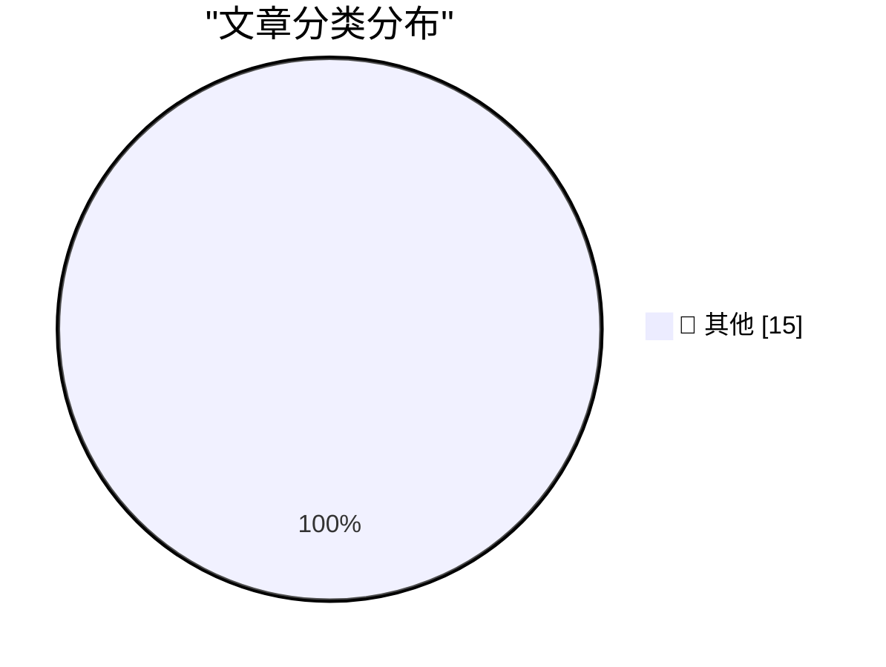

# 📰 AI 博客每日精选 — 2026-04-16

> 来自 Karpathy 推荐的 92 个顶级技术博客，AI 精选 Top 15

## 🏆 今日必读

🥇 **datasette.io news preview**

[datasette.io news preview](https://simonwillison.net/2026/Apr/16/datasette-io-preview/#atom-everything) — simonwillison.net · 10 小时前 · 📝 其他

> datasette.io news preview

🥈 **datasette-export-database 0.3a1**

[datasette-export-database 0.3a1](https://simonwillison.net/2026/Apr/15/datasette-export-database/#atom-everything) — simonwillison.net · 11 小时前 · 📝 其他

> datasette-export-database 0.3a1

🥉 **datasette 1.0a27**

[datasette 1.0a27](https://simonwillison.net/2026/Apr/15/datasette/#atom-everything) — simonwillison.net · 11 小时前 · 📝 其他

> datasette 1.0a27

---

## 📊 数据概览

| 扫描源 | 抓取文章 | 时间范围 | 精选 |
|:---:|:---:|:---:|:---:|
| 84/92 | 2450 篇 → 50 篇 | 48h | **15 篇** |

### 分类分布

---

## 📝 其他

### 1. datasette.io news preview

[datasette.io news preview](https://simonwillison.net/2026/Apr/16/datasette-io-preview/#atom-everything) — **simonwillison.net** · 10 小时前 · ⭐ 15/30

> datasette.io news preview

---

### 2. datasette-export-database 0.3a1

[datasette-export-database 0.3a1](https://simonwillison.net/2026/Apr/15/datasette-export-database/#atom-everything) — **simonwillison.net** · 11 小时前 · ⭐ 15/30

> datasette-export-database 0.3a1

---

### 3. datasette 1.0a27

[datasette 1.0a27](https://simonwillison.net/2026/Apr/15/datasette/#atom-everything) — **simonwillison.net** · 11 小时前 · ⭐ 15/30

> datasette 1.0a27

---

### 4. Quoting John Gruber

[Quoting John Gruber](https://simonwillison.net/2026/Apr/15/john-gruber/#atom-everything) — **simonwillison.net** · 17 小时前 · ⭐ 15/30

> Quoting John Gruber

---

### 5. Gemini 3.1 Flash TTS

[Gemini 3.1 Flash TTS](https://simonwillison.net/2026/Apr/15/gemini-31-flash-tts/#atom-everything) — **simonwillison.net** · 17 小时前 · ⭐ 15/30

> Gemini 3.1 Flash TTS

---

### 6. Gemini 3.1 Flash TTS

[Gemini 3.1 Flash TTS](https://simonwillison.net/2026/Apr/15/gemini-flash-tts/#atom-everything) — **simonwillison.net** · 18 小时前 · ⭐ 15/30

> Gemini 3.1 Flash TTS

---

### 7. Quoting Kyle Kingsbury

[Quoting Kyle Kingsbury](https://simonwillison.net/2026/Apr/15/kyle-kingsbury/#atom-everything) — **simonwillison.net** · 19 小时前 · ⭐ 15/30

> Quoting Kyle Kingsbury

---

### 8. datasette-ports 0.3

[datasette-ports 0.3](https://simonwillison.net/2026/Apr/15/datasette-ports/#atom-everything) — **simonwillison.net** · 1 天前 · ⭐ 15/30

> datasette-ports 0.3

---

### 9. Zig 0.16.0 release notes: "Juicy Main"

[Zig 0.16.0 release notes: "Juicy Main"](https://simonwillison.net/2026/Apr/15/juicy-main/#atom-everything) — **simonwillison.net** · 1 天前 · ⭐ 15/30

> Zig 0.16.0 release notes: "Juicy Main"

---

### 10. datasette PR #2689: Replace token-based CSRF with Sec-Fetch-Site header protection

[datasette PR #2689: Replace token-based CSRF with Sec-Fetch-Site header protection](https://simonwillison.net/2026/Apr/14/replace-token-based-csrf/#atom-everything) — **simonwillison.net** · 1 天前 · ⭐ 15/30

> datasette PR #2689: Replace token-based CSRF with Sec-Fetch-Site header protection

---

### 11. Trusted access for the next era of cyber defense

[Trusted access for the next era of cyber defense](https://simonwillison.net/2026/Apr/14/trusted-access-openai/#atom-everything) — **simonwillison.net** · 1 天前 · ⭐ 15/30

> Trusted access for the next era of cyber defense

---

### 12. Cybersecurity Looks Like Proof of Work Now

[Cybersecurity Looks Like Proof of Work Now](https://simonwillison.net/2026/Apr/14/cybersecurity-proof-of-work/#atom-everything) — **simonwillison.net** · 1 天前 · ⭐ 15/30

> Cybersecurity Looks Like Proof of Work Now

---

### 13. An Arm Mainboard for the Framework Laptop

[An Arm Mainboard for the Framework Laptop](https://www.jeffgeerling.com/blog/2026/arm-mainboard-for-framework-laptop/) — **jeffgeerling.com** · 20 小时前 · ⭐ 15/30

> An Arm Mainboard for the Framework Laptop

---

### 14. Patch Tuesday, April 2026 Edition

[Patch Tuesday, April 2026 Edition](https://krebsonsecurity.com/2026/04/patch-tuesday-april-2026-edition/) — **krebsonsecurity.com** · 1 天前 · ⭐ 15/30

> Patch Tuesday, April 2026 Edition

---

### 15. So Close to Getting It

[So Close to Getting It](https://www.theverge.com/tech/906873/sofa-app-track-tv-movies-installer) — **daringfireball.net** · 9 小时前 · ⭐ 15/30

> So Close to Getting It

---

*生成于 2026-04-16 10:54 | 扫描 84 源 → 获取 2450 篇 → 精选 15 篇*
*基于 [Hacker News Popularity Contest 2025](https://refactoringenglish.com/tools/hn-popularity/) RSS 源列表，由 [Andrej Karpathy](https://x.com/karpathy) 推荐*
*由「懂点儿AI」制作，欢迎关注同名微信公众号获取更多 AI 实用技巧 💡*
