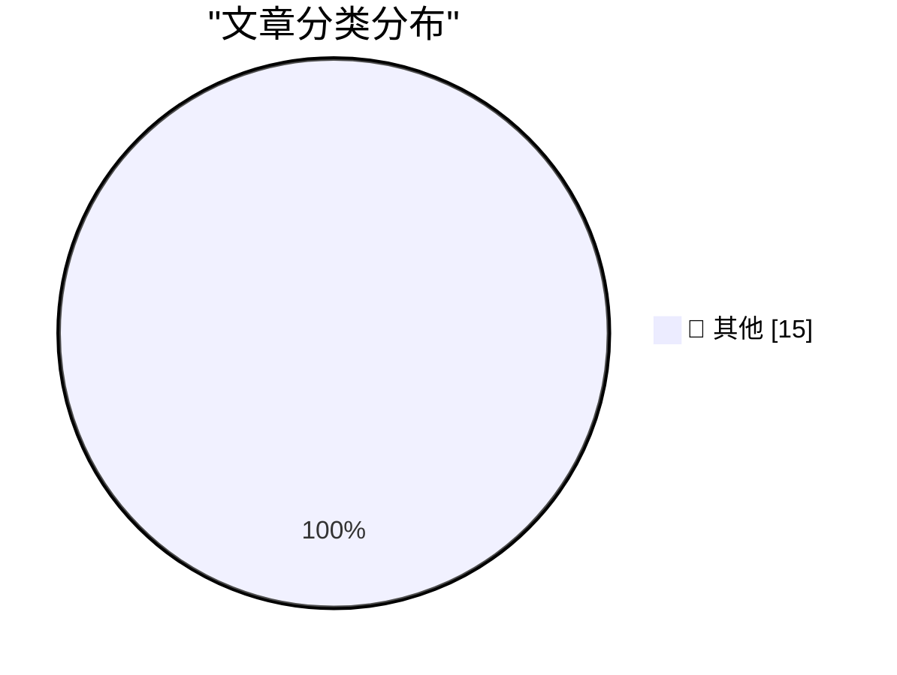

# 📰 AI 博客每日精选 — 2026-04-08

> 来自 Karpathy 推荐的 92 个顶级技术博客，AI 精选 Top 15

## 🏆 今日必读

🥇 **GLM-5.1: Towards Long-Horizon Tasks**

[GLM-5.1: Towards Long-Horizon Tasks](https://simonwillison.net/2026/Apr/7/glm-51/#atom-everything) — simonwillison.net · 13 小时前 · 📝 其他

> GLM-5.1: Towards Long-Horizon Tasks

🥈 **Anthropic's Project Glasswing - restricting Claude Mythos to security researchers - sounds necessary to me**

[Anthropic's Project Glasswing - restricting Claude Mythos to security researchers - sounds necessary to me](https://simonwillison.net/2026/Apr/7/project-glasswing/#atom-everything) — simonwillison.net · 13 小时前 · 📝 其他

> Anthropic's Project Glasswing - restricting Claude Mythos to security researchers - sounds necessary to me

🥉 **SQLite WAL Mode Across Docker Containers Sharing a Volume**

[SQLite WAL Mode Across Docker Containers Sharing a Volume](https://simonwillison.net/2026/Apr/7/sqlite-wal-docker-containers/#atom-everything) — simonwillison.net · 19 小时前 · 📝 其他

> SQLite WAL Mode Across Docker Containers Sharing a Volume

---

## 📊 数据概览

| 扫描源 | 抓取文章 | 时间范围 | 精选 |
|:---:|:---:|:---:|:---:|
| 83/92 | 2423 篇 → 35 篇 | 48h | **15 篇** |

### 分类分布

---

## 📝 其他

### 1. GLM-5.1: Towards Long-Horizon Tasks

[GLM-5.1: Towards Long-Horizon Tasks](https://simonwillison.net/2026/Apr/7/glm-51/#atom-everything) — **simonwillison.net** · 13 小时前 · ⭐ 15/30

> GLM-5.1: Towards Long-Horizon Tasks

---

### 2. Anthropic's Project Glasswing - restricting Claude Mythos to security researchers - sounds necessary to me

[Anthropic's Project Glasswing - restricting Claude Mythos to security researchers - sounds necessary to me](https://simonwillison.net/2026/Apr/7/project-glasswing/#atom-everything) — **simonwillison.net** · 13 小时前 · ⭐ 15/30

> Anthropic's Project Glasswing - restricting Claude Mythos to security researchers - sounds necessary to me

---

### 3. SQLite WAL Mode Across Docker Containers Sharing a Volume

[SQLite WAL Mode Across Docker Containers Sharing a Volume](https://simonwillison.net/2026/Apr/7/sqlite-wal-docker-containers/#atom-everything) — **simonwillison.net** · 19 小时前 · ⭐ 15/30

> SQLite WAL Mode Across Docker Containers Sharing a Volume

---

### 4. Russia Hacked Routers to Steal Microsoft Office Tokens

[Russia Hacked Routers to Steal Microsoft Office Tokens](https://krebsonsecurity.com/2026/04/russia-hacked-routers-to-steal-microsoft-office-tokens/) — **krebsonsecurity.com** · 17 小时前 · ⭐ 15/30

> Russia Hacked Routers to Steal Microsoft Office Tokens

---

### 5. Solar Eclipse From the Far Side of the Moon

[Solar Eclipse From the Far Side of the Moon](https://kottke.org/26/04/solar-eclipse-far-side-of-the-moon) — **daringfireball.net** · 12 小时前 · ⭐ 15/30

> Solar Eclipse From the Far Side of the Moon

---

### 6. Sam Altman, in a Video Released by OpenAI, Apparently Thinks AGI Is Going to Hit Society Like a Once-a-Century Pandemic

[Sam Altman, in a Video Released by OpenAI, Apparently Thinks AGI Is Going to Hit Society Like a Once-a-Century Pandemic](https://x.com/OpenAINewsroom/status/2041618671236469200?s=20) — **daringfireball.net** · 12 小时前 · ⭐ 15/30

> Sam Altman, in a Video Released by OpenAI, Apparently Thinks AGI Is Going to Hit Society Like a Once-a-Century Pandemic

---

### 7. ★ OpenAI Announces $122 Billion Additional ‘Committed Capital’, and Announces Their ‘Superapp’ Plan for the Future

[★ OpenAI Announces $122 Billion Additional ‘Committed Capital’, and Announces Their ‘Superapp’ Plan for the Future](https://daringfireball.net/2026/04/openai_future) — **daringfireball.net** · 12 小时前 · ⭐ 15/30

> ★ OpenAI Announces $122 Billion Additional ‘Committed Capital’, and Announces Their ‘Superapp’ Plan for the Future

---

### 8. Om Malik and Ben Thompson on OpenAI Buying TBPN

[Om Malik and Ben Thompson on OpenAI Buying TBPN](https://om.co/2026/04/02/openai-masters-of-agitprop-2-0/) — **daringfireball.net** · 17 小时前 · ⭐ 15/30

> Om Malik and Ben Thompson on OpenAI Buying TBPN

---

### 9. Flighty Airports Meltdown Map

[Flighty Airports Meltdown Map](https://flighty.com/airports) — **daringfireball.net** · 18 小时前 · ⭐ 15/30

> Flighty Airports Meltdown Map

---

### 10. The Data Drop: Every iPhone

[The Data Drop: Every iPhone](https://sheets.works/data-viz/every-iphone) — **daringfireball.net** · 18 小时前 · ⭐ 15/30

> The Data Drop: Every iPhone

---

### 11. [Sponsor] Zed, a Font Superfamily

[[Sponsor] Zed, a Font Superfamily](https://www.typotheque.com/blog/zed-a-sans-for-the-needs-of-21century/?utm_source=df) — **daringfireball.net** · 1 天前 · ⭐ 15/30

> [Sponsor] Zed, a Font Superfamily

---

### 12. Anthropic Accidentally Leaked the Entire Claude Code CLI Source Code

[Anthropic Accidentally Leaked the Entire Claude Code CLI Source Code](https://arstechnica.com/ai/2026/03/entire-claude-code-cli-source-code-leaks-thanks-to-exposed-map-file/) — **daringfireball.net** · 1 天前 · ⭐ 15/30

> Anthropic Accidentally Leaked the Entire Claude Code CLI Source Code

---

### 13. Little Finder Guy Stars in Nine New Videos on TikTok and YouTube

[Little Finder Guy Stars in Nine New Videos on TikTok and YouTube](https://www.macrumors.com/2026/04/02/little-finder-guy-tiktok-youtube/) — **daringfireball.net** · 1 天前 · ⭐ 15/30

> Little Finder Guy Stars in Nine New Videos on TikTok and YouTube

---

### 14. AI Did It in 12 Minutes. It Took Me 10 Hours to Fix It

[AI Did It in 12 Minutes. It Took Me 10 Hours to Fix It](https://idiallo.com/blog/it-took-me-10-hours-to-fix-ai-code?src=feed) — **idiallo.com** · 1 天前 · ⭐ 15/30

> AI Did It in 12 Minutes. It Took Me 10 Hours to Fix It

---

### 15. Pluralistic: Switzerland's Goldilocks fiber (07 Apr 2026)

[Pluralistic: Switzerland's Goldilocks fiber (07 Apr 2026)](https://pluralistic.net/2026/04/07/swisscom/) — **pluralistic.net** · 1 天前 · ⭐ 15/30

> Pluralistic: Switzerland's Goldilocks fiber (07 Apr 2026)

---

*生成于 2026-04-08 10:47 | 扫描 83 源 → 获取 2423 篇 → 精选 15 篇*
*基于 [Hacker News Popularity Contest 2025](https://refactoringenglish.com/tools/hn-popularity/) RSS 源列表，由 [Andrej Karpathy](https://x.com/karpathy) 推荐*
*由「懂点儿AI」制作，欢迎关注同名微信公众号获取更多 AI 实用技巧 💡*
