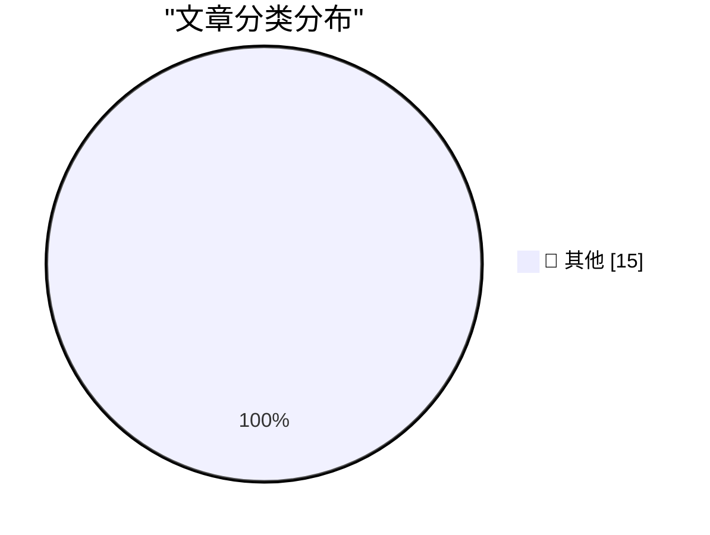

# 📰 AI 博客每日精选 — 2026-04-23

> 来自 Karpathy 推荐的 92 个顶级技术博客，AI 精选 Top 15

## 🏆 今日必读

🥇 **Qwen3.6-27B: Flagship-Level Coding in a 27B Dense Model**

[Qwen3.6-27B: Flagship-Level Coding in a 27B Dense Model](https://simonwillison.net/2026/Apr/22/qwen36-27b/#atom-everything) — simonwillison.net · 18 小时前 · 📝 其他

> Qwen3.6-27B: Flagship-Level Coding in a 27B Dense Model

🥈 **Quoting Bobby Holley**

[Quoting Bobby Holley](https://simonwillison.net/2026/Apr/22/bobby-holley/#atom-everything) — simonwillison.net · 1 天前 · 📝 其他

> Quoting Bobby Holley

🥉 **Changes to GitHub Copilot Individual plans**

[Changes to GitHub Copilot Individual plans](https://simonwillison.net/2026/Apr/22/changes-to-github-copilot/#atom-everything) — simonwillison.net · 1 天前 · 📝 其他

> Changes to GitHub Copilot Individual plans

---

## 📊 数据概览

| 扫描源 | 抓取文章 | 时间范围 | 精选 |
|:---:|:---:|:---:|:---:|
| 82/92 | 2410 篇 → 36 篇 | 48h | **15 篇** |

### 分类分布

---

## 📝 其他

### 1. Qwen3.6-27B: Flagship-Level Coding in a 27B Dense Model

[Qwen3.6-27B: Flagship-Level Coding in a 27B Dense Model](https://simonwillison.net/2026/Apr/22/qwen36-27b/#atom-everything) — **simonwillison.net** · 18 小时前 · ⭐ 15/30

> Qwen3.6-27B: Flagship-Level Coding in a 27B Dense Model

---

### 2. Quoting Bobby Holley

[Quoting Bobby Holley](https://simonwillison.net/2026/Apr/22/bobby-holley/#atom-everything) — **simonwillison.net** · 1 天前 · ⭐ 15/30

> Quoting Bobby Holley

---

### 3. Changes to GitHub Copilot Individual plans

[Changes to GitHub Copilot Individual plans](https://simonwillison.net/2026/Apr/22/changes-to-github-copilot/#atom-everything) — **simonwillison.net** · 1 天前 · ⭐ 15/30

> Changes to GitHub Copilot Individual plans

---

### 4. Is Claude Code going to cost $100/month? Probably not - it's all very confusing

[Is Claude Code going to cost $100/month? Probably not - it's all very confusing](https://simonwillison.net/2026/Apr/22/claude-code-confusion/#atom-everything) — **simonwillison.net** · 1 天前 · ⭐ 15/30

> Is Claude Code going to cost $100/month? Probably not - it's all very confusing

---

### 5. Where's the raccoon with the ham radio? (ChatGPT Images 2.0)

[Where's the raccoon with the ham radio? (ChatGPT Images 2.0)](https://simonwillison.net/2026/Apr/21/gpt-image-2/#atom-everything) — **simonwillison.net** · 1 天前 · ⭐ 15/30

> Where's the raccoon with the ham radio? (ChatGPT Images 2.0)

---

### 6. Quoting Andreas Påhlsson-Notini

[Quoting Andreas Påhlsson-Notini](https://simonwillison.net/2026/Apr/21/andreas-pahlsson-notini/#atom-everything) — **simonwillison.net** · 1 天前 · ⭐ 15/30

> Quoting Andreas Påhlsson-Notini

---

### 7. scosman/pelicans_riding_bicycles

[scosman/pelicans_riding_bicycles](https://simonwillison.net/2026/Apr/21/scosman/#atom-everything) — **simonwillison.net** · 1 天前 · ⭐ 15/30

> scosman/pelicans_riding_bicycles

---

### 8. ‘Scattered Spider’ Member ‘Tylerb’ Pleads Guilty

[‘Scattered Spider’ Member ‘Tylerb’ Pleads Guilty](https://krebsonsecurity.com/2026/04/scattered-spider-member-tylerb-pleads-guilty/) — **krebsonsecurity.com** · 1 天前 · ⭐ 15/30

> ‘Scattered Spider’ Member ‘Tylerb’ Pleads Guilty

---

### 9. DF T-Shirts and Hoodies: Get Them While the Getting Is Good

[DF T-Shirts and Hoodies: Get Them While the Getting Is Good](https://store.daringfireball.net/) — **daringfireball.net** · 15 小时前 · ⭐ 15/30

> DF T-Shirts and Hoodies: Get Them While the Getting Is Good

---

### 10. There Are Corrections, and There Are Corrections

[There Are Corrections, and There Are Corrections](https://www.nytimes.com/2026/04/21/nyregion/mets-mamdani-curse.html?unlocked_article_code=1.c1A.iLO0.Kqdo8aBhNAY1) — **daringfireball.net** · 16 小时前 · ⭐ 15/30

> There Are Corrections, and There Are Corrections

---

### 11. Ben Thompson on Tim Cook’s Legacy

[Ben Thompson on Tim Cook’s Legacy](https://stratechery.com/2026/tim-cooks-impeccable-timing/) — **daringfireball.net** · 18 小时前 · ⭐ 15/30

> Ben Thompson on Tim Cook’s Legacy

---

### 12. [Sponsor] Rec League

[[Sponsor] Rec League](https://recleague.com/?lyr_campaign=df) — **daringfireball.net** · 1 天前 · ⭐ 15/30

> [Sponsor] Rec League

---

### 13. Trump on Tim Apple

[Trump on Tim Apple](https://truthsocial.com/@realDonaldTrump/posts/116442276577696798) — **daringfireball.net** · 1 天前 · ⭐ 15/30

> Trump on Tim Apple

---

### 14. How to Come Up With Great Ideas

[How to Come Up With Great Ideas](https://idiallo.com/blog/how-to-come-up-with-great-ideas?src=feed) — **idiallo.com** · 23 小时前 · ⭐ 15/30

> How to Come Up With Great Ideas

---

### 15. Pluralistic: It's not a crime if we do it (to nurses) with an app (22 Apr 2026)

[Pluralistic: It's not a crime if we do it (to nurses) with an app (22 Apr 2026)](https://pluralistic.net/2026/04/22/uber-for-nurses/) — **pluralistic.net** · 19 小时前 · ⭐ 15/30

> Pluralistic: It's not a crime if we do it (to nurses) with an app (22 Apr 2026)

---

*生成于 2026-04-23 11:00 | 扫描 82 源 → 获取 2410 篇 → 精选 15 篇*
*基于 [Hacker News Popularity Contest 2025](https://refactoringenglish.com/tools/hn-popularity/) RSS 源列表，由 [Andrej Karpathy](https://x.com/karpathy) 推荐*
*由「懂点儿AI」制作，欢迎关注同名微信公众号获取更多 AI 实用技巧 💡*
