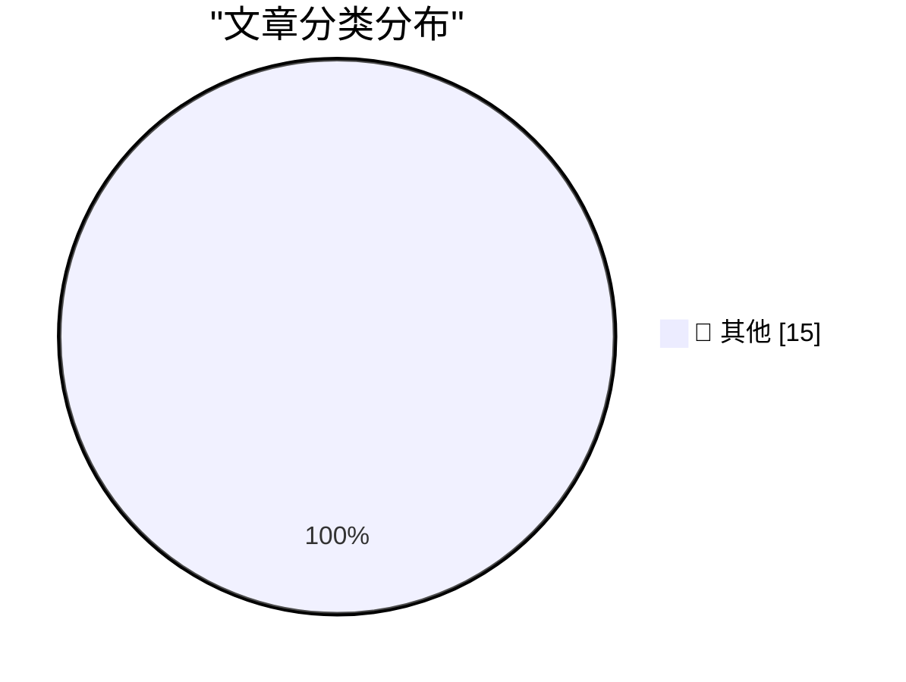

# 📰 AI 博客每日精选 — 2026-04-04

> 来自 Karpathy 推荐的 92 个顶级技术博客，AI 精选 Top 15

## 🏆 今日必读

🥇 **Quoting Kyle Daigle**

[Quoting Kyle Daigle](https://simonwillison.net/2026/Apr/4/kyle-daigle/#atom-everything) — simonwillison.net · 8 小时前 · 📝 其他

> Quoting Kyle Daigle

🥈 **Vulnerability Research Is Cooked**

[Vulnerability Research Is Cooked](https://simonwillison.net/2026/Apr/3/vulnerability-research-is-cooked/#atom-everything) — simonwillison.net · 10 小时前 · 📝 其他

> Vulnerability Research Is Cooked

🥉 **The cognitive impact of coding agents**

[The cognitive impact of coding agents](https://simonwillison.net/2026/Apr/3/cognitive-cost/#atom-everything) — simonwillison.net · 10 小时前 · 📝 其他

> The cognitive impact of coding agents

---

## 📊 数据概览

| 扫描源 | 抓取文章 | 时间范围 | 精选 |
|:---:|:---:|:---:|:---:|
| 84/92 | 2443 篇 → 46 篇 | 48h | **15 篇** |

### 分类分布

---

## 📝 其他

### 1. Quoting Kyle Daigle

[Quoting Kyle Daigle](https://simonwillison.net/2026/Apr/4/kyle-daigle/#atom-everything) — **simonwillison.net** · 8 小时前 · ⭐ 15/30

> Quoting Kyle Daigle

---

### 2. Vulnerability Research Is Cooked

[Vulnerability Research Is Cooked](https://simonwillison.net/2026/Apr/3/vulnerability-research-is-cooked/#atom-everything) — **simonwillison.net** · 10 小时前 · ⭐ 15/30

> Vulnerability Research Is Cooked

---

### 3. The cognitive impact of coding agents

[The cognitive impact of coding agents](https://simonwillison.net/2026/Apr/3/cognitive-cost/#atom-everything) — **simonwillison.net** · 10 小时前 · ⭐ 15/30

> The cognitive impact of coding agents

---

### 4. Quoting Willy Tarreau

[Quoting Willy Tarreau](https://simonwillison.net/2026/Apr/3/willy-tarreau/#atom-everything) — **simonwillison.net** · 12 小时前 · ⭐ 15/30

> Quoting Willy Tarreau

---

### 5. Quoting Daniel Stenberg

[Quoting Daniel Stenberg](https://simonwillison.net/2026/Apr/3/daniel-stenberg/#atom-everything) — **simonwillison.net** · 12 小时前 · ⭐ 15/30

> Quoting Daniel Stenberg

---

### 6. Quoting Greg Kroah-Hartman

[Quoting Greg Kroah-Hartman](https://simonwillison.net/2026/Apr/3/greg-kroah-hartman/#atom-everything) — **simonwillison.net** · 12 小时前 · ⭐ 15/30

> Quoting Greg Kroah-Hartman

---

### 7. Can JavaScript Escape a CSP Meta Tag Inside an Iframe?

[Can JavaScript Escape a CSP Meta Tag Inside an Iframe?](https://simonwillison.net/2026/Apr/3/test-csp-iframe-escape/#atom-everything) — **simonwillison.net** · 18 小时前 · ⭐ 15/30

> Can JavaScript Escape a CSP Meta Tag Inside an Iframe?

---

### 8. The Axios supply chain attack used individually targeted social engineering

[The Axios supply chain attack used individually targeted social engineering](https://simonwillison.net/2026/Apr/3/supply-chain-social-engineering/#atom-everything) — **simonwillison.net** · 20 小时前 · ⭐ 15/30

> The Axios supply chain attack used individually targeted social engineering

---

### 9. Highlights from my conversation about agentic engineering on Lenny's Podcast

[Highlights from my conversation about agentic engineering on Lenny's Podcast](https://simonwillison.net/2026/Apr/2/lennys-podcast/#atom-everything) — **simonwillison.net** · 1 天前 · ⭐ 15/30

> Highlights from my conversation about agentic engineering on Lenny's Podcast

---

### 10. Gemma 4: Byte for byte, the most capable open models

[Gemma 4: Byte for byte, the most capable open models](https://simonwillison.net/2026/Apr/2/gemma-4/#atom-everything) — **simonwillison.net** · 1 天前 · ⭐ 15/30

> Gemma 4: Byte for byte, the most capable open models

---

### 11. llm-gemini 0.30

[llm-gemini 0.30](https://simonwillison.net/2026/Apr/2/llm-gemini/#atom-everything) — **simonwillison.net** · 1 天前 · ⭐ 15/30

> llm-gemini 0.30

---

### 12. Build your own Dial-up ISP with a Raspberry Pi

[Build your own Dial-up ISP with a Raspberry Pi](https://www.jeffgeerling.com/blog/2026/build-your-own-dial-up-isp-with-a-raspberry-pi/) — **jeffgeerling.com** · 20 小时前 · ⭐ 15/30

> Build your own Dial-up ISP with a Raspberry Pi

---

### 13. Programming (with AI agents) as theory building

[Programming (with AI agents) as theory building](https://seangoedecke.com/programming-with-ai-agents-as-theory-building/) — **seangoedecke.com** · 1 天前 · ⭐ 15/30

> Programming (with AI agents) as theory building

---

### 14. Apple Releases iOS 18 Security Updates for iOS 26 Holdouts

[Apple Releases iOS 18 Security Updates for iOS 26 Holdouts](https://sixcolors.com/post/2026/04/apple-releases-ios-18-security-updates-for-ios-26-holdouts/) — **daringfireball.net** · 14 小时前 · ⭐ 15/30

> Apple Releases iOS 18 Security Updates for iOS 26 Holdouts

---

### 15. Apple Still Has Jessica Chastain’s ‘The Savant’ on Ice, Seven Months After It Was Set to Debut

[Apple Still Has Jessica Chastain’s ‘The Savant’ on Ice, Seven Months After It Was Set to Debut](https://www.macstories.net/news/coming-soon-whats-next-on-apple-tv-and-apple-arcade-in-april-2026/) — **daringfireball.net** · 16 小时前 · ⭐ 15/30

> Apple Still Has Jessica Chastain’s ‘The Savant’ on Ice, Seven Months After It Was Set to Debut

---

*生成于 2026-04-04 10:22 | 扫描 84 源 → 获取 2443 篇 → 精选 15 篇*
*基于 [Hacker News Popularity Contest 2025](https://refactoringenglish.com/tools/hn-popularity/) RSS 源列表，由 [Andrej Karpathy](https://x.com/karpathy) 推荐*
*由「懂点儿AI」制作，欢迎关注同名微信公众号获取更多 AI 实用技巧 💡*
