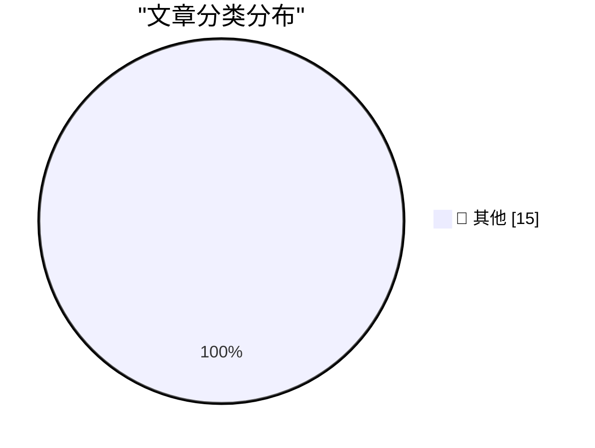

# 📰 AI 博客每日精选 — 2026-04-24

> 来自 Karpathy 推荐的 92 个顶级技术博客，AI 精选 Top 15

## 🏆 今日必读

🥇 **DeepSeek V4 - almost on the frontier, a fraction of the price**

[DeepSeek V4 - almost on the frontier, a fraction of the price](https://simonwillison.net/2026/Apr/24/deepseek-v4/#atom-everything) — simonwillison.net · 4 小时前 · 📝 其他

> DeepSeek V4 - almost on the frontier, a fraction of the price

🥈 **Millisecond Converter**

[Millisecond Converter](https://simonwillison.net/2026/Apr/24/milliseconds/#atom-everything) — simonwillison.net · 6 小时前 · 📝 其他

> Millisecond Converter

🥉 **It's a big one**

[It's a big one](https://simonwillison.net/2026/Apr/24/weekly/#atom-everything) — simonwillison.net · 6 小时前 · 📝 其他

> It's a big one

---

## 📊 数据概览

| 扫描源 | 抓取文章 | 时间范围 | 精选 |
|:---:|:---:|:---:|:---:|
| 81/92 | 2403 篇 → 43 篇 | 48h | **15 篇** |

### 分类分布

---

## 📝 其他

### 1. DeepSeek V4 - almost on the frontier, a fraction of the price

[DeepSeek V4 - almost on the frontier, a fraction of the price](https://simonwillison.net/2026/Apr/24/deepseek-v4/#atom-everything) — **simonwillison.net** · 4 小时前 · ⭐ 15/30

> DeepSeek V4 - almost on the frontier, a fraction of the price

---

### 2. Millisecond Converter

[Millisecond Converter](https://simonwillison.net/2026/Apr/24/milliseconds/#atom-everything) — **simonwillison.net** · 6 小时前 · ⭐ 15/30

> Millisecond Converter

---

### 3. It's a big one

[It's a big one](https://simonwillison.net/2026/Apr/24/weekly/#atom-everything) — **simonwillison.net** · 6 小时前 · ⭐ 15/30

> It's a big one

---

### 4. russellromney/honker

[russellromney/honker](https://simonwillison.net/2026/Apr/24/honker/#atom-everything) — **simonwillison.net** · 9 小时前 · ⭐ 15/30

> russellromney/honker

---

### 5. An update on recent Claude Code quality reports

[An update on recent Claude Code quality reports](https://simonwillison.net/2026/Apr/24/recent-claude-code-quality-reports/#atom-everything) — **simonwillison.net** · 9 小时前 · ⭐ 15/30

> An update on recent Claude Code quality reports

---

### 6. Serving the For You feed

[Serving the For You feed](https://simonwillison.net/2026/Apr/24/serving-the-for-you-feed/#atom-everything) — **simonwillison.net** · 9 小时前 · ⭐ 15/30

> Serving the For You feed

---

### 7. Extract PDF text in your browser with LiteParse for the web

[Extract PDF text in your browser with LiteParse for the web](https://simonwillison.net/2026/Apr/23/liteparse-for-the-web/#atom-everything) — **simonwillison.net** · 13 小时前 · ⭐ 15/30

> Extract PDF text in your browser with LiteParse for the web

---

### 8. A pelican for GPT-5.5 via the semi-official Codex backdoor API

[A pelican for GPT-5.5 via the semi-official Codex backdoor API](https://simonwillison.net/2026/Apr/23/gpt-5-5/#atom-everything) — **simonwillison.net** · 14 小时前 · ⭐ 15/30

> A pelican for GPT-5.5 via the semi-official Codex backdoor API

---

### 9. llm-openai-via-codex 0.1a0

[llm-openai-via-codex 0.1a0](https://simonwillison.net/2026/Apr/23/llm-openai-via-codex/#atom-everything) — **simonwillison.net** · 15 小时前 · ⭐ 15/30

> llm-openai-via-codex 0.1a0

---

### 10. Quoting Maggie Appleton

[Quoting Maggie Appleton](https://simonwillison.net/2026/Apr/23/maggie-appleton/#atom-everything) — **simonwillison.net** · 21 小时前 · ⭐ 15/30

> Quoting Maggie Appleton

---

### 11. Qwen3.6-27B: Flagship-Level Coding in a 27B Dense Model

[Qwen3.6-27B: Flagship-Level Coding in a 27B Dense Model](https://simonwillison.net/2026/Apr/22/qwen36-27b/#atom-everything) — **simonwillison.net** · 1 天前 · ⭐ 15/30

> Qwen3.6-27B: Flagship-Level Coding in a 27B Dense Model

---

### 12. Software engineering may no longer be a lifetime career

[Software engineering may no longer be a lifetime career](https://seangoedecke.com/software-engineering-may-no-longer-be-a-lifetime-career/) — **seangoedecke.com** · 10 小时前 · ⭐ 15/30

> Software engineering may no longer be a lifetime career

---

### 13. United Kingdom to Pass Smoking Ban Only for Those Who Are Not Yet Legal Adults

[United Kingdom to Pass Smoking Ban Only for Those Who Are Not Yet Legal Adults](https://www.nytimes.com/2026/04/21/world/europe/uk-smoking-ban-2009.html?unlocked_article_code=1.dVA.f9yJ.YMVg9N8QOlio) — **daringfireball.net** · 9 小时前 · ⭐ 15/30

> United Kingdom to Pass Smoking Ban Only for Those Who Are Not Yet Legal Adults

---

### 14. Trump’s Blog Has Somehow Lost $1.1 Billion

[Trump’s Blog Has Somehow Lost $1.1 Billion](https://www.motherjones.com/politics/2026/04/truth-social-ceo-out-after-1-1-billion-in-losses/) — **daringfireball.net** · 13 小时前 · ⭐ 15/30

> Trump’s Blog Has Somehow Lost $1.1 Billion

---

### 15. Nilay Patel: ‘Beware Software Brain’

[Nilay Patel: ‘Beware Software Brain’](https://www.theverge.com/podcast/917029/software-brain-ai-backlash-databases-automation) — **daringfireball.net** · 14 小时前 · ⭐ 15/30

> Nilay Patel: ‘Beware Software Brain’

---

*生成于 2026-04-24 10:58 | 扫描 81 源 → 获取 2403 篇 → 精选 15 篇*
*基于 [Hacker News Popularity Contest 2025](https://refactoringenglish.com/tools/hn-popularity/) RSS 源列表，由 [Andrej Karpathy](https://x.com/karpathy) 推荐*
*由「懂点儿AI」制作，欢迎关注同名微信公众号获取更多 AI 实用技巧 💡*
