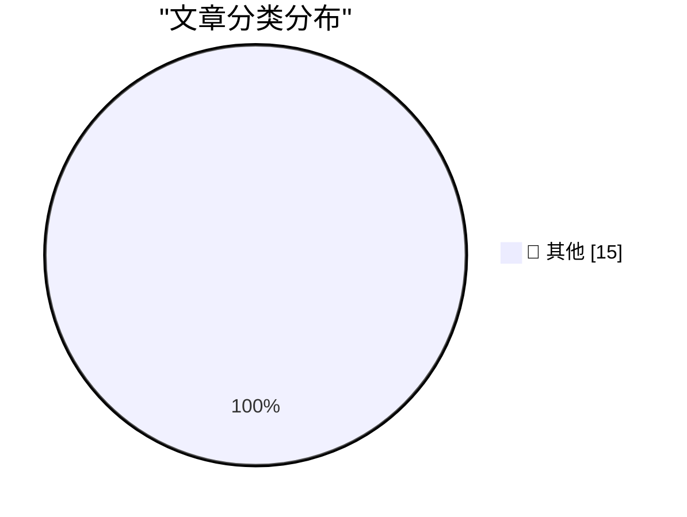

# 📰 AI 博客每日精选 — 2026-02-27

> 来自 Karpathy 推荐的 92 个顶级技术博客，AI 精选 Top 15

## 🏆 今日必读

🥇 **Hoard things you know how to do**

[Hoard things you know how to do](https://simonwillison.net/guides/agentic-engineering-patterns/hoard-things-you-know-how-to-do/#atom-everything) — simonwillison.net · 15 小时前 · 📝 其他

> Hoard things you know how to do

🥈 **Quoting Andrej Karpathy**

[Quoting Andrej Karpathy](https://simonwillison.net/2026/Feb/26/andrej-karpathy/#atom-everything) — simonwillison.net · 16 小时前 · 📝 其他

> Quoting Andrej Karpathy

🥉 **Google API Keys Weren't Secrets. But then Gemini Changed the Rules.**

[Google API Keys Weren't Secrets. But then Gemini Changed the Rules.](https://simonwillison.net/2026/Feb/26/google-api-keys/#atom-everything) — simonwillison.net · 1 天前 · 📝 其他

> Google API Keys Weren't Secrets. But then Gemini Changed the Rules.

---

## 📊 数据概览

| 扫描源 | 抓取文章 | 时间范围 | 精选 |
|:---:|:---:|:---:|:---:|
| 84/92 | 2418 篇 → 48 篇 | 48h | **15 篇** |

### 分类分布

---

## 📝 其他

### 1. Hoard things you know how to do

[Hoard things you know how to do](https://simonwillison.net/guides/agentic-engineering-patterns/hoard-things-you-know-how-to-do/#atom-everything) — **simonwillison.net** · 15 小时前 · ⭐ 15/30

> Hoard things you know how to do

---

### 2. Quoting Andrej Karpathy

[Quoting Andrej Karpathy](https://simonwillison.net/2026/Feb/26/andrej-karpathy/#atom-everything) — **simonwillison.net** · 16 小时前 · ⭐ 15/30

> Quoting Andrej Karpathy

---

### 3. Google API Keys Weren't Secrets. But then Gemini Changed the Rules.

[Google API Keys Weren't Secrets. But then Gemini Changed the Rules.](https://simonwillison.net/2026/Feb/26/google-api-keys/#atom-everything) — **simonwillison.net** · 1 天前 · ⭐ 15/30

> Google API Keys Weren't Secrets. But then Gemini Changed the Rules.

---

### 4. Quoting Benedict Evans

[Quoting Benedict Evans](https://simonwillison.net/2026/Feb/26/benedict-evans/#atom-everything) — **simonwillison.net** · 1 天前 · ⭐ 15/30

> Quoting Benedict Evans

---

### 5. tldraw issue: Move tests to closed source repo

[tldraw issue: Move tests to closed source repo](https://simonwillison.net/2026/Feb/25/closed-tests/#atom-everything) — **simonwillison.net** · 1 天前 · ⭐ 15/30

> tldraw issue: Move tests to closed source repo

---

### 6. Claude Code Remote Control

[Claude Code Remote Control](https://simonwillison.net/2026/Feb/25/claude-code-remote-control/#atom-everything) — **simonwillison.net** · 1 天前 · ⭐ 15/30

> Claude Code Remote Control

---

### 7. I vibe coded my dream macOS presentation app

[I vibe coded my dream macOS presentation app](https://simonwillison.net/2026/Feb/25/present/#atom-everything) — **simonwillison.net** · 1 天前 · ⭐ 15/30

> I vibe coded my dream macOS presentation app

---

### 8. How to Securely Erase an old Hard Drive on macOS Tahoe

[How to Securely Erase an old Hard Drive on macOS Tahoe](https://www.jeffgeerling.com/blog/2026/securely-erase-hard-drive-macos-tahoe/) — **jeffgeerling.com** · 15 小时前 · ⭐ 15/30

> How to Securely Erase an old Hard Drive on macOS Tahoe

---

### 9. Apple Announces F1 Broadcast Details, and a Surprising Netflix Partnership

[Apple Announces F1 Broadcast Details, and a Surprising Netflix Partnership](https://sixcolors.com/post/2026/02/apple-announces-f1-details-and-a-surprising-netflix-partnership/) — **daringfireball.net** · 10 小时前 · ⭐ 15/30

> Apple Announces F1 Broadcast Details, and a Surprising Netflix Partnership

---

### 10. Energym

[Energym](https://www.aicandy.be/giorgio-1) — **daringfireball.net** · 11 小时前 · ⭐ 15/30

> Energym

---

### 11. Netflix Backs Out of Bid for Warner Bros., Paving Way for Paramount Takeover

[Netflix Backs Out of Bid for Warner Bros., Paving Way for Paramount Takeover](https://www.nytimes.com/2026/02/26/business/warner-bros-discovery-paramount-deal-netflix.html?unlocked_article_code=1.PVA.3639.2yWKES49z8Os) — **daringfireball.net** · 11 小时前 · ⭐ 15/30

> Netflix Backs Out of Bid for Warner Bros., Paving Way for Paramount Takeover

---

### 12. iPhone and iPad Approved to Handle Classified NATO Information

[iPhone and iPad Approved to Handle Classified NATO Information](https://nr.apple.com/Do0I6B8WX0) — **daringfireball.net** · 14 小时前 · ⭐ 15/30

> iPhone and iPad Approved to Handle Classified NATO Information

---

### 13. ‘Steve Jobs in Exile’

[‘Steve Jobs in Exile’](https://geoffreycain.net/steve-jobs-in-exile/) — **daringfireball.net** · 17 小时前 · ⭐ 15/30

> ‘Steve Jobs in Exile’

---

### 14. Microsoft Adds Additional Markdown Features to Windows Notepad

[Microsoft Adds Additional Markdown Features to Windows Notepad](https://blogs.windows.com/windows-insider/2026/01/21/notepad-and-paint-updates-begin-rolling-out-to-windows-insiders/) — **daringfireball.net** · 17 小时前 · ⭐ 15/30

> Microsoft Adds Additional Markdown Features to Windows Notepad

---

### 15. Prediction ‘Market’ Kalshi Accuses MrBeast Editor of Insider Trading

[Prediction ‘Market’ Kalshi Accuses MrBeast Editor of Insider Trading](https://www.npr.org/2026/02/25/nx-s1-5726050/kalshi-insider-trading-enforcement-actions) — **daringfireball.net** · 18 小时前 · ⭐ 15/30

> Prediction ‘Market’ Kalshi Accuses MrBeast Editor of Insider Trading

---

*生成于 2026-02-27 11:48 | 扫描 84 源 → 获取 2418 篇 → 精选 15 篇*
*基于 [Hacker News Popularity Contest 2025](https://refactoringenglish.com/tools/hn-popularity/) RSS 源列表，由 [Andrej Karpathy](https://x.com/karpathy) 推荐*
*由「懂点儿AI」制作，欢迎关注同名微信公众号获取更多 AI 实用技巧 💡*
