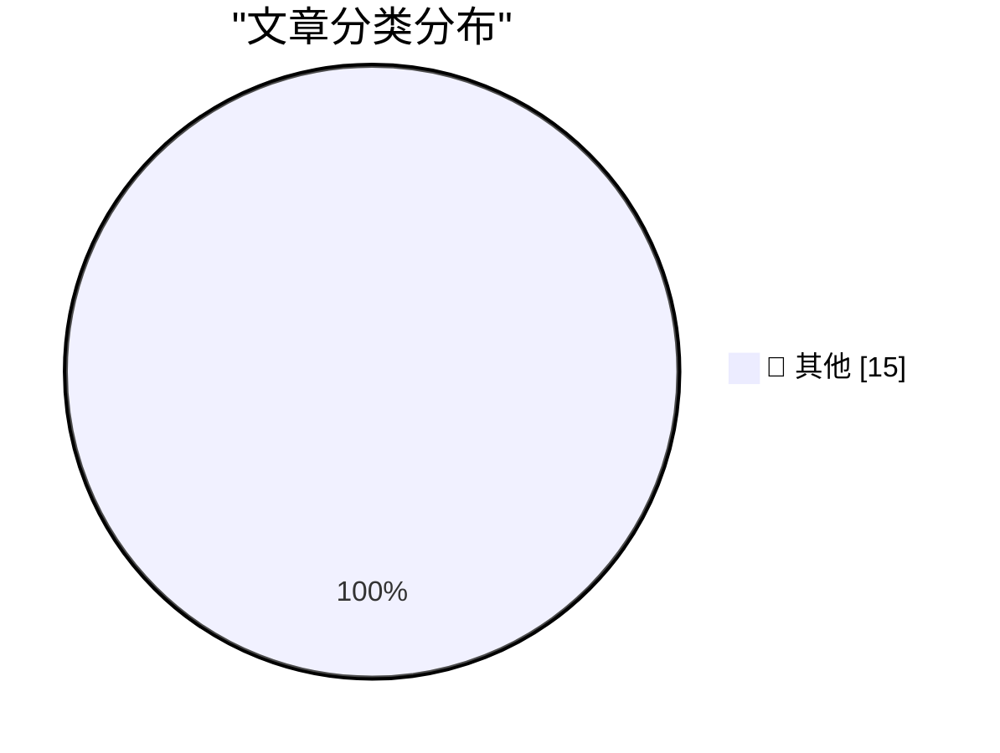

# 📰 AI 博客每日精选 — 2026-04-29

> 来自 Karpathy 推荐的 92 个顶级技术博客，AI 精选 Top 15

## 🏆 今日必读

🥇 **Quoting OpenAI Codex base_instructions**

[Quoting OpenAI Codex base_instructions](https://simonwillison.net/2026/Apr/28/openai-codex/#atom-everything) — simonwillison.net · 13 小时前 · 📝 其他

> Quoting OpenAI Codex base_instructions

🥈 **Quoting Matthew Yglesias**

[Quoting Matthew Yglesias](https://simonwillison.net/2026/Apr/28/matthew-yglesias/#atom-everything) — simonwillison.net · 21 小时前 · 📝 其他

> Quoting Matthew Yglesias

🥉 **What's new in pip 26.1 - lockfiles and dependency cooldowns!**

[What's new in pip 26.1 - lockfiles and dependency cooldowns!](https://simonwillison.net/2026/Apr/28/pip-261/#atom-everything) — simonwillison.net · 1 天前 · 📝 其他

> What's new in pip 26.1 - lockfiles and dependency cooldowns!

---

## 📊 数据概览

| 扫描源 | 抓取文章 | 时间范围 | 精选 |
|:---:|:---:|:---:|:---:|
| 84/92 | 2463 篇 → 38 篇 | 48h | **15 篇** |

### 分类分布

---

## 📝 其他

### 1. Quoting OpenAI Codex base_instructions

[Quoting OpenAI Codex base_instructions](https://simonwillison.net/2026/Apr/28/openai-codex/#atom-everything) — **simonwillison.net** · 13 小时前 · ⭐ 15/30

> Quoting OpenAI Codex base_instructions

---

### 2. Quoting Matthew Yglesias

[Quoting Matthew Yglesias](https://simonwillison.net/2026/Apr/28/matthew-yglesias/#atom-everything) — **simonwillison.net** · 21 小时前 · ⭐ 15/30

> Quoting Matthew Yglesias

---

### 3. What's new in pip 26.1 - lockfiles and dependency cooldowns!

[What's new in pip 26.1 - lockfiles and dependency cooldowns!](https://simonwillison.net/2026/Apr/28/pip-261/#atom-everything) — **simonwillison.net** · 1 天前 · ⭐ 15/30

> What's new in pip 26.1 - lockfiles and dependency cooldowns!

---

### 4. Introducing talkie: a 13B vintage language model from 1930

[Introducing talkie: a 13B vintage language model from 1930](https://simonwillison.net/2026/Apr/28/talkie/#atom-everything) — **simonwillison.net** · 1 天前 · ⭐ 15/30

> Introducing talkie: a 13B vintage language model from 1930

---

### 5. microsoft/VibeVoice

[microsoft/VibeVoice](https://simonwillison.net/2026/Apr/27/vibevoice/#atom-everything) — **simonwillison.net** · 1 天前 · ⭐ 15/30

> microsoft/VibeVoice

---

### 6. Tracking the history of the now-deceased OpenAI Microsoft AGI clause

[Tracking the history of the now-deceased OpenAI Microsoft AGI clause](https://simonwillison.net/2026/Apr/27/now-deceased-agi-clause/#atom-everything) — **simonwillison.net** · 1 天前 · ⭐ 15/30

> Tracking the history of the now-deceased OpenAI Microsoft AGI clause

---

### 7. Speech translation in Google Meet is now rolling out to mobile devices

[Speech translation in Google Meet is now rolling out to mobile devices](https://simonwillison.net/2026/Apr/27/speech-translation-in-google-meet-is-now-rolling-out-to-mobile-d/#atom-everything) — **simonwillison.net** · 1 天前 · ⭐ 15/30

> Speech translation in Google Meet is now rolling out to mobile devices

---

### 8. Rec League

[Rec League](https://recleague.com/?lyr_campaign=df) — **daringfireball.net** · 1 天前 · ⭐ 15/30

> Rec League

---

### 9. Sponsor The Talk Show

[Sponsor The Talk Show](https://daringfireball.net/feeds/sponsors/) — **daringfireball.net** · 1 天前 · ⭐ 15/30

> Sponsor The Talk Show

---

### 10. Yours Truly on The Vergecast

[Yours Truly on The Vergecast](https://www.theverge.com/podcast/917965/apple-ceo-cook-ternus-transition) — **daringfireball.net** · 1 天前 · ⭐ 15/30

> Yours Truly on The Vergecast

---

### 11. Spring 2026 Dev Contest Results!

[Spring 2026 Dev Contest Results!](https://repebble.com/blog/spring-2026-dev-contest-results) — **ericmigi.com** · 1 天前 · ⭐ 15/30

> Spring 2026 Dev Contest Results!

---

### 12. Don't use localhost:3000, use your own custom domain

[Don't use localhost:3000, use your own custom domain](https://idiallo.com/blog/say-no-to-localhost3000-use-custom-domains?src=feed) — **idiallo.com** · 1 天前 · ⭐ 15/30

> Don't use localhost:3000, use your own custom domain

---

### 13. Pluralistic: Vicky Osterweil's "The Extended Universe" (28 Apr 2026)

[Pluralistic: Vicky Osterweil's "The Extended Universe" (28 Apr 2026)](https://pluralistic.net/2026/04/27/mouseketeers/) — **pluralistic.net** · 1 天前 · ⭐ 15/30

> Pluralistic: Vicky Osterweil's "The Extended Universe" (28 Apr 2026)

---

### 14. Theatre Review: Hadestown ★★★★★

[Theatre Review: Hadestown ★★★★★](https://shkspr.mobi/blog/2026/04/theatre-review-hadestown/) — **shkspr.mobi** · 1 天前 · ⭐ 15/30

> Theatre Review: Hadestown ★★★★★

---

### 15. Ghostty Is Leaving GitHub

[Ghostty Is Leaving GitHub](https://mitchellh.com/writing/ghostty-leaving-github) — **mitchellh.com** · 1 天前 · ⭐ 15/30

> Ghostty Is Leaving GitHub

---

*生成于 2026-04-29 11:23 | 扫描 84 源 → 获取 2463 篇 → 精选 15 篇*
*基于 [Hacker News Popularity Contest 2025](https://refactoringenglish.com/tools/hn-popularity/) RSS 源列表，由 [Andrej Karpathy](https://x.com/karpathy) 推荐*
*由「懂点儿AI」制作，欢迎关注同名微信公众号获取更多 AI 实用技巧 💡*
