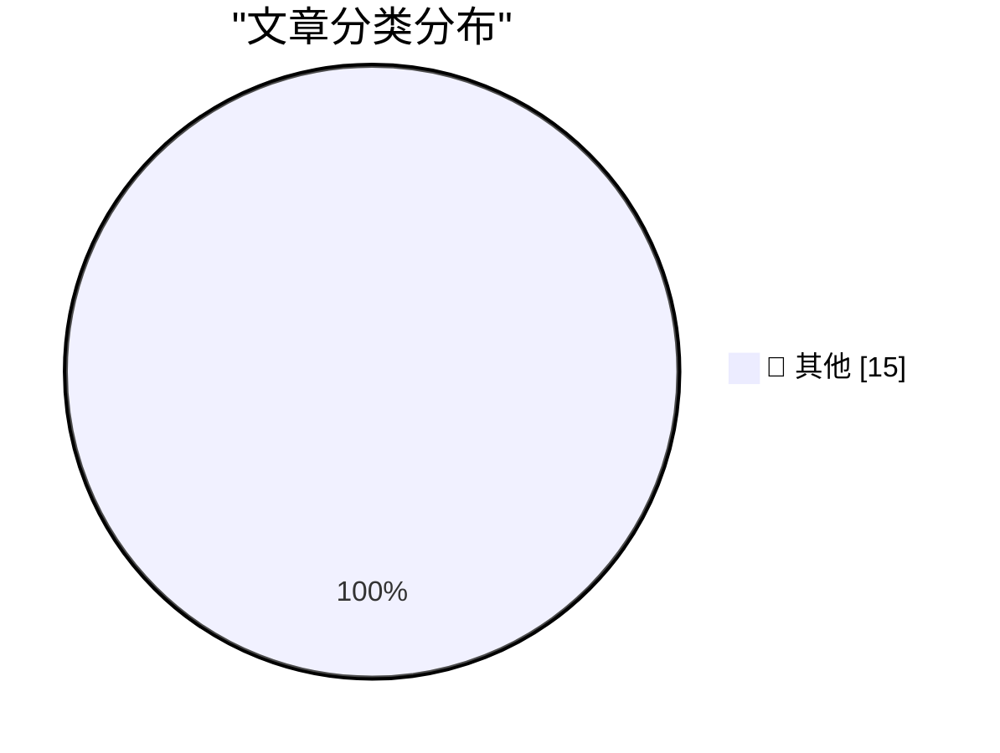

# 📰 AI 博客每日精选 — 2026-03-13

> 来自 Karpathy 推荐的 92 个顶级技术博客，AI 精选 Top 15

## 🏆 今日必读

🥇 **Shopify/liquid: Performance: 53% faster parse+render, 61% fewer allocations**

[Shopify/liquid: Performance: 53% faster parse+render, 61% fewer allocations](https://simonwillison.net/2026/Mar/13/liquid/#atom-everything) — simonwillison.net · 7 小时前 · 📝 其他

> Shopify/liquid: Performance: 53% faster parse+render, 61% fewer allocations

🥈 **MALUS - Clean Room as a Service**

[MALUS - Clean Room as a Service](https://simonwillison.net/2026/Mar/12/malus/#atom-everything) — simonwillison.net · 15 小时前 · 📝 其他

> MALUS - Clean Room as a Service

🥉 **Coding After Coders: The End of Computer Programming as We Know It**

[Coding After Coders: The End of Computer Programming as We Know It](https://simonwillison.net/2026/Mar/12/coding-after-coders/#atom-everything) — simonwillison.net · 15 小时前 · 📝 其他

> Coding After Coders: The End of Computer Programming as We Know It

---

## 📊 数据概览

| 扫描源 | 抓取文章 | 时间范围 | 精选 |
|:---:|:---:|:---:|:---:|
| 83/92 | 2402 篇 → 45 篇 | 48h | **15 篇** |

### 分类分布

---

## 📝 其他

### 1. Shopify/liquid: Performance: 53% faster parse+render, 61% fewer allocations

[Shopify/liquid: Performance: 53% faster parse+render, 61% fewer allocations](https://simonwillison.net/2026/Mar/13/liquid/#atom-everything) — **simonwillison.net** · 7 小时前 · ⭐ 15/30

> Shopify/liquid: Performance: 53% faster parse+render, 61% fewer allocations

---

### 2. MALUS - Clean Room as a Service

[MALUS - Clean Room as a Service](https://simonwillison.net/2026/Mar/12/malus/#atom-everything) — **simonwillison.net** · 15 小时前 · ⭐ 15/30

> MALUS - Clean Room as a Service

---

### 3. Coding After Coders: The End of Computer Programming as We Know It

[Coding After Coders: The End of Computer Programming as We Know It](https://simonwillison.net/2026/Mar/12/coding-after-coders/#atom-everything) — **simonwillison.net** · 15 小时前 · ⭐ 15/30

> Coding After Coders: The End of Computer Programming as We Know It

---

### 4. Quoting Les Orchard

[Quoting Les Orchard](https://simonwillison.net/2026/Mar/12/les-orchard/#atom-everything) — **simonwillison.net** · 18 小时前 · ⭐ 15/30

> Quoting Les Orchard

---

### 5. Sorting algorithms

[Sorting algorithms](https://simonwillison.net/2026/Mar/11/sorting-algorithms/#atom-everything) — **simonwillison.net** · 1 天前 · ⭐ 15/30

> Sorting algorithms

---

### 6. Quoting John Carmack

[Quoting John Carmack](https://simonwillison.net/2026/Mar/11/john-carmack/#atom-everything) — **simonwillison.net** · 1 天前 · ⭐ 15/30

> Quoting John Carmack

---

### 7. Can the MacBook Neo replace my M4 Air?

[Can the MacBook Neo replace my M4 Air?](https://www.jeffgeerling.com/blog/2026/macbook-neo-replace-m4-air/) — **jeffgeerling.com** · 17 小时前 · ⭐ 15/30

> Can the MacBook Neo replace my M4 Air?

---

### 8. Iran-Backed Hackers Claim Wiper Attack on Medtech Firm Stryker

[Iran-Backed Hackers Claim Wiper Attack on Medtech Firm Stryker](https://krebsonsecurity.com/2026/03/iran-backed-hackers-claim-wiper-attack-on-medtech-firm-stryker/) — **krebsonsecurity.com** · 1 天前 · ⭐ 15/30

> Iran-Backed Hackers Claim Wiper Attack on Medtech Firm Stryker

---

### 9. Accents

[Accents](https://mahdi.jp/apps/accents) — **daringfireball.net** · 11 小时前 · ⭐ 15/30

> Accents

---

### 10. Apple’s Platform Security Guide Adds a Brief Note on the MacBook Neo’s On-Screen Camera Indicator

[Apple’s Platform Security Guide Adds a Brief Note on the MacBook Neo’s On-Screen Camera Indicator](https://support.apple.com/guide/security/mac-on-screen-camera-indicator-light-sec75a2d237d/1/web/1) — **daringfireball.net** · 11 小时前 · ⭐ 15/30

> Apple’s Platform Security Guide Adds a Brief Note on the MacBook Neo’s On-Screen Camera Indicator

---

### 11. Eddy Cue Says F1 on Apple TV Opened to Increased Viewership

[Eddy Cue Says F1 on Apple TV Opened to Increased Viewership](https://www.hollywoodreporter.com/tv/tv-news/apple-tv-formula-1-ratings-eddy-cue-strong-start-1236529359/) — **daringfireball.net** · 11 小时前 · ⭐ 15/30

> Eddy Cue Says F1 on Apple TV Opened to Increased Viewership

---

### 12. MacBook Neo Teardown

[MacBook Neo Teardown](https://www.youtube.com/watch?v=5k7Lv7f-5CQ) — **daringfireball.net** · 16 小时前 · ⭐ 15/30

> MacBook Neo Teardown

---

### 13. Software Proprioception

[Software Proprioception](https://unsung.aresluna.org/software-proprioception/) — **daringfireball.net** · 19 小时前 · ⭐ 15/30

> Software Proprioception

---

### 14. Jason Snell Is on Jeopardy Next Week

[Jason Snell Is on Jeopardy Next Week](https://sixcolors.com/post/2026/03/ill-take-beach-reading-for-1000-ken/) — **daringfireball.net** · 1 天前 · ⭐ 15/30

> Jason Snell Is on Jeopardy Next Week

---

### 15. Another One From the Archive: ‘Web Kit’ vs. ‘WebKit’

[Another One From the Archive: ‘Web Kit’ vs. ‘WebKit’](https://daringfireball.net/2006/05/web_kit_vs_webkit) — **daringfireball.net** · 1 天前 · ⭐ 15/30

> Another One From the Archive: ‘Web Kit’ vs. ‘WebKit’

---

*生成于 2026-03-13 11:22 | 扫描 83 源 → 获取 2402 篇 → 精选 15 篇*
*基于 [Hacker News Popularity Contest 2025](https://refactoringenglish.com/tools/hn-popularity/) RSS 源列表，由 [Andrej Karpathy](https://x.com/karpathy) 推荐*
*由「懂点儿AI」制作，欢迎关注同名微信公众号获取更多 AI 实用技巧 💡*
