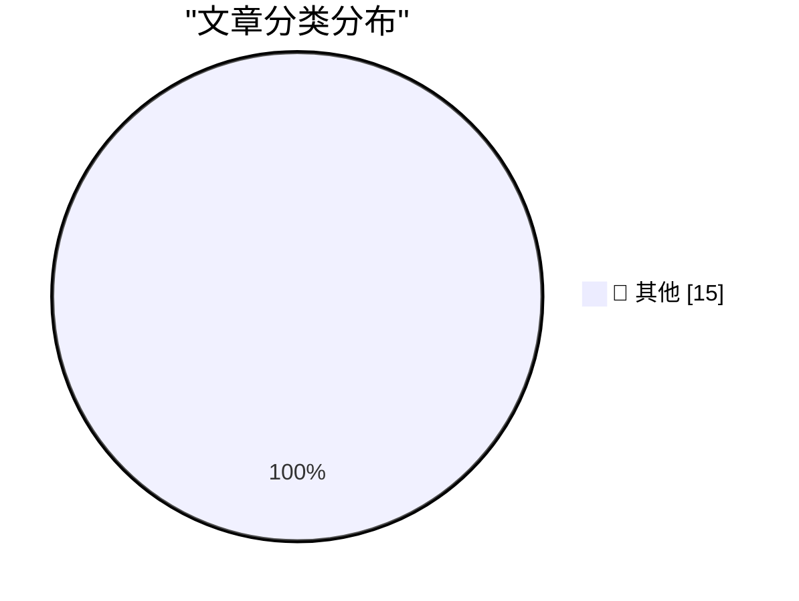

# 📰 AI 博客每日精选 — 2026-03-02

> 来自 Karpathy 推荐的 92 个顶级技术博客，AI 精选 Top 15

## 🏆 今日必读

🥇 **Quoting claude.com/import-memory**

[Quoting claude.com/import-memory](https://simonwillison.net/2026/Mar/1/claude-import-memory/#atom-everything) — simonwillison.net · 1 天前 · 📝 其他

> Quoting claude.com/import-memory

🥈 **Interactive explanations**

[Interactive explanations](https://simonwillison.net/guides/agentic-engineering-patterns/interactive-explanations/#atom-everything) — simonwillison.net · 1 天前 · 📝 其他

> Interactive explanations

🥉 **Expert Beginners and Lone Wolves will dominate this early LLM era**

[Expert Beginners and Lone Wolves will dominate this early LLM era](https://www.jeffgeerling.com/blog/2026/expert-beginners-and-lone-wolves-dominate-llm-era/) — jeffgeerling.com · 13 小时前 · 📝 其他

> Expert Beginners and Lone Wolves will dominate this early LLM era

---

## 📊 数据概览

| 扫描源 | 抓取文章 | 时间范围 | 精选 |
|:---:|:---:|:---:|:---:|
| 82/92 | 2380 篇 → 28 篇 | 48h | **15 篇** |

### 分类分布

---

## 📝 其他

### 1. Quoting claude.com/import-memory

[Quoting claude.com/import-memory](https://simonwillison.net/2026/Mar/1/claude-import-memory/#atom-everything) — **simonwillison.net** · 1 天前 · ⭐ 15/30

> Quoting claude.com/import-memory

---

### 2. Interactive explanations

[Interactive explanations](https://simonwillison.net/guides/agentic-engineering-patterns/interactive-explanations/#atom-everything) — **simonwillison.net** · 1 天前 · ⭐ 15/30

> Interactive explanations

---

### 3. Expert Beginners and Lone Wolves will dominate this early LLM era

[Expert Beginners and Lone Wolves will dominate this early LLM era](https://www.jeffgeerling.com/blog/2026/expert-beginners-and-lone-wolves-dominate-llm-era/) — **jeffgeerling.com** · 13 小时前 · ⭐ 15/30

> Expert Beginners and Lone Wolves will dominate this early LLM era

---

### 4. Who is the Kimwolf Botmaster “Dort”?

[Who is the Kimwolf Botmaster “Dort”?](https://krebsonsecurity.com/2026/02/who-is-the-kimwolf-botmaster-dort/) — **krebsonsecurity.com** · 1 天前 · ⭐ 15/30

> Who is the Kimwolf Botmaster “Dort”?

---

### 5. Sentry

[Sentry](https://sentry.io/resources/ios-workshop-jan-2026/?utm_source=daringfireball&amp;utm_medium=paid-display&amp;utm_campaign=general-fy27q1-evergreen&amp;utm_content=static-ad-mobilerss-trysentry) — **daringfireball.net** · 19 小时前 · ⭐ 15/30

> Sentry

---

### 6. The Talk Show: ‘Bad Dates’

[The Talk Show: ‘Bad Dates’](https://daringfireball.net/thetalkshow/2026/02/28/ep-442) — **daringfireball.net** · 19 小时前 · ⭐ 15/30

> The Talk Show: ‘Bad Dates’

---

### 7. Trump’s Enormous Gamble on Regime Change in Iran

[Trump’s Enormous Gamble on Regime Change in Iran](https://www.theatlantic.com/ideas/2026/02/trumps-iran-regime-change-attack-gamble/686190/?gift=aQyUJR7AIw1mJWdQ6Ed6yOWB4bfod1kQqCyz2RXbHaY) — **daringfireball.net** · 1 天前 · ⭐ 15/30

> Trump’s Enormous Gamble on Regime Change in Iran

---

### 8. Redis patterns for coding

[Redis patterns for coding](http://antirez.com/news/161) — **antirez.com** · 1 天前 · ⭐ 15/30

> Redis patterns for coding

---

### 9. &ldquo;How old are you?&rdquo; Asked the OS

[&ldquo;How old are you?&rdquo; Asked the OS](https://idiallo.com/byte-size/how-old-are-you-asked-the-os?src=feed) — **idiallo.com** · 1 天前 · ⭐ 15/30

> &ldquo;How old are you?&rdquo; Asked the OS

---

### 10. That's it, I'm cancelling my ChatGPT

[That's it, I'm cancelling my ChatGPT](https://idiallo.com/byte-size/im-cancelling-my-chatgpt-openai-account?src=feed) — **idiallo.com** · 1 天前 · ⭐ 15/30

> That's it, I'm cancelling my ChatGPT

---

### 11. Pluralistic: No one wants to read your AI slop (02 Mar 2026)

[Pluralistic: No one wants to read your AI slop (02 Mar 2026)](https://pluralistic.net/2026/03/02/nonconsensual-slopping/) — **pluralistic.net** · 2 小时前 · ⭐ 15/30

> Pluralistic: No one wants to read your AI slop (02 Mar 2026)

---

### 12. Book Review: Under Fire - Black Britain in Wartime by Stephen Bourne ★★★★☆

[Book Review: Under Fire - Black Britain in Wartime by Stephen Bourne ★★★★☆](https://shkspr.mobi/blog/2026/03/book-review-under-fire-black-britain-in-wartime-by-stephen-bourne/) — **shkspr.mobi** · 23 小时前 · ⭐ 15/30

> Book Review: Under Fire - Black Britain in Wartime by Stephen Bourne ★★★★☆

---

### 13. 30 months to 3MWh - some more home battery stats

[30 months to 3MWh - some more home battery stats](https://shkspr.mobi/blog/2026/02/30-months-to-3mwh-some-more-home-battery-stats/) — **shkspr.mobi** · 1 天前 · ⭐ 15/30

> 30 months to 3MWh - some more home battery stats

---

### 14. The Unbound Scepter

[The Unbound Scepter](https://xeiaso.net/blog/2026/seroquel-xanax-trip-report/) — **xeiaso.net** · 11 小时前 · ⭐ 15/30

> The Unbound Scepter

---

### 15. Killing my inner Necron

[Killing my inner Necron](https://xeiaso.net/blog/2026/killing-my-inner-necron/) — **xeiaso.net** · 1 天前 · ⭐ 15/30

> Killing my inner Necron

---

*生成于 2026-03-02 11:39 | 扫描 82 源 → 获取 2380 篇 → 精选 15 篇*
*基于 [Hacker News Popularity Contest 2025](https://refactoringenglish.com/tools/hn-popularity/) RSS 源列表，由 [Andrej Karpathy](https://x.com/karpathy) 推荐*
*由「懂点儿AI」制作，欢迎关注同名微信公众号获取更多 AI 实用技巧 💡*
