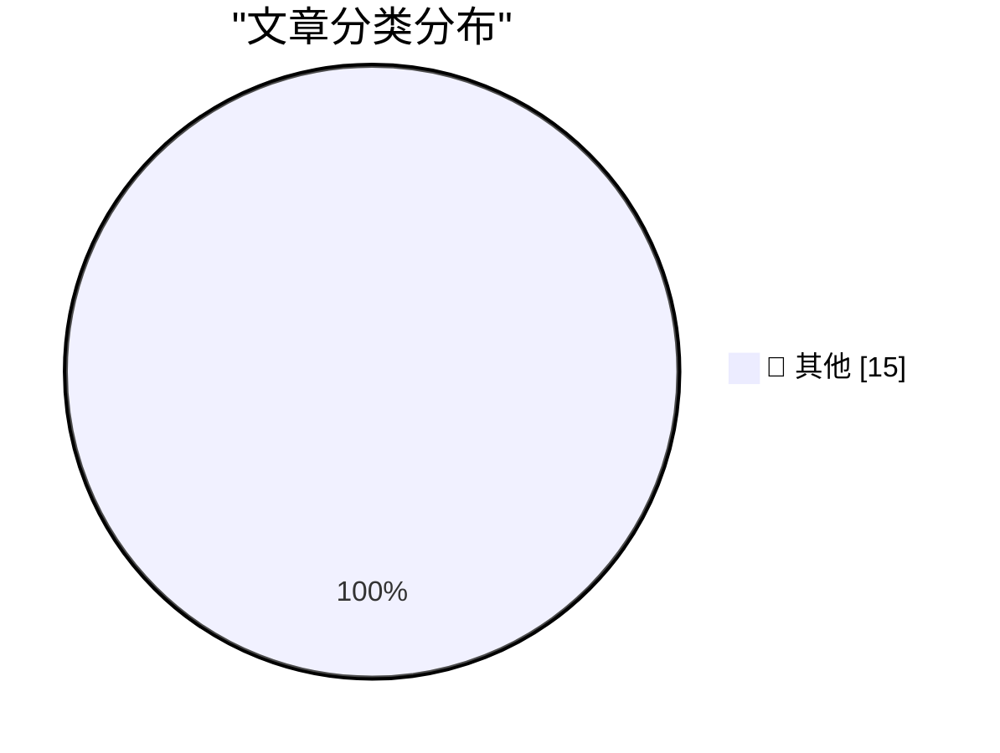

# 📰 AI 博客每日精选 — 2026-04-26

> 来自 Karpathy 推荐的 92 个顶级技术博客，AI 精选 Top 15

## 🏆 今日必读

🥇 **WHY ARE YOU LIKE THIS**

[WHY ARE YOU LIKE THIS](https://simonwillison.net/2026/Apr/25/why-are-you-like-this/#atom-everything) — simonwillison.net · 17 小时前 · 📝 其他

> WHY ARE YOU LIKE THIS

🥈 **Quoting Romain Huet**

[Quoting Romain Huet](https://simonwillison.net/2026/Apr/25/romain-huet/#atom-everything) — simonwillison.net · 22 小时前 · 📝 其他

> Quoting Romain Huet

🥉 **GPT-5.5 prompting guide**

[GPT-5.5 prompting guide](https://simonwillison.net/2026/Apr/25/gpt-5-5-prompting-guide/#atom-everything) — simonwillison.net · 1 天前 · 📝 其他

> GPT-5.5 prompting guide

---

## 📊 数据概览

| 扫描源 | 抓取文章 | 时间范围 | 精选 |
|:---:|:---:|:---:|:---:|
| 82/92 | 2428 篇 → 27 篇 | 48h | **15 篇** |

### 分类分布

---

## 📝 其他

### 1. WHY ARE YOU LIKE THIS

[WHY ARE YOU LIKE THIS](https://simonwillison.net/2026/Apr/25/why-are-you-like-this/#atom-everything) — **simonwillison.net** · 17 小时前 · ⭐ 15/30

> WHY ARE YOU LIKE THIS

---

### 2. Quoting Romain Huet

[Quoting Romain Huet](https://simonwillison.net/2026/Apr/25/romain-huet/#atom-everything) — **simonwillison.net** · 22 小时前 · ⭐ 15/30

> Quoting Romain Huet

---

### 3. GPT-5.5 prompting guide

[GPT-5.5 prompting guide](https://simonwillison.net/2026/Apr/25/gpt-5-5-prompting-guide/#atom-everything) — **simonwillison.net** · 1 天前 · ⭐ 15/30

> GPT-5.5 prompting guide

---

### 4. llm 0.31

[llm 0.31](https://simonwillison.net/2026/Apr/24/llm/#atom-everything) — **simonwillison.net** · 1 天前 · ⭐ 15/30

> llm 0.31

---

### 5. The people do not yearn for automation

[The people do not yearn for automation](https://simonwillison.net/2026/Apr/24/the-people-do-not-yearn-for-automation/#atom-everything) — **simonwillison.net** · 1 天前 · ⭐ 15/30

> The people do not yearn for automation

---

### 6. New 10 GbE USB adapters are cooler, smaller, cheaper

[New 10 GbE USB adapters are cooler, smaller, cheaper](https://www.jeffgeerling.com/blog/2026/new-10-gbe-usb-adapters-cooler-smaller-cheaper/) — **jeffgeerling.com** · 1 天前 · ⭐ 15/30

> New 10 GbE USB adapters are cooler, smaller, cheaper

---

### 7. ★ Time to Serve Some Delicious Claim Chowder Regarding the Cook-Ternus CEO Transition

[★ Time to Serve Some Delicious Claim Chowder Regarding the Cook-Ternus CEO Transition](https://daringfireball.net/2026/04/delicious_claim_chowder_regarding_the_cook-ternus_ceo_transition) — **daringfireball.net** · 1 天前 · ⭐ 15/30

> ★ Time to Serve Some Delicious Claim Chowder Regarding the Cook-Ternus CEO Transition

---

### 8. ★ Norwegian Boating Licenses and Generational Law

[★ Norwegian Boating Licenses and Generational Law](https://daringfireball.net/2026/04/norwegian_boating_licenses_and_generational_law) — **daringfireball.net** · 1 天前 · ⭐ 15/30

> ★ Norwegian Boating Licenses and Generational Law

---

### 9. ★ ‘We Don’t Serve Their Kind Here’

[★ ‘We Don’t Serve Their Kind Here’](https://daringfireball.net/2026/04/we_dont_serve_their_kind_here) — **daringfireball.net** · 1 天前 · ⭐ 15/30

> ★ ‘We Don’t Serve Their Kind Here’

---

### 10. XOXO Explore

[XOXO Explore](https://xoxofest.com/blog/2026-launching-xoxo-explore/) — **daringfireball.net** · 1 天前 · ⭐ 15/30

> XOXO Explore

---

### 11. New Zealand Passed a Generational Smoking Ban in 2022, But Repealed It Before It Went Into Effect

[New Zealand Passed a Generational Smoking Ban in 2022, But Repealed It Before It Went Into Effect](https://www.theguardian.com/world/2023/nov/27/new-zealand-scraps-world-first-smoking-generation-ban-to-fund-tax-cuts) — **daringfireball.net** · 1 天前 · ⭐ 15/30

> New Zealand Passed a Generational Smoking Ban in 2022, But Repealed It Before It Went Into Effect

---

### 12. The Satisfaction of a ChatGPT Plan

[The Satisfaction of a ChatGPT Plan](https://idiallo.com/byte-size/the-satisfaction-of-a-chatgpt-plan?src=feed) — **idiallo.com** · 16 小时前 · ⭐ 15/30

> The Satisfaction of a ChatGPT Plan

---

### 13. What Do You Charge For?

[What Do You Charge For?](https://idiallo.com/blog/what-do-you-charge-for?src=feed) — **idiallo.com** · 1 天前 · ⭐ 15/30

> What Do You Charge For?

---

### 14. Pluralistic: Ada Palmer's "Inventing the Renaissance" (25 Apr 2026)

[Pluralistic: Ada Palmer's "Inventing the Renaissance" (25 Apr 2026)](https://pluralistic.net/2026/04/25/machiavellian/) — **pluralistic.net** · 23 小时前 · ⭐ 15/30

> Pluralistic: Ada Palmer's "Inventing the Renaissance" (25 Apr 2026)

---

### 15. Pluralistic: A free, open visual identity for enshittification (24 Apr 2026)

[Pluralistic: A free, open visual identity for enshittification (24 Apr 2026)](https://pluralistic.net/2026/04/24/poop-emoji-plus-plus/) — **pluralistic.net** · 1 天前 · ⭐ 15/30

> Pluralistic: A free, open visual identity for enshittification (24 Apr 2026)

---

*生成于 2026-04-26 10:35 | 扫描 82 源 → 获取 2428 篇 → 精选 15 篇*
*基于 [Hacker News Popularity Contest 2025](https://refactoringenglish.com/tools/hn-popularity/) RSS 源列表，由 [Andrej Karpathy](https://x.com/karpathy) 推荐*
*由「懂点儿AI」制作，欢迎关注同名微信公众号获取更多 AI 实用技巧 💡*
