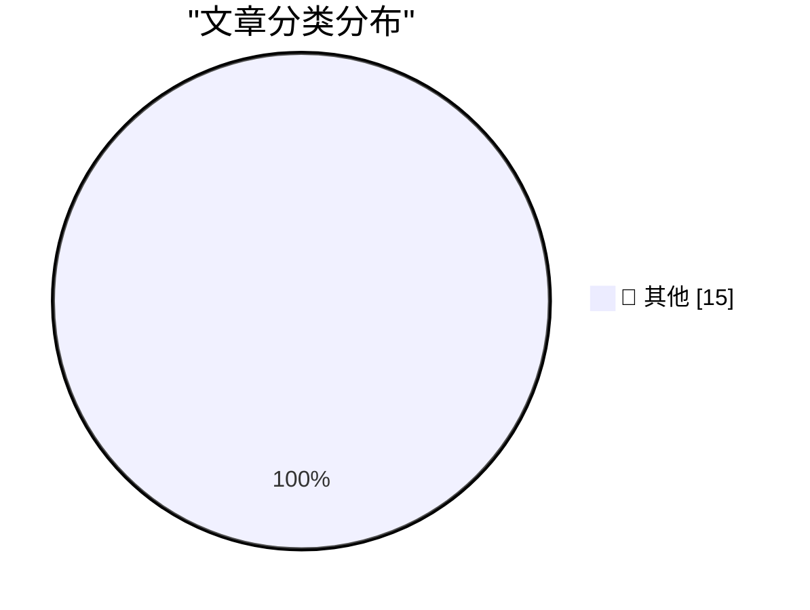

# 📰 AI 博客每日精选 — 2026-03-08

> 来自 Karpathy 推荐的 92 个顶级技术博客，AI 精选 Top 15

## 🏆 今日必读

🥇 **Codex for Open Source**

[Codex for Open Source](https://simonwillison.net/2026/Mar/7/codex-for-open-source/#atom-everything) — simonwillison.net · 16 小时前 · 📝 其他

> Codex for Open Source

🥈 **Quoting Ally Piechowski**

[Quoting Ally Piechowski](https://simonwillison.net/2026/Mar/6/ally-piechowski/#atom-everything) — simonwillison.net · 1 天前 · 📝 其他

> Quoting Ally Piechowski

🥉 **Anthropic and the Pentagon**

[Anthropic and the Pentagon](https://simonwillison.net/2026/Mar/6/anthropic-and-the-pentagon/#atom-everything) — simonwillison.net · 1 天前 · 📝 其他

> Anthropic and the Pentagon

---

## 📊 数据概览

| 扫描源 | 抓取文章 | 时间范围 | 精选 |
|:---:|:---:|:---:|:---:|
| 84/92 | 2423 篇 → 32 篇 | 48h | **15 篇** |

### 分类分布

---

## 📝 其他

### 1. Codex for Open Source

[Codex for Open Source](https://simonwillison.net/2026/Mar/7/codex-for-open-source/#atom-everything) — **simonwillison.net** · 16 小时前 · ⭐ 15/30

> Codex for Open Source

---

### 2. Quoting Ally Piechowski

[Quoting Ally Piechowski](https://simonwillison.net/2026/Mar/6/ally-piechowski/#atom-everything) — **simonwillison.net** · 1 天前 · ⭐ 15/30

> Quoting Ally Piechowski

---

### 3. Anthropic and the Pentagon

[Anthropic and the Pentagon](https://simonwillison.net/2026/Mar/6/anthropic-and-the-pentagon/#atom-everything) — **simonwillison.net** · 1 天前 · ⭐ 15/30

> Anthropic and the Pentagon

---

### 4. A PTP Wall Clock is impractical and a little too precise

[A PTP Wall Clock is impractical and a little too precise](https://www.jeffgeerling.com/blog/2026/ptp-wall-clock-impractical-too-precise/) — **jeffgeerling.com** · 1 天前 · ⭐ 15/30

> A PTP Wall Clock is impractical and a little too precise

---

### 5. ‘npx workos’

[‘npx workos’](https://workos.com/docs/authkit/cli-installer?utm_source=tldrdev&amp;utm_medium=newsletter&amp;utm_campaign=q12026) — **daringfireball.net** · 12 小时前 · ⭐ 15/30

> ‘npx workos’

---

### 6. Daring Fireball Weekly Sponsorship Openings

[Daring Fireball Weekly Sponsorship Openings](https://daringfireball.net/feeds/sponsors/) — **daringfireball.net** · 1 天前 · ⭐ 15/30

> Daring Fireball Weekly Sponsorship Openings

---

### 7. Google’s Threat Intelligence Group on Coruna, a Powerful iOS Exploit Kit of Mysterious Origin

[Google’s Threat Intelligence Group on Coruna, a Powerful iOS Exploit Kit of Mysterious Origin](https://cloud.google.com/blog/topics/threat-intelligence/coruna-powerful-ios-exploit-kit) — **daringfireball.net** · 1 天前 · ⭐ 15/30

> Google’s Threat Intelligence Group on Coruna, a Powerful iOS Exploit Kit of Mysterious Origin

---

### 8. ‘The Window Chrome of Our Discontent’

[‘The Window Chrome of Our Discontent’](https://pxlnv.com/blog/window-chrome-of-our-discontent/) — **daringfireball.net** · 1 天前 · ⭐ 15/30

> ‘The Window Chrome of Our Discontent’

---

### 9. The Verge Interviews Tim Sweeney After Victory in ‘Epic v. Google’

[The Verge Interviews Tim Sweeney After Victory in ‘Epic v. Google’](https://www.theverge.com/23996474/epic-tim-sweeney-interview-win-google-antitrust-lawsuit-district-court) — **daringfireball.net** · 1 天前 · ⭐ 15/30

> The Verge Interviews Tim Sweeney After Victory in ‘Epic v. Google’

---

### 10. Tim Sweeney Signed Away His Right to Criticize Google’s Play Store Until 2032

[Tim Sweeney Signed Away His Right to Criticize Google’s Play Store Until 2032](https://www.theverge.com/news/889595/tim-sweeney-signed-away-his-right-to-criticize-google-until-2032) — **daringfireball.net** · 1 天前 · ⭐ 15/30

> Tim Sweeney Signed Away His Right to Criticize Google’s Play Store Until 2032

---

### 11. The MacBook Neo’s Price, Looking to the Past and Future

[The MacBook Neo’s Price, Looking to the Past and Future](https://x.com/ethan_is_online/status/2029331836137291941?s=42) — **daringfireball.net** · 1 天前 · ⭐ 15/30

> The MacBook Neo’s Price, Looking to the Past and Future

---

### 12. ‘Never the Same Game Twice’

[‘Never the Same Game Twice’](https://johnmccoy.org/2026/03/05/never-the-same-game-twice/) — **daringfireball.net** · 1 天前 · ⭐ 15/30

> ‘Never the Same Game Twice’

---

### 13. Another Steve Jobs Quote on Lower-Priced Macs

[Another Steve Jobs Quote on Lower-Priced Macs](https://technologizer.com/2008/10/22/the-case-for-a-mac-netbook/index.html) — **daringfireball.net** · 1 天前 · ⭐ 15/30

> Another Steve Jobs Quote on Lower-Priced Macs

---

### 14. It Depends

[It Depends](https://idiallo.com/blog/it-depends-experts-never-give-straight-answers?src=feed) — **idiallo.com** · 1 天前 · ⭐ 15/30

> It Depends

---

### 15. Remove annoying banners

[Remove annoying banners](https://maurycyz.com/projects/fixsite/) — **maurycyz.com** · 1 天前 · ⭐ 15/30

> Remove annoying banners

---

*生成于 2026-03-08 10:53 | 扫描 84 源 → 获取 2423 篇 → 精选 15 篇*
*基于 [Hacker News Popularity Contest 2025](https://refactoringenglish.com/tools/hn-popularity/) RSS 源列表，由 [Andrej Karpathy](https://x.com/karpathy) 推荐*
*由「懂点儿AI」制作，欢迎关注同名微信公众号获取更多 AI 实用技巧 💡*
