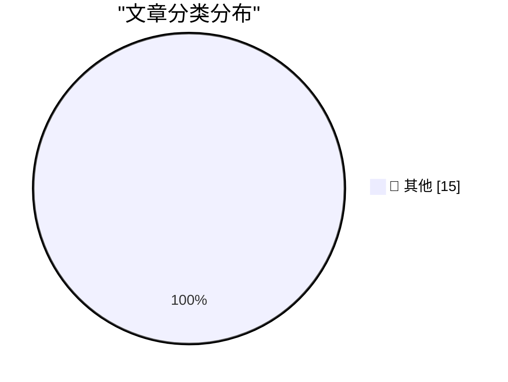

# 📰 AI 博客每日精选 — 2026-04-14

> 来自 Karpathy 推荐的 92 个顶级技术博客，AI 精选 Top 15

## 🏆 今日必读

🥇 **Steve Yegge**

[Steve Yegge](https://simonwillison.net/2026/Apr/13/steve-yegge/#atom-everything) — simonwillison.net · 13 小时前 · 📝 其他

> Steve Yegge

🥈 **Exploring the new `servo` crate**

[Exploring the new `servo` crate](https://simonwillison.net/2026/Apr/13/servo-crate-exploration/#atom-everything) — simonwillison.net · 19 小时前 · 📝 其他

> Exploring the new `servo` crate

🥉 **Quoting Bryan Cantrill**

[Quoting Bryan Cantrill](https://simonwillison.net/2026/Apr/13/bryan-cantrill/#atom-everything) — simonwillison.net · 1 天前 · 📝 其他

> Quoting Bryan Cantrill

---

## 📊 数据概览

| 扫描源 | 抓取文章 | 时间范围 | 精选 |
|:---:|:---:|:---:|:---:|
| 83/92 | 2429 篇 → 32 篇 | 48h | **15 篇** |

### 分类分布

---

## 📝 其他

### 1. Steve Yegge

[Steve Yegge](https://simonwillison.net/2026/Apr/13/steve-yegge/#atom-everything) — **simonwillison.net** · 13 小时前 · ⭐ 15/30

> Steve Yegge

---

### 2. Exploring the new `servo` crate

[Exploring the new `servo` crate](https://simonwillison.net/2026/Apr/13/servo-crate-exploration/#atom-everything) — **simonwillison.net** · 19 小时前 · ⭐ 15/30

> Exploring the new `servo` crate

---

### 3. Quoting Bryan Cantrill

[Quoting Bryan Cantrill](https://simonwillison.net/2026/Apr/13/bryan-cantrill/#atom-everything) — **simonwillison.net** · 1 天前 · ⭐ 15/30

> Quoting Bryan Cantrill

---

### 4. Gemma 4 audio with MLX

[Gemma 4 audio with MLX](https://simonwillison.net/2026/Apr/12/mlx-audio/#atom-everything) — **simonwillison.net** · 1 天前 · ⭐ 15/30

> Gemma 4 audio with MLX

---

### 5. Steven Soderbergh Twice Pitched James Bond Projects

[Steven Soderbergh Twice Pitched James Bond Projects](https://theplaylist.net/steven-soderbergh-says-he-pitched-two-different-james-bond-plans-including-a-twofer-that-would-have-created-an-new-auteur-lane-for-the-franchise-20260409/) — **daringfireball.net** · 10 小时前 · ⭐ 15/30

> Steven Soderbergh Twice Pitched James Bond Projects

---

### 6. Apple Frames 4

[Apple Frames 4](https://www.macstories.net/stories/introducing-apple-frames-4-a-revamped-shortcut-support-for-frame-colors-proportional-scaling-and-the-apple-frames-cli-for-developers/) — **daringfireball.net** · 10 小时前 · ⭐ 15/30

> Apple Frames 4

---

### 7. Memory, They Say, Is the First Thing to Go

[Memory, They Say, Is the First Thing to Go](https://daringfireball.net/2006/09/zoom_using_scroll_wheel) — **daringfireball.net** · 11 小时前 · ⭐ 15/30

> Memory, They Say, Is the First Thing to Go

---

### 8. [Sponsor] WorkOS FGA: The Authorization Layer for AI Agents

[[Sponsor] WorkOS FGA: The Authorization Layer for AI Agents](https://workos.com/blog/agents-need-authorization-not-just-authentication?utm_source=daringfireball&amp;utm_medium=newsletter&amp;utm_campaign=q22026) — **daringfireball.net** · 13 小时前 · ⭐ 15/30

> [Sponsor] WorkOS FGA: The Authorization Layer for AI Agents

---

### 9. Tahoe Nitpick of the Day: ‘Reduce Transparency’ Makes Layers Harder to See, Not Easier

[Tahoe Nitpick of the Day: ‘Reduce Transparency’ Makes Layers Harder to See, Not Easier](https://mastodon.social/@tuomas_h/116397694769738857) — **daringfireball.net** · 13 小时前 · ⭐ 15/30

> Tahoe Nitpick of the Day: ‘Reduce Transparency’ Makes Layers Harder to See, Not Easier

---

### 10. John Martellaro, RIP

[John Martellaro, RIP](https://geektells.com/john-martellaro-remembrance/) — **daringfireball.net** · 15 小时前 · ⭐ 15/30

> John Martellaro, RIP

---

### 11. Marcin Wichary Visits the Large Scale Systems Museum

[Marcin Wichary Visits the Large Scale Systems Museum](https://flickr.com/photos/mwichary/albums/72177720332956990/) — **daringfireball.net** · 15 小时前 · ⭐ 15/30

> Marcin Wichary Visits the Large Scale Systems Museum

---

### 12. MacOS Tip: Enable the Zoom ‘Peek’ Gesture

[MacOS Tip: Enable the Zoom ‘Peek’ Gesture](https://unsung.aresluna.org/testing-tip-enable-the-zoom-peek-gesture/) — **daringfireball.net** · 17 小时前 · ⭐ 15/30

> MacOS Tip: Enable the Zoom ‘Peek’ Gesture

---

### 13. FT: ‘Meta Builds AI Version of Mark Zuckerberg to Interact With Staff’

[FT: ‘Meta Builds AI Version of Mark Zuckerberg to Interact With Staff’](https://www.ft.com/content/02107c23-6c7a-4c19-b8e2-b45f4bb9ce5f) — **daringfireball.net** · 17 小时前 · ⭐ 15/30

> FT: ‘Meta Builds AI Version of Mark Zuckerberg to Interact With Staff’

---

### 14. Zed — A Font Superfamily

[Zed — A Font Superfamily](https://www.typotheque.com/blog/zed-a-sans-for-the-needs-of-21century/?utm_source=df) — **daringfireball.net** · 1 天前 · ⭐ 15/30

> Zed — A Font Superfamily

---

### 15. Viktor Orban Loses Election in Hungary, Concedes Defeat, Congratulates Opposition Winners

[Viktor Orban Loses Election in Hungary, Concedes Defeat, Congratulates Opposition Winners](https://www.nytimes.com/2026/04/12/world/europe/hungary-election-orban-magyar.html) — **daringfireball.net** · 1 天前 · ⭐ 15/30

> Viktor Orban Loses Election in Hungary, Concedes Defeat, Congratulates Opposition Winners

---

*生成于 2026-04-14 10:55 | 扫描 83 源 → 获取 2429 篇 → 精选 15 篇*
*基于 [Hacker News Popularity Contest 2025](https://refactoringenglish.com/tools/hn-popularity/) RSS 源列表，由 [Andrej Karpathy](https://x.com/karpathy) 推荐*
*由「懂点儿AI」制作，欢迎关注同名微信公众号获取更多 AI 实用技巧 💡*
