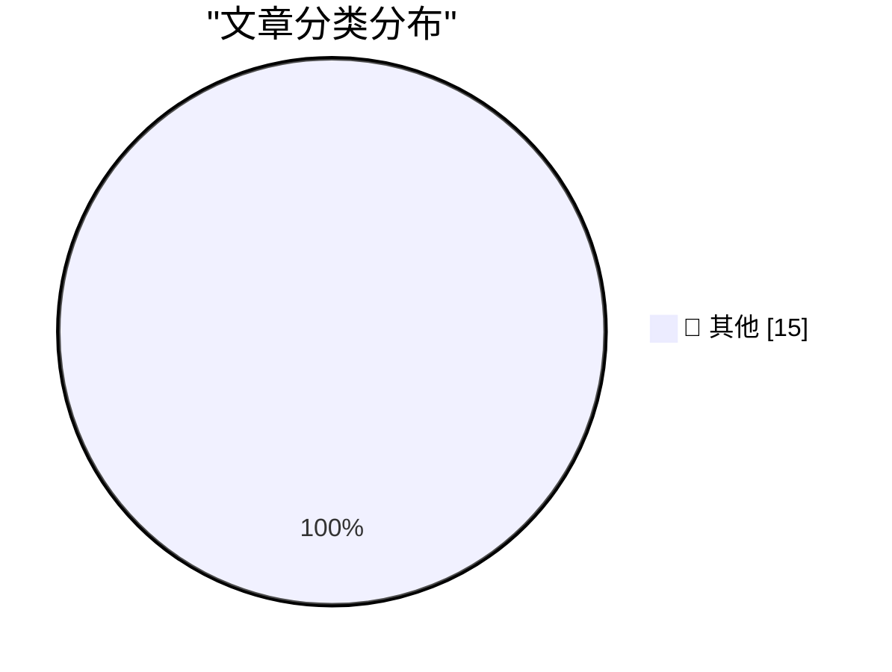

# 📰 AI 博客每日精选 — 2026-04-25

> 来自 Karpathy 推荐的 92 个顶级技术博客，AI 精选 Top 15

## 🏆 今日必读

🥇 **GPT-5.5 prompting guide**

[GPT-5.5 prompting guide](https://simonwillison.net/2026/Apr/25/gpt-5-5-prompting-guide/#atom-everything) — simonwillison.net · 6 小时前 · 📝 其他

> GPT-5.5 prompting guide

🥈 **llm 0.31**

[llm 0.31](https://simonwillison.net/2026/Apr/24/llm/#atom-everything) — simonwillison.net · 10 小时前 · 📝 其他

> llm 0.31

🥉 **The people do not yearn for automation**

[The people do not yearn for automation](https://simonwillison.net/2026/Apr/24/the-people-do-not-yearn-for-automation/#atom-everything) — simonwillison.net · 11 小时前 · 📝 其他

> The people do not yearn for automation

---

## 📊 数据概览

| 扫描源 | 抓取文章 | 时间范围 | 精选 |
|:---:|:---:|:---:|:---:|
| 83/92 | 2440 篇 → 46 篇 | 48h | **15 篇** |

### 分类分布

---

## 📝 其他

### 1. GPT-5.5 prompting guide

[GPT-5.5 prompting guide](https://simonwillison.net/2026/Apr/25/gpt-5-5-prompting-guide/#atom-everything) — **simonwillison.net** · 6 小时前 · ⭐ 15/30

> GPT-5.5 prompting guide

---

### 2. llm 0.31

[llm 0.31](https://simonwillison.net/2026/Apr/24/llm/#atom-everything) — **simonwillison.net** · 10 小时前 · ⭐ 15/30

> llm 0.31

---

### 3. The people do not yearn for automation

[The people do not yearn for automation](https://simonwillison.net/2026/Apr/24/the-people-do-not-yearn-for-automation/#atom-everything) — **simonwillison.net** · 11 小时前 · ⭐ 15/30

> The people do not yearn for automation

---

### 4. DeepSeek V4 - almost on the frontier, a fraction of the price

[DeepSeek V4 - almost on the frontier, a fraction of the price](https://simonwillison.net/2026/Apr/24/deepseek-v4/#atom-everything) — **simonwillison.net** · 1 天前 · ⭐ 15/30

> DeepSeek V4 - almost on the frontier, a fraction of the price

---

### 5. Millisecond Converter

[Millisecond Converter](https://simonwillison.net/2026/Apr/24/milliseconds/#atom-everything) — **simonwillison.net** · 1 天前 · ⭐ 15/30

> Millisecond Converter

---

### 6. It's a big one

[It's a big one](https://simonwillison.net/2026/Apr/24/weekly/#atom-everything) — **simonwillison.net** · 1 天前 · ⭐ 15/30

> It's a big one

---

### 7. russellromney/honker

[russellromney/honker](https://simonwillison.net/2026/Apr/24/honker/#atom-everything) — **simonwillison.net** · 1 天前 · ⭐ 15/30

> russellromney/honker

---

### 8. An update on recent Claude Code quality reports

[An update on recent Claude Code quality reports](https://simonwillison.net/2026/Apr/24/recent-claude-code-quality-reports/#atom-everything) — **simonwillison.net** · 1 天前 · ⭐ 15/30

> An update on recent Claude Code quality reports

---

### 9. Serving the For You feed

[Serving the For You feed](https://simonwillison.net/2026/Apr/24/serving-the-for-you-feed/#atom-everything) — **simonwillison.net** · 1 天前 · ⭐ 15/30

> Serving the For You feed

---

### 10. Extract PDF text in your browser with LiteParse for the web

[Extract PDF text in your browser with LiteParse for the web](https://simonwillison.net/2026/Apr/23/liteparse-for-the-web/#atom-everything) — **simonwillison.net** · 1 天前 · ⭐ 15/30

> Extract PDF text in your browser with LiteParse for the web

---

### 11. A pelican for GPT-5.5 via the semi-official Codex backdoor API

[A pelican for GPT-5.5 via the semi-official Codex backdoor API](https://simonwillison.net/2026/Apr/23/gpt-5-5/#atom-everything) — **simonwillison.net** · 1 天前 · ⭐ 15/30

> A pelican for GPT-5.5 via the semi-official Codex backdoor API

---

### 12. llm-openai-via-codex 0.1a0

[llm-openai-via-codex 0.1a0](https://simonwillison.net/2026/Apr/23/llm-openai-via-codex/#atom-everything) — **simonwillison.net** · 1 天前 · ⭐ 15/30

> llm-openai-via-codex 0.1a0

---

### 13. Quoting Maggie Appleton

[Quoting Maggie Appleton](https://simonwillison.net/2026/Apr/23/maggie-appleton/#atom-everything) — **simonwillison.net** · 1 天前 · ⭐ 15/30

> Quoting Maggie Appleton

---

### 14. New 10 GbE USB adapters are cooler, smaller, cheaper

[New 10 GbE USB adapters are cooler, smaller, cheaper](https://www.jeffgeerling.com/blog/2026/new-10-gbe-usb-adapters-cooler-smaller-cheaper/) — **jeffgeerling.com** · 20 小时前 · ⭐ 15/30

> New 10 GbE USB adapters are cooler, smaller, cheaper

---

### 15. Software engineering may no longer be a lifetime career

[Software engineering may no longer be a lifetime career](https://seangoedecke.com/software-engineering-may-no-longer-be-a-lifetime-career/) — **seangoedecke.com** · 1 天前 · ⭐ 15/30

> Software engineering may no longer be a lifetime career

---

*生成于 2026-04-25 10:33 | 扫描 83 源 → 获取 2440 篇 → 精选 15 篇*
*基于 [Hacker News Popularity Contest 2025](https://refactoringenglish.com/tools/hn-popularity/) RSS 源列表，由 [Andrej Karpathy](https://x.com/karpathy) 推荐*
*由「懂点儿AI」制作，欢迎关注同名微信公众号获取更多 AI 实用技巧 💡*
