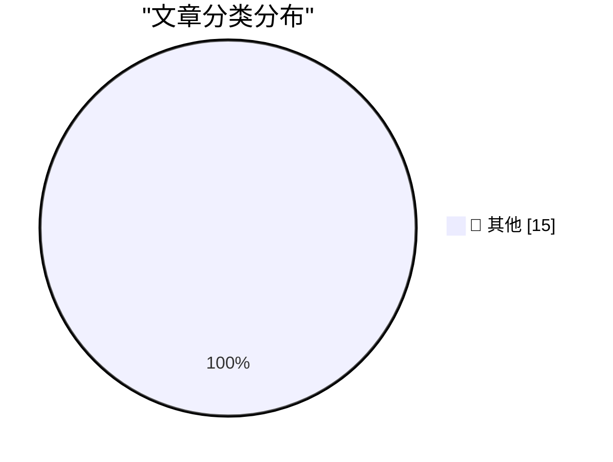

# 📰 AI 博客每日精选 — 2026-03-06

> 来自 Karpathy 推荐的 92 个顶级技术博客，AI 精选 Top 15

## 🏆 今日必读

🥇 **Agentic manual testing**

[Agentic manual testing](https://simonwillison.net/guides/agentic-engineering-patterns/agentic-manual-testing/#atom-everything) — simonwillison.net · 5 小时前 · 📝 其他

> Agentic manual testing

🥈 **Clinejection — Compromising Cline's Production Releases just by Prompting an Issue Triager**

[Clinejection — Compromising Cline's Production Releases just by Prompting an Issue Triager](https://simonwillison.net/2026/Mar/6/clinejection/#atom-everything) — simonwillison.net · 8 小时前 · 📝 其他

> Clinejection — Compromising Cline's Production Releases just by Prompting an Issue Triager

🥉 **Introducing GPT‑5.4**

[Introducing GPT‑5.4](https://simonwillison.net/2026/Mar/5/introducing-gpt54/#atom-everything) — simonwillison.net · 11 小时前 · 📝 其他

> Introducing GPT‑5.4

---

## 📊 数据概览

| 扫描源 | 抓取文章 | 时间范围 | 精选 |
|:---:|:---:|:---:|:---:|
| 85/92 | 2437 篇 → 26 篇 | 48h | **15 篇** |

### 分类分布

---

## 📝 其他

### 1. Agentic manual testing

[Agentic manual testing](https://simonwillison.net/guides/agentic-engineering-patterns/agentic-manual-testing/#atom-everything) — **simonwillison.net** · 5 小时前 · ⭐ 15/30

> Agentic manual testing

---

### 2. Clinejection — Compromising Cline's Production Releases just by Prompting an Issue Triager

[Clinejection — Compromising Cline's Production Releases just by Prompting an Issue Triager](https://simonwillison.net/2026/Mar/6/clinejection/#atom-everything) — **simonwillison.net** · 8 小时前 · ⭐ 15/30

> Clinejection — Compromising Cline's Production Releases just by Prompting an Issue Triager

---

### 3. Introducing GPT‑5.4

[Introducing GPT‑5.4](https://simonwillison.net/2026/Mar/5/introducing-gpt54/#atom-everything) — **simonwillison.net** · 11 小时前 · ⭐ 15/30

> Introducing GPT‑5.4

---

### 4. Can coding agents relicense open source through a “clean room” implementation of code?

[Can coding agents relicense open source through a “clean room” implementation of code?](https://simonwillison.net/2026/Mar/5/chardet/#atom-everything) — **simonwillison.net** · 18 小时前 · ⭐ 15/30

> Can coding agents relicense open source through a “clean room” implementation of code?

---

### 5. Anti-patterns: things to avoid

[Anti-patterns: things to avoid](https://simonwillison.net/guides/agentic-engineering-patterns/anti-patterns/#atom-everything) — **simonwillison.net** · 1 天前 · ⭐ 15/30

> Anti-patterns: things to avoid

---

### 6. Something is afoot in the land of Qwen

[Something is afoot in the land of Qwen](https://simonwillison.net/2026/Mar/4/qwen/#atom-everything) — **simonwillison.net** · 1 天前 · ⭐ 15/30

> Something is afoot in the land of Qwen

---

### 7. I don't know if my job will still exist in ten years

[I don't know if my job will still exist in ten years](https://seangoedecke.com/will-my-job-still-exist/) — **seangoedecke.com** · 11 小时前 · ⭐ 15/30

> I don't know if my job will still exist in ten years

---

### 8. Steve Jobs in 2007, on Apple’s Pursuit of PC Market Share: ‘We Just Can’t Ship Junk’

[Steve Jobs in 2007, on Apple’s Pursuit of PC Market Share: ‘We Just Can’t Ship Junk’](https://www.youtube.com/watch?v=U37Ds3RvyoM) — **daringfireball.net** · 15 小时前 · ⭐ 15/30

> Steve Jobs in 2007, on Apple’s Pursuit of PC Market Share: ‘We Just Can’t Ship Junk’

---

### 9. ★ Thoughts and Observations on the MacBook Neo

[★ Thoughts and Observations on the MacBook Neo](https://daringfireball.net/2026/03/599_not_a_piece_of_junk_macbook_neo) — **daringfireball.net** · 1 天前 · ⭐ 15/30

> ★ Thoughts and Observations on the MacBook Neo

---

### 10. Studio Display vs. Studio Display XDR

[Studio Display vs. Studio Display XDR](https://www.apple.com/displays/) — **daringfireball.net** · 1 天前 · ⭐ 15/30

> Studio Display vs. Studio Display XDR

---

### 11. Compatibility Notes on the New Studio Displays

[Compatibility Notes on the New Studio Displays](https://www.macrumors.com/2026/03/03/apple-studio-display-no-intel-mac-support/) — **daringfireball.net** · 1 天前 · ⭐ 15/30

> Compatibility Notes on the New Studio Displays

---

### 12. ‘In Other Words, Batman Has Become Superman and Robin Has Become Batman’

[‘In Other Words, Batman Has Become Superman and Robin Has Become Batman’](https://sixcolors.com/post/2026/03/apple-gives-in-to-temptation-and-renames-its-cpu-cores/) — **daringfireball.net** · 1 天前 · ⭐ 15/30

> ‘In Other Words, Batman Has Become Superman and Robin Has Become Batman’

---

### 13. Interruption-Driven Development

[Interruption-Driven Development](https://idiallo.com/blog/interruption-driven-development?src=feed) — **idiallo.com** · 1 天前 · ⭐ 15/30

> Interruption-Driven Development

---

### 14. Pluralistic: Blowtorching the frog (05 Mar 2026) executive-dysfunction

[Pluralistic: Blowtorching the frog (05 Mar 2026) executive-dysfunction](https://pluralistic.net/2026/03/05/executive-dysfunction/) — **pluralistic.net** · 15 小时前 · ⭐ 15/30

> Pluralistic: Blowtorching the frog (05 Mar 2026) executive-dysfunction

---

### 15. Book Review: Katabasis by R. F. Kuang ★★★★⯪

[Book Review: Katabasis by R. F. Kuang ★★★★⯪](https://shkspr.mobi/blog/2026/03/book-review-katabasis-by-r-f-kuang/) — **shkspr.mobi** · 22 小时前 · ⭐ 15/30

> Book Review: Katabasis by R. F. Kuang ★★★★⯪

---

*生成于 2026-03-06 11:06 | 扫描 85 源 → 获取 2437 篇 → 精选 15 篇*
*基于 [Hacker News Popularity Contest 2025](https://refactoringenglish.com/tools/hn-popularity/) RSS 源列表，由 [Andrej Karpathy](https://x.com/karpathy) 推荐*
*由「懂点儿AI」制作，欢迎关注同名微信公众号获取更多 AI 实用技巧 💡*
