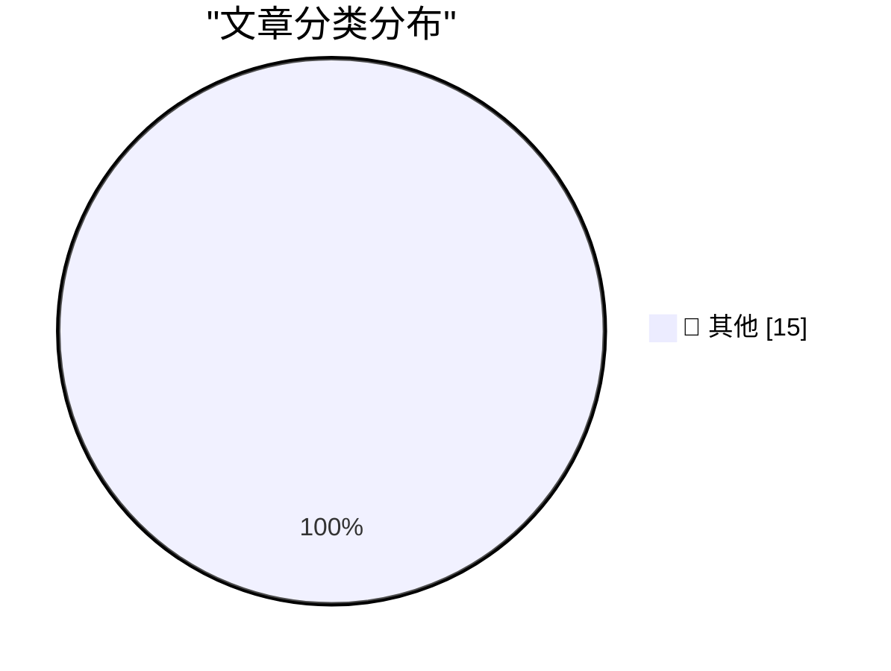

# 📰 AI 博客每日精选 — 2026-03-31

> 来自 Karpathy 推荐的 92 个顶级技术博客，AI 精选 Top 15

## 🏆 今日必读

🥇 **datasette-files 0.1a3**

[datasette-files 0.1a3](https://simonwillison.net/2026/Mar/30/datasette-files/#atom-everything) — simonwillison.net · 10 小时前 · 📝 其他

> datasette-files 0.1a3

🥈 **Quoting Georgi Gerganov**

[Quoting Georgi Gerganov](https://simonwillison.net/2026/Mar/30/georgi-gerganov/#atom-everything) — simonwillison.net · 13 小时前 · 📝 其他

> Quoting Georgi Gerganov

🥉 **datasette-llm 0.1a3**

[datasette-llm 0.1a3](https://simonwillison.net/2026/Mar/30/datasette-llm/#atom-everything) — simonwillison.net · 14 小时前 · 📝 其他

> datasette-llm 0.1a3

---

## 📊 数据概览

| 扫描源 | 抓取文章 | 时间范围 | 精选 |
|:---:|:---:|:---:|:---:|
| 82/92 | 2385 篇 → 35 篇 | 48h | **15 篇** |

### 分类分布

---

## 📝 其他

### 1. datasette-files 0.1a3

[datasette-files 0.1a3](https://simonwillison.net/2026/Mar/30/datasette-files/#atom-everything) — **simonwillison.net** · 10 小时前 · ⭐ 15/30

> datasette-files 0.1a3

---

### 2. Quoting Georgi Gerganov

[Quoting Georgi Gerganov](https://simonwillison.net/2026/Mar/30/georgi-gerganov/#atom-everything) — **simonwillison.net** · 13 小时前 · ⭐ 15/30

> Quoting Georgi Gerganov

---

### 3. datasette-llm 0.1a3

[datasette-llm 0.1a3](https://simonwillison.net/2026/Mar/30/datasette-llm/#atom-everything) — **simonwillison.net** · 14 小时前 · ⭐ 15/30

> datasette-llm 0.1a3

---

### 4. Mr. Chatterbox is a (weak) Victorian-era ethically trained model you can run on your own computer

[Mr. Chatterbox is a (weak) Victorian-era ethically trained model you can run on your own computer](https://simonwillison.net/2026/Mar/30/mr-chatterbox/#atom-everything) — **simonwillison.net** · 20 小时前 · ⭐ 15/30

> Mr. Chatterbox is a (weak) Victorian-era ethically trained model you can run on your own computer

---

### 5. llm-mrchatterbox 0.1

[llm-mrchatterbox 0.1](https://simonwillison.net/2026/Mar/30/llm-mrchatterbox-2/#atom-everything) — **simonwillison.net** · 1 天前 · ⭐ 15/30

> llm-mrchatterbox 0.1

---

### 6. Pretext

[Pretext](https://simonwillison.net/2026/Mar/29/pretext/#atom-everything) — **simonwillison.net** · 1 天前 · ⭐ 15/30

> Pretext

---

### 7. Pretext — Under the Hood

[Pretext — Under the Hood](https://simonwillison.net/2026/Mar/29/pretext-explainer/#atom-everything) — **simonwillison.net** · 1 天前 · ⭐ 15/30

> Pretext — Under the Hood

---

### 8. Python Vulnerability Lookup

[Python Vulnerability Lookup](https://simonwillison.net/2026/Mar/29/python-vulnerability-lookup/#atom-everything) — **simonwillison.net** · 1 天前 · ⭐ 15/30

> Python Vulnerability Lookup

---

### 9. [Sponsor] Material Security

[[Sponsor] Material Security](https://material.security/lp-cloud-office-security?utm_source=third-party&amp;utm_medium=email&amp;utm_campaign=20260330-daringfireball) — **daringfireball.net** · 13 小时前 · ⭐ 15/30

> [Sponsor] Material Security

---

### 10. ‘The Brand Age’

[‘The Brand Age’](https://paulgraham.com/brandage.html) — **daringfireball.net** · 17 小时前 · ⭐ 15/30

> ‘The Brand Age’

---

### 11. Macs of Unusual Size

[Macs of Unusual Size](https://scottknaster.substack.com/p/macs-of-unusual-size) — **daringfireball.net** · 18 小时前 · ⭐ 15/30

> Macs of Unusual Size

---

### 12. WorkOS

[WorkOS](https://workos.com/docs/authkit/cli-installer?utm_source=daringfireball&amp;utm_medium=newsletter&amp;utm_campaign=q12026) — **daringfireball.net** · 1 天前 · ⭐ 15/30

> WorkOS

---

### 13. The Talk Show: ‘You’re Going to Have the Niggles’

[The Talk Show: ‘You’re Going to Have the Niggles’](https://daringfireball.net/thetalkshow/2026/03/29/ep-444) — **daringfireball.net** · 1 天前 · ⭐ 15/30

> The Talk Show: ‘You’re Going to Have the Niggles’

---

### 14. Version History: ‘The Macintosh’

[Version History: ‘The Macintosh’](https://www.theverge.com/podcast/903068/macintosh-1984-version-history) — **daringfireball.net** · 1 天前 · ⭐ 15/30

> Version History: ‘The Macintosh’

---

### 15. The Verge: ‘Rank the Best Apple Products From the Last 50 Years’

[The Verge: ‘Rank the Best Apple Products From the Last 50 Years’](https://www.theverge.com/cs/tech/900477/apple-50-anniversary-rank-products) — **daringfireball.net** · 1 天前 · ⭐ 15/30

> The Verge: ‘Rank the Best Apple Products From the Last 50 Years’

---

*生成于 2026-03-31 10:43 | 扫描 82 源 → 获取 2385 篇 → 精选 15 篇*
*基于 [Hacker News Popularity Contest 2025](https://refactoringenglish.com/tools/hn-popularity/) RSS 源列表，由 [Andrej Karpathy](https://x.com/karpathy) 推荐*
*由「懂点儿AI」制作，欢迎关注同名微信公众号获取更多 AI 实用技巧 💡*
