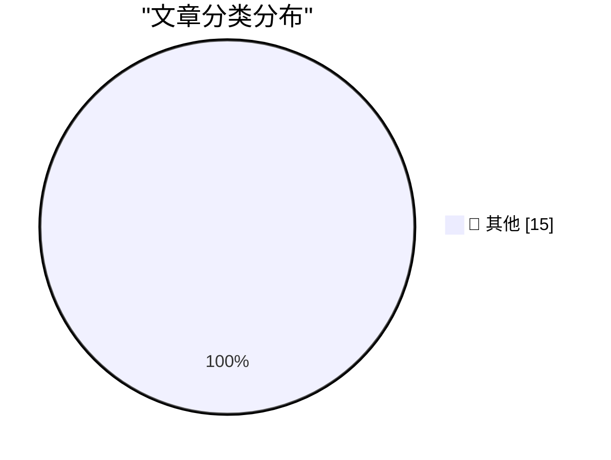

# 📰 AI 博客每日精选 — 2026-03-19

> 来自 Karpathy 推荐的 92 个顶级技术博客，AI 精选 Top 15

## 🏆 今日必读

🥇 **Autoresearching Apple's "LLM in a Flash" to run Qwen 397B locally**

[Autoresearching Apple's "LLM in a Flash" to run Qwen 397B locally](https://simonwillison.net/2026/Mar/18/llm-in-a-flash/#atom-everything) — simonwillison.net · 11 小时前 · 📝 其他

> Autoresearching Apple's "LLM in a Flash" to run Qwen 397B locally

🥈 **Snowflake Cortex AI Escapes Sandbox and Executes Malware**

[Snowflake Cortex AI Escapes Sandbox and Executes Malware](https://simonwillison.net/2026/Mar/18/snowflake-cortex-ai/#atom-everything) — simonwillison.net · 18 小时前 · 📝 其他

> Snowflake Cortex AI Escapes Sandbox and Executes Malware

🥉 **Quoting Ken Jin**

[Quoting Ken Jin](https://simonwillison.net/2026/Mar/17/ken-jin/#atom-everything) — simonwillison.net · 1 天前 · 📝 其他

> Quoting Ken Jin

---

## 📊 数据概览

| 扫描源 | 抓取文章 | 时间范围 | 精选 |
|:---:|:---:|:---:|:---:|
| 84/92 | 2433 篇 → 40 篇 | 48h | **15 篇** |

### 分类分布

---

## 📝 其他

### 1. Autoresearching Apple's "LLM in a Flash" to run Qwen 397B locally

[Autoresearching Apple's "LLM in a Flash" to run Qwen 397B locally](https://simonwillison.net/2026/Mar/18/llm-in-a-flash/#atom-everything) — **simonwillison.net** · 11 小时前 · ⭐ 15/30

> Autoresearching Apple's "LLM in a Flash" to run Qwen 397B locally

---

### 2. Snowflake Cortex AI Escapes Sandbox and Executes Malware

[Snowflake Cortex AI Escapes Sandbox and Executes Malware](https://simonwillison.net/2026/Mar/18/snowflake-cortex-ai/#atom-everything) — **simonwillison.net** · 18 小时前 · ⭐ 15/30

> Snowflake Cortex AI Escapes Sandbox and Executes Malware

---

### 3. Quoting Ken Jin

[Quoting Ken Jin](https://simonwillison.net/2026/Mar/17/ken-jin/#atom-everything) — **simonwillison.net** · 1 天前 · ⭐ 15/30

> Quoting Ken Jin

---

### 4. GPT-5.4 mini and GPT-5.4 nano, which can describe 76,000 photos for $52

[GPT-5.4 mini and GPT-5.4 nano, which can describe 76,000 photos for $52](https://simonwillison.net/2026/Mar/17/mini-and-nano/#atom-everything) — **simonwillison.net** · 1 天前 · ⭐ 15/30

> GPT-5.4 mini and GPT-5.4 nano, which can describe 76,000 photos for $52

---

### 5. Quoting Tim Schilling

[Quoting Tim Schilling](https://simonwillison.net/2026/Mar/17/tim-schilling/#atom-everything) — **simonwillison.net** · 1 天前 · ⭐ 15/30

> Quoting Tim Schilling

---

### 6. Subagents

[Subagents](https://simonwillison.net/guides/agentic-engineering-patterns/subagents/#atom-everything) — **simonwillison.net** · 1 天前 · ⭐ 15/30

> Subagents

---

### 7. The Talk Show: ‘The Pogue Feature’

[The Talk Show: ‘The Pogue Feature’](https://daringfireball.net/thetalkshow/2026/03/18/ep-443) — **daringfireball.net** · 12 小时前 · ⭐ 15/30

> The Talk Show: ‘The Pogue Feature’

---

### 8. ★ ‘Your Frustration Is the Product’

[★ ‘Your Frustration Is the Product’](https://daringfireball.net/2026/03/your_frustration_is_the_product) — **daringfireball.net** · 12 小时前 · ⭐ 15/30

> ★ ‘Your Frustration Is the Product’

---

### 9. How to Identify Your Apple Keyboard Layout by Country or Region

[How to Identify Your Apple Keyboard Layout by Country or Region](https://support.apple.com/en-us/102743) — **daringfireball.net** · 14 小时前 · ⭐ 15/30

> How to Identify Your Apple Keyboard Layout by Country or Region

---

### 10. Jony Ive on Redesigning the Christie’s Rostrum

[Jony Ive on Redesigning the Christie’s Rostrum](https://www.youtube.com/watch?v=HLXDxx06_EM) — **daringfireball.net** · 14 小时前 · ⭐ 15/30

> Jony Ive on Redesigning the Christie’s Rostrum

---

### 11. Meta Is Dropping VR Support From Horizon Worlds

[Meta Is Dropping VR Support From Horizon Worlds](https://www.uploadvr.com/meta-horizon-worlds-dropping-vr-support/) — **daringfireball.net** · 16 小时前 · ⭐ 15/30

> Meta Is Dropping VR Support From Horizon Worlds

---

### 12. David Zaslav Set to Receive Up to $887 Million if Paramount Acquisition of Warner Bros Closes

[David Zaslav Set to Receive Up to $887 Million if Paramount Acquisition of Warner Bros Closes](https://finance.yahoo.com/news/warner-bros-discovery-ceo-david-zaslav-set-to-receive-up-to-887-million-if-paramount-deal-closes-144501826.html) — **daringfireball.net** · 17 小时前 · ⭐ 15/30

> David Zaslav Set to Receive Up to $887 Million if Paramount Acquisition of Warner Bros Closes

---

### 13. ★ Squashing

[★ Squashing](https://daringfireball.net/2026/03/squashing) — **daringfireball.net** · 1 天前 · ⭐ 15/30

> ★ Squashing

---

### 14. Fox Sports to Broadcast U.S.-Venezuela World Baseball Classic Final in Immersive 3D — But Not on Vision Pro

[Fox Sports to Broadcast U.S.-Venezuela World Baseball Classic Final in Immersive 3D — But Not on Vision Pro](https://x.com/mlbonfox/status/2033902946174271992?s=46) — **daringfireball.net** · 1 天前 · ⭐ 15/30

> Fox Sports to Broadcast U.S.-Venezuela World Baseball Classic Final in Immersive 3D — But Not on Vision Pro

---

### 15. Samsung Discontinues Its Galaxy Z TriFold After Just Three Months

[Samsung Discontinues Its Galaxy Z TriFold After Just Three Months](https://www.theverge.com/tech/895879/samsung-galaxy-z-trifold-discontinued-stock-sold-out) — **daringfireball.net** · 1 天前 · ⭐ 15/30

> Samsung Discontinues Its Galaxy Z TriFold After Just Three Months

---

*生成于 2026-03-19 11:53 | 扫描 84 源 → 获取 2433 篇 → 精选 15 篇*
*基于 [Hacker News Popularity Contest 2025](https://refactoringenglish.com/tools/hn-popularity/) RSS 源列表，由 [Andrej Karpathy](https://x.com/karpathy) 推荐*
*由「懂点儿AI」制作，欢迎关注同名微信公众号获取更多 AI 实用技巧 💡*
