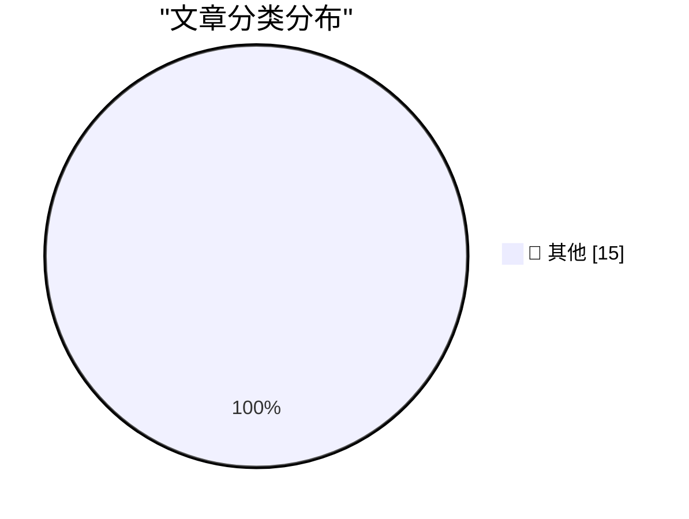

# 📰 AI 博客每日精选 — 2026-04-09

> 来自 Karpathy 推荐的 92 个顶级技术博客，AI 精选 Top 15

## 🏆 今日必读

🥇 **Meta's new model is Muse Spark, and meta.ai chat has some interesting tools**

[Meta's new model is Muse Spark, and meta.ai chat has some interesting tools](https://simonwillison.net/2026/Apr/8/muse-spark/#atom-everything) — simonwillison.net · 11 小时前 · 📝 其他

> Meta's new model is Muse Spark, and meta.ai chat has some interesting tools

🥈 **Quoting Giles Turnbull**

[Quoting Giles Turnbull](https://simonwillison.net/2026/Apr/8/giles-turnbull/#atom-everything) — simonwillison.net · 19 小时前 · 📝 其他

> Quoting Giles Turnbull

🥉 **GLM-5.1: Towards Long-Horizon Tasks**

[GLM-5.1: Towards Long-Horizon Tasks](https://simonwillison.net/2026/Apr/7/glm-51/#atom-everything) — simonwillison.net · 1 天前 · 📝 其他

> GLM-5.1: Towards Long-Horizon Tasks

---

## 📊 数据概览

| 扫描源 | 抓取文章 | 时间范围 | 精选 |
|:---:|:---:|:---:|:---:|
| 84/92 | 2446 篇 → 34 篇 | 48h | **15 篇** |

### 分类分布

---

## 📝 其他

### 1. Meta's new model is Muse Spark, and meta.ai chat has some interesting tools

[Meta's new model is Muse Spark, and meta.ai chat has some interesting tools](https://simonwillison.net/2026/Apr/8/muse-spark/#atom-everything) — **simonwillison.net** · 11 小时前 · ⭐ 15/30

> Meta's new model is Muse Spark, and meta.ai chat has some interesting tools

---

### 2. Quoting Giles Turnbull

[Quoting Giles Turnbull](https://simonwillison.net/2026/Apr/8/giles-turnbull/#atom-everything) — **simonwillison.net** · 19 小时前 · ⭐ 15/30

> Quoting Giles Turnbull

---

### 3. GLM-5.1: Towards Long-Horizon Tasks

[GLM-5.1: Towards Long-Horizon Tasks](https://simonwillison.net/2026/Apr/7/glm-51/#atom-everything) — **simonwillison.net** · 1 天前 · ⭐ 15/30

> GLM-5.1: Towards Long-Horizon Tasks

---

### 4. Anthropic's Project Glasswing - restricting Claude Mythos to security researchers - sounds necessary to me

[Anthropic's Project Glasswing - restricting Claude Mythos to security researchers - sounds necessary to me](https://simonwillison.net/2026/Apr/7/project-glasswing/#atom-everything) — **simonwillison.net** · 1 天前 · ⭐ 15/30

> Anthropic's Project Glasswing - restricting Claude Mythos to security researchers - sounds necessary to me

---

### 5. SQLite WAL Mode Across Docker Containers Sharing a Volume

[SQLite WAL Mode Across Docker Containers Sharing a Volume](https://simonwillison.net/2026/Apr/7/sqlite-wal-docker-containers/#atom-everything) — **simonwillison.net** · 1 天前 · ⭐ 15/30

> SQLite WAL Mode Across Docker Containers Sharing a Volume

---

### 6. Russia Hacked Routers to Steal Microsoft Office Tokens

[Russia Hacked Routers to Steal Microsoft Office Tokens](https://krebsonsecurity.com/2026/04/russia-hacked-routers-to-steal-microsoft-office-tokens/) — **krebsonsecurity.com** · 1 天前 · ⭐ 15/30

> Russia Hacked Routers to Steal Microsoft Office Tokens

---

### 7. Anthropic’s New Claude Mythos Is So Good at Finding and Exploiting Vulnerabilities That They’re Not Releasing It to the Public

[Anthropic’s New Claude Mythos Is So Good at Finding and Exploiting Vulnerabilities That They’re Not Releasing It to the Public](https://red.anthropic.com/2026/mythos-preview/) — **daringfireball.net** · 19 小时前 · ⭐ 15/30

> Anthropic’s New Claude Mythos Is So Good at Finding and Exploiting Vulnerabilities That They’re Not Releasing It to the Public

---

### 8. Solar Eclipse From the Far Side of the Moon

[Solar Eclipse From the Far Side of the Moon](https://kottke.org/26/04/solar-eclipse-far-side-of-the-moon) — **daringfireball.net** · 1 天前 · ⭐ 15/30

> Solar Eclipse From the Far Side of the Moon

---

### 9. Sam Altman, in a Video Released by OpenAI, Apparently Thinks AGI Is Going to Hit Society Like a Once-a-Century Pandemic

[Sam Altman, in a Video Released by OpenAI, Apparently Thinks AGI Is Going to Hit Society Like a Once-a-Century Pandemic](https://x.com/OpenAINewsroom/status/2041618671236469200?s=20) — **daringfireball.net** · 1 天前 · ⭐ 15/30

> Sam Altman, in a Video Released by OpenAI, Apparently Thinks AGI Is Going to Hit Society Like a Once-a-Century Pandemic

---

### 10. ★ OpenAI Announces $122 Billion Additional ‘Committed Capital’, and Announces Their ‘Superapp’ Plan for the Future

[★ OpenAI Announces $122 Billion Additional ‘Committed Capital’, and Announces Their ‘Superapp’ Plan for the Future](https://daringfireball.net/2026/04/openai_future) — **daringfireball.net** · 1 天前 · ⭐ 15/30

> ★ OpenAI Announces $122 Billion Additional ‘Committed Capital’, and Announces Their ‘Superapp’ Plan for the Future

---

### 11. Om Malik and Ben Thompson on OpenAI Buying TBPN

[Om Malik and Ben Thompson on OpenAI Buying TBPN](https://om.co/2026/04/02/openai-masters-of-agitprop-2-0/) — **daringfireball.net** · 1 天前 · ⭐ 15/30

> Om Malik and Ben Thompson on OpenAI Buying TBPN

---

### 12. Flighty Airports Meltdown Map

[Flighty Airports Meltdown Map](https://flighty.com/airports) — **daringfireball.net** · 1 天前 · ⭐ 15/30

> Flighty Airports Meltdown Map

---

### 13. The Data Drop: Every iPhone

[The Data Drop: Every iPhone](https://sheets.works/data-viz/every-iphone) — **daringfireball.net** · 1 天前 · ⭐ 15/30

> The Data Drop: Every iPhone

---

### 14. Pluralistic: Process knowledge (08 Apr 2026)

[Pluralistic: Process knowledge (08 Apr 2026)](https://pluralistic.net/2026/04/08/process-knowledge-vs-bosses/) — **pluralistic.net** · 21 小时前 · ⭐ 15/30

> Pluralistic: Process knowledge (08 Apr 2026)

---

### 15. Theatre Review: Avenue Q ★★★★★

[Theatre Review: Avenue Q ★★★★★](https://shkspr.mobi/blog/2026/04/theatre-review-avenue-q/) — **shkspr.mobi** · 23 小时前 · ⭐ 15/30

> Theatre Review: Avenue Q ★★★★★

---

*生成于 2026-04-09 10:51 | 扫描 84 源 → 获取 2446 篇 → 精选 15 篇*
*基于 [Hacker News Popularity Contest 2025](https://refactoringenglish.com/tools/hn-popularity/) RSS 源列表，由 [Andrej Karpathy](https://x.com/karpathy) 推荐*
*由「懂点儿AI」制作，欢迎关注同名微信公众号获取更多 AI 实用技巧 💡*
