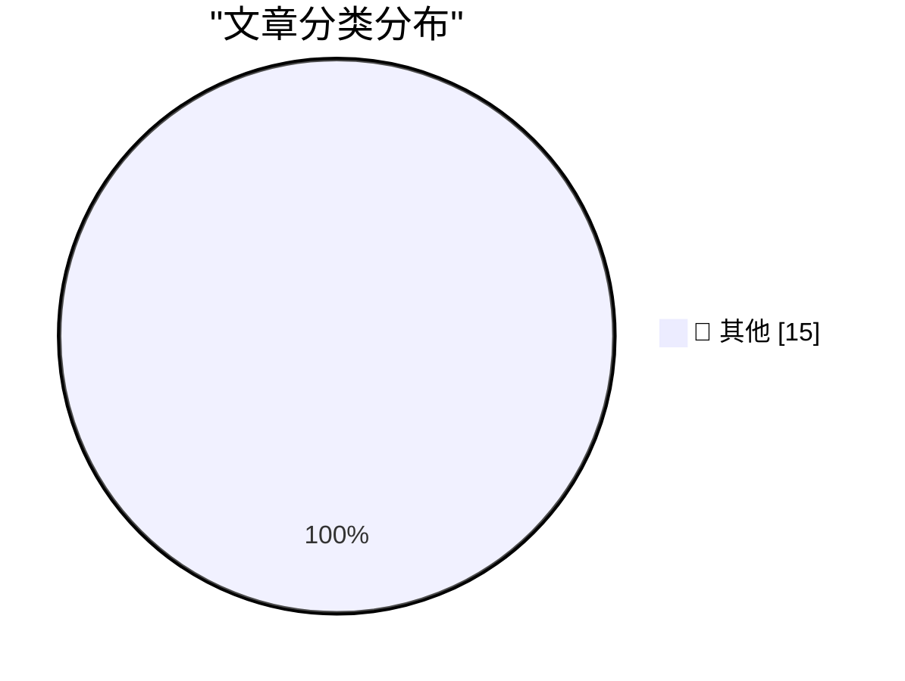

# 📰 AI 博客每日精选 — 2026-03-04

> 来自 Karpathy 推荐的 92 个顶级技术博客，AI 精选 Top 15

## 🏆 今日必读

🥇 **Quoting Donald Knuth**

[Quoting Donald Knuth](https://simonwillison.net/2026/Mar/3/donald-knuth/#atom-everything) — simonwillison.net · 11 小时前 · 📝 其他

> Quoting Donald Knuth

🥈 **Gemini 3.1 Flash-Lite**

[Gemini 3.1 Flash-Lite](https://simonwillison.net/2026/Mar/3/gemini-31-flash-lite/#atom-everything) — simonwillison.net · 13 小时前 · 📝 其他

> Gemini 3.1 Flash-Lite

🥉 **GIF optimization tool using WebAssembly and Gifsicle**

[GIF optimization tool using WebAssembly and Gifsicle](https://simonwillison.net/guides/agentic-engineering-patterns/gif-optimization/#atom-everything) — simonwillison.net · 1 天前 · 📝 其他

> GIF optimization tool using WebAssembly and Gifsicle

---

## 📊 数据概览

| 扫描源 | 抓取文章 | 时间范围 | 精选 |
|:---:|:---:|:---:|:---:|
| 85/92 | 2437 篇 → 44 篇 | 48h | **15 篇** |

### 分类分布

---

## 📝 其他

### 1. Quoting Donald Knuth

[Quoting Donald Knuth](https://simonwillison.net/2026/Mar/3/donald-knuth/#atom-everything) — **simonwillison.net** · 11 小时前 · ⭐ 15/30

> Quoting Donald Knuth

---

### 2. Gemini 3.1 Flash-Lite

[Gemini 3.1 Flash-Lite](https://simonwillison.net/2026/Mar/3/gemini-31-flash-lite/#atom-everything) — **simonwillison.net** · 13 小时前 · ⭐ 15/30

> Gemini 3.1 Flash-Lite

---

### 3. GIF optimization tool using WebAssembly and Gifsicle

[GIF optimization tool using WebAssembly and Gifsicle](https://simonwillison.net/guides/agentic-engineering-patterns/gif-optimization/#atom-everything) — **simonwillison.net** · 1 天前 · ⭐ 15/30

> GIF optimization tool using WebAssembly and Gifsicle

---

### 4. February sponsors-only newsletter

[February sponsors-only newsletter](https://simonwillison.net/2026/Mar/2/february-newsletter/#atom-everything) — **simonwillison.net** · 1 天前 · ⭐ 15/30

> February sponsors-only newsletter

---

### 5. I built a pint-sized Macintosh

[I built a pint-sized Macintosh](https://www.jeffgeerling.com/blog/2026/pint-sized-macintosh-pico-micro-mac/) — **jeffgeerling.com** · 1 天前 · ⭐ 15/30

> I built a pint-sized Macintosh

---

### 6. Giving LLMs a personality is just good engineering

[Giving LLMs a personality is just good engineering](https://seangoedecke.com/giving-llms-a-personality/) — **seangoedecke.com** · 1 天前 · ⭐ 15/30

> Giving LLMs a personality is just good engineering

---

### 7. Apple Announces Updated Studio Display and All-New Studio Display XDR

[Apple Announces Updated Studio Display and All-New Studio Display XDR](https://www.apple.com/newsroom/2026/03/apple-unveils-new-studio-display-and-all-new-studio-display-xdr/) — **daringfireball.net** · 13 小时前 · ⭐ 15/30

> Apple Announces Updated Studio Display and All-New Studio Display XDR

---

### 8. New MacBook Air With M5

[New MacBook Air With M5](https://www.apple.com/newsroom/2026/03/apple-introduces-the-new-macbook-air-with-m5/) — **daringfireball.net** · 14 小时前 · ⭐ 15/30

> New MacBook Air With M5

---

### 9. Apple Might Have Prematurely Leaked the Name ‘MacBook Neo’

[Apple Might Have Prematurely Leaked the Name ‘MacBook Neo’](https://www.macrumors.com/2026/03/03/apple-accidentally-leaks-macbook-neo/) — **daringfireball.net** · 14 小时前 · ⭐ 15/30

> Apple Might Have Prematurely Leaked the Name ‘MacBook Neo’

---

### 10. Apple Introduces MacBook Pro Models With M5 Pro and M5 Max Chips

[Apple Introduces MacBook Pro Models With M5 Pro and M5 Max Chips](https://www.apple.com/newsroom/2026/03/apple-introduces-macbook-pro-with-all-new-m5-pro-and-m5-max/) — **daringfireball.net** · 15 小时前 · ⭐ 15/30

> Apple Introduces MacBook Pro Models With M5 Pro and M5 Max Chips

---

### 11. Apple Debuts M5 Pro and M5 Max, and Renames Its M-Series CPU Cores

[Apple Debuts M5 Pro and M5 Max, and Renames Its M-Series CPU Cores](https://www.apple.com/newsroom/2026/03/apple-debuts-m5-pro-and-m5-max-to-supercharge-the-most-demanding-pro-workflows/) — **daringfireball.net** · 17 小时前 · ⭐ 15/30

> Apple Debuts M5 Pro and M5 Max, and Renames Its M-Series CPU Cores

---

### 12. [Sponsor] npx workos: An AI Agent That Writes Auth Directly Into Your Codebase

[[Sponsor] npx workos: An AI Agent That Writes Auth Directly Into Your Codebase](https://workos.com/docs/authkit/cli-installer?utm_source=tldrdev&amp;utm_medium=newsletter&amp;utm_campaign=q12026) — **daringfireball.net** · 1 天前 · ⭐ 15/30

> [Sponsor] npx workos: An AI Agent That Writes Auth Directly Into Your Codebase

---

### 13. ★ HazeOver — Mac Utility for Highlighting the Frontmost Window

[★ HazeOver — Mac Utility for Highlighting the Frontmost Window](https://daringfireball.net/2026/03/hazeover) — **daringfireball.net** · 1 天前 · ⭐ 15/30

> ★ HazeOver — Mac Utility for Highlighting the Frontmost Window

---

### 14. Unsung Heroes: Flickr’s URLs Scheme

[Unsung Heroes: Flickr’s URLs Scheme](https://unsung.aresluna.org/unsung-heroes-flickrs-urls-scheme/) — **daringfireball.net** · 1 天前 · ⭐ 15/30

> Unsung Heroes: Flickr’s URLs Scheme

---

### 15. ChangeTheHeaders

[ChangeTheHeaders](https://underpassapp.com/news/2025/3/4.html) — **daringfireball.net** · 1 天前 · ⭐ 15/30

> ChangeTheHeaders

---

*生成于 2026-03-04 11:20 | 扫描 85 源 → 获取 2437 篇 → 精选 15 篇*
*基于 [Hacker News Popularity Contest 2025](https://refactoringenglish.com/tools/hn-popularity/) RSS 源列表，由 [Andrej Karpathy](https://x.com/karpathy) 推荐*
*由「懂点儿AI」制作，欢迎关注同名微信公众号获取更多 AI 实用技巧 💡*
