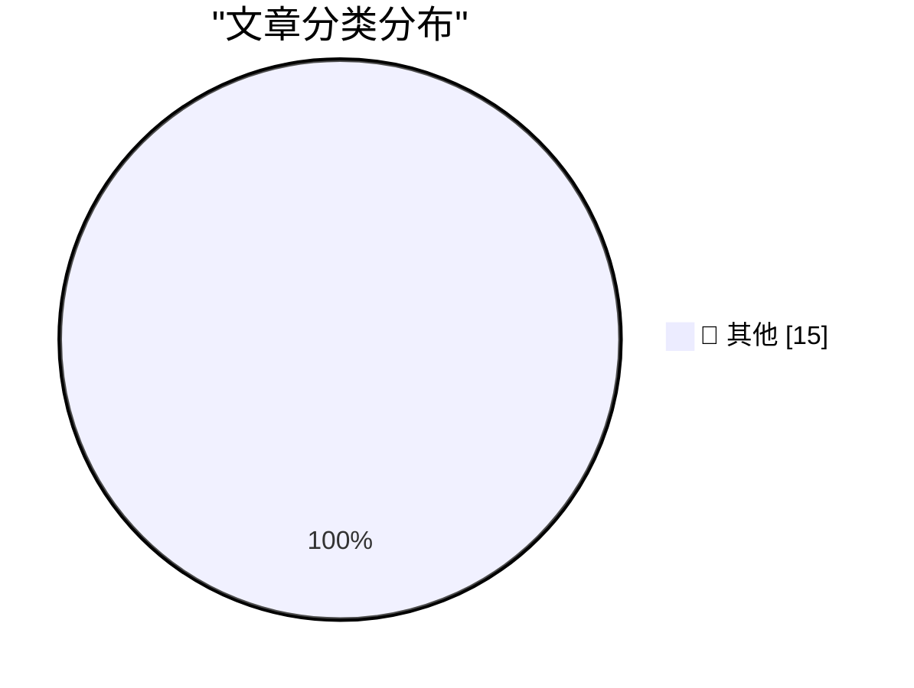

# 📰 AI 博客每日精选 — 2026-04-12

> 来自 Karpathy 推荐的 92 个顶级技术博客，AI 精选 Top 15

## 🏆 今日必读

🥇 **SQLite 3.53.0**

[SQLite 3.53.0](https://simonwillison.net/2026/Apr/11/sqlite/#atom-everything) — simonwillison.net · 14 小时前 · 📝 其他

> SQLite 3.53.0

🥈 **SQLite Query Result Formatter Demo**

[SQLite Query Result Formatter Demo](https://simonwillison.net/2026/Apr/11/sqlite-qrf/#atom-everything) — simonwillison.net · 14 小时前 · 📝 其他

> SQLite Query Result Formatter Demo

🥉 **Kākāpō parrots**

[Kākāpō parrots](https://simonwillison.net/2026/Apr/10/kakapo/#atom-everything) — simonwillison.net · 1 天前 · 📝 其他

> Kākāpō parrots

---

## 📊 数据概览

| 扫描源 | 抓取文章 | 时间范围 | 精选 |
|:---:|:---:|:---:|:---:|
| 83/92 | 2422 篇 → 20 篇 | 48h | **15 篇** |

### 分类分布

---

## 📝 其他

### 1. SQLite 3.53.0

[SQLite 3.53.0](https://simonwillison.net/2026/Apr/11/sqlite/#atom-everything) — **simonwillison.net** · 14 小时前 · ⭐ 15/30

> SQLite 3.53.0

---

### 2. SQLite Query Result Formatter Demo

[SQLite Query Result Formatter Demo](https://simonwillison.net/2026/Apr/11/sqlite-qrf/#atom-everything) — **simonwillison.net** · 14 小时前 · ⭐ 15/30

> SQLite Query Result Formatter Demo

---

### 3. Kākāpō parrots

[Kākāpō parrots](https://simonwillison.net/2026/Apr/10/kakapo/#atom-everything) — **simonwillison.net** · 1 天前 · ⭐ 15/30

> Kākāpō parrots

---

### 4. ChatGPT voice mode is a weaker model

[ChatGPT voice mode is a weaker model](https://simonwillison.net/2026/Apr/10/voice-mode-is-weaker/#atom-everything) — **simonwillison.net** · 1 天前 · ⭐ 15/30

> ChatGPT voice mode is a weaker model

---

### 5. Pan American Luggage Labels

[Pan American Luggage Labels](https://ellafreire.com/collections/pan-american-luggage-labels) — **daringfireball.net** · 17 小时前 · ⭐ 15/30

> Pan American Luggage Labels

---

### 6. ★ Let Us Learn to Show Our Friendship for a Man When He Is Alive and Not After He Is Dead

[★ Let Us Learn to Show Our Friendship for a Man When He Is Alive and Not After He Is Dead](https://daringfireball.net/2026/04/when_he_is_alive_and_not_after_he_is_dead) — **daringfireball.net** · 1 天前 · ⭐ 15/30

> ★ Let Us Learn to Show Our Friendship for a Man When He Is Alive and Not After He Is Dead

---

### 7. Ed Bindels’s Apple Museum in Utrecht, Netherlands

[Ed Bindels’s Apple Museum in Utrecht, Netherlands](https://applemuseum.nl/) — **daringfireball.net** · 1 天前 · ⭐ 15/30

> Ed Bindels’s Apple Museum in Utrecht, Netherlands

---

### 8. Your friends are hiding their best ideas from you

[Your friends are hiding their best ideas from you](https://idiallo.com/blog/your-friends-are-hiding-their-ideas?src=feed) — **idiallo.com** · 1 天前 · ⭐ 15/30

> Your friends are hiding their best ideas from you

---

### 9. Pluralistic: Don't Be Evil (11 Apr 2026)

[Pluralistic: Don't Be Evil (11 Apr 2026)](https://pluralistic.net/2026/04/11/obvious-terrible-ideas/) — **pluralistic.net** · 20 小时前 · ⭐ 15/30

> Pluralistic: Don't Be Evil (11 Apr 2026)

---

### 10. Cheapest way to keep a UK mobile number using an eSIM

[Cheapest way to keep a UK mobile number using an eSIM](https://shkspr.mobi/blog/2026/04/cheapest-way-to-keep-a-uk-mobile-number-using-an-esim/) — **shkspr.mobi** · 22 小时前 · ⭐ 15/30

> Cheapest way to keep a UK mobile number using an eSIM

---

### 11. [RSS Club] Why do you use RSS rather than Atom?

[[RSS Club] Why do you use RSS rather than Atom?](https://shkspr.mobi/blog/2026/04/rss-club-why-do-you-use-rss-rather-than-atom/) — **shkspr.mobi** · 1 天前 · ⭐ 15/30

> [RSS Club] Why do you use RSS rather than Atom?

---

### 12. How do you add or remove a handle from an active Wait­For­Multiple­Objects?, part 2

[How do you add or remove a handle from an active Wait­For­Multiple­Objects?, part 2](https://devblogs.microsoft.com/oldnewthing/20260410-00/?p=112223) — **devblogs.microsoft.com/oldnewthing** · 1 天前 · ⭐ 15/30

> How do you add or remove a handle from an active Wait­For­Multiple­Objects?, part 2

---

### 13. The Center Has a Bias

[The Center Has a Bias](https://lucumr.pocoo.org/2026/4/11/the-center-has-a-bias/) — **lucumr.pocoo.org** · 1 天前 · ⭐ 15/30

> The Center Has a Bias

---

### 14. Distribution of digits in fractions

[Distribution of digits in fractions](https://www.johndcook.com/blog/2026/04/10/fraction-digits/) — **johndcook.com** · 1 天前 · ⭐ 15/30

> Distribution of digits in fractions

---

### 15. Optimism is not a personality flaw

[Optimism is not a personality flaw](https://www.joanwestenberg.com/optimism-is-not-a-personality-flaw/) — **joanwestenberg.com** · 9 小时前 · ⭐ 15/30

> Optimism is not a personality flaw

---

*生成于 2026-04-12 10:28 | 扫描 83 源 → 获取 2422 篇 → 精选 15 篇*
*基于 [Hacker News Popularity Contest 2025](https://refactoringenglish.com/tools/hn-popularity/) RSS 源列表，由 [Andrej Karpathy](https://x.com/karpathy) 推荐*
*由「懂点儿AI」制作，欢迎关注同名微信公众号获取更多 AI 实用技巧 💡*
