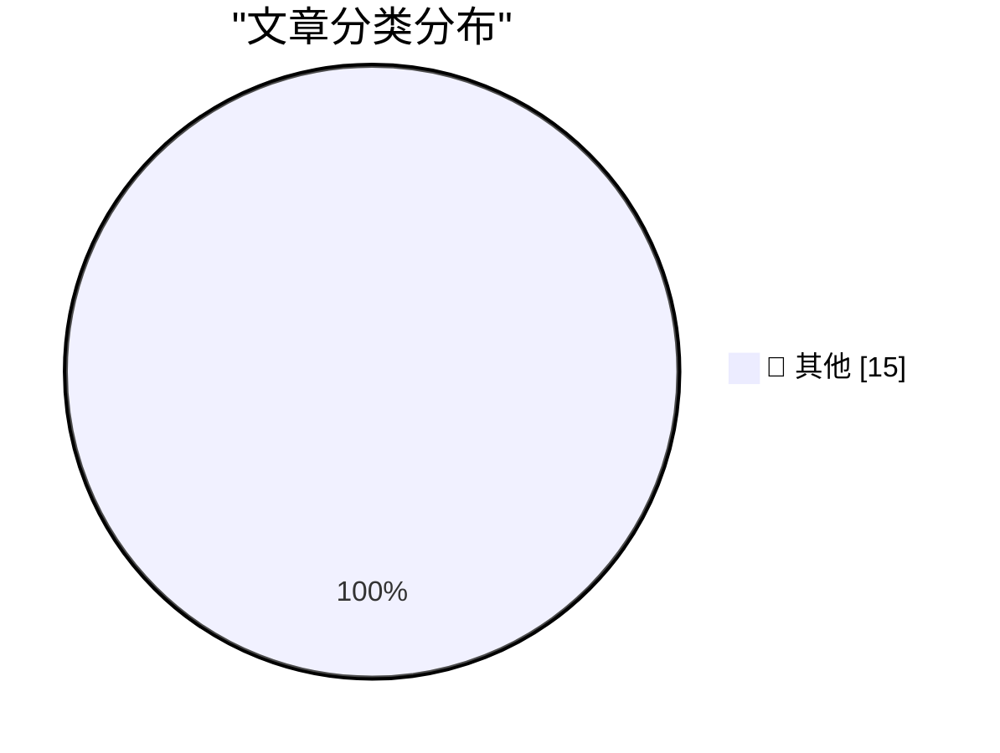

# 📰 AI 博客每日精选 — 2026-02-28

> 来自 Karpathy 推荐的 92 个顶级技术博客，AI 精选 Top 15

## 🏆 今日必读

🥇 **Please, please, please stop using passkeys for encrypting user data**

[Please, please, please stop using passkeys for encrypting user data](https://simonwillison.net/2026/Feb/27/passkeys/#atom-everything) — simonwillison.net · 11 小时前 · 📝 其他

> Please, please, please stop using passkeys for encrypting user data

🥈 **An AI agent coding skeptic tries AI agent coding, in excessive detail**

[An AI agent coding skeptic tries AI agent coding, in excessive detail](https://simonwillison.net/2026/Feb/27/ai-agent-coding-in-excessive-detail/#atom-everything) — simonwillison.net · 14 小时前 · 📝 其他

> An AI agent coding skeptic tries AI agent coding, in excessive detail

🥉 **Free Claude Max for (large project) open source maintainers**

[Free Claude Max for (large project) open source maintainers](https://simonwillison.net/2026/Feb/27/claude-max-oss-six-months/#atom-everything) — simonwillison.net · 16 小时前 · 📝 其他

> Free Claude Max for (large project) open source maintainers

---

## 📊 数据概览

| 扫描源 | 抓取文章 | 时间范围 | 精选 |
|:---:|:---:|:---:|:---:|
| 84/92 | 2418 篇 → 41 篇 | 48h | **15 篇** |

### 分类分布

---

## 📝 其他

### 1. Please, please, please stop using passkeys for encrypting user data

[Please, please, please stop using passkeys for encrypting user data](https://simonwillison.net/2026/Feb/27/passkeys/#atom-everything) — **simonwillison.net** · 11 小时前 · ⭐ 15/30

> Please, please, please stop using passkeys for encrypting user data

---

### 2. An AI agent coding skeptic tries AI agent coding, in excessive detail

[An AI agent coding skeptic tries AI agent coding, in excessive detail](https://simonwillison.net/2026/Feb/27/ai-agent-coding-in-excessive-detail/#atom-everything) — **simonwillison.net** · 14 小时前 · ⭐ 15/30

> An AI agent coding skeptic tries AI agent coding, in excessive detail

---

### 3. Free Claude Max for (large project) open source maintainers

[Free Claude Max for (large project) open source maintainers](https://simonwillison.net/2026/Feb/27/claude-max-oss-six-months/#atom-everything) — **simonwillison.net** · 16 小时前 · ⭐ 15/30

> Free Claude Max for (large project) open source maintainers

---

### 4. Unicode Explorer using binary search over fetch() HTTP range requests

[Unicode Explorer using binary search over fetch() HTTP range requests](https://simonwillison.net/2026/Feb/27/unicode-explorer/#atom-everything) — **simonwillison.net** · 16 小时前 · ⭐ 15/30

> Unicode Explorer using binary search over fetch() HTTP range requests

---

### 5. Hoard things you know how to do

[Hoard things you know how to do](https://simonwillison.net/guides/agentic-engineering-patterns/hoard-things-you-know-how-to-do/#atom-everything) — **simonwillison.net** · 1 天前 · ⭐ 15/30

> Hoard things you know how to do

---

### 6. Quoting Andrej Karpathy

[Quoting Andrej Karpathy](https://simonwillison.net/2026/Feb/26/andrej-karpathy/#atom-everything) — **simonwillison.net** · 1 天前 · ⭐ 15/30

> Quoting Andrej Karpathy

---

### 7. Upgrading my Open Source Pi Surveillance Server with Frigate

[Upgrading my Open Source Pi Surveillance Server with Frigate](https://www.jeffgeerling.com/blog/2026/upgrading-my-open-source-pi-surveillance-server-frigate/) — **jeffgeerling.com** · 19 小时前 · ⭐ 15/30

> Upgrading my Open Source Pi Surveillance Server with Frigate

---

### 8. How to Securely Erase an old Hard Drive on macOS Tahoe

[How to Securely Erase an old Hard Drive on macOS Tahoe](https://www.jeffgeerling.com/blog/2026/securely-erase-hard-drive-macos-tahoe/) — **jeffgeerling.com** · 1 天前 · ⭐ 15/30

> How to Securely Erase an old Hard Drive on macOS Tahoe

---

### 9. West Virginia’s Anti-Apple CSAM Lawsuit Would Help Child Predators Walk Free

[West Virginia’s Anti-Apple CSAM Lawsuit Would Help Child Predators Walk Free](https://www.techdirt.com/2026/02/25/west-virginias-anti-apple-csam-lawsuit-would-help-child-predators-walk-free/) — **daringfireball.net** · 15 小时前 · ⭐ 15/30

> West Virginia’s Anti-Apple CSAM Lawsuit Would Help Child Predators Walk Free

---

### 10. How to Block the ‘Upgrade to Tahoe’ Alerts and System Settings Indicator

[How to Block the ‘Upgrade to Tahoe’ Alerts and System Settings Indicator](https://robservatory.com/block-the-upgrade-to-tahoe-alerts-and-system-settings-indicator/) — **daringfireball.net** · 16 小时前 · ⭐ 15/30

> How to Block the ‘Upgrade to Tahoe’ Alerts and System Settings Indicator

---

### 11. ★ A Sometimes-Hidden Setting Controls What Happens When You Tap a Call in the iOS 26 Phone App

[★ A Sometimes-Hidden Setting Controls What Happens When You Tap a Call in the iOS 26 Phone App](https://daringfireball.net/2026/02/sometimes_hidden_setting_phone_app) — **daringfireball.net** · 16 小时前 · ⭐ 15/30

> ★ A Sometimes-Hidden Setting Controls What Happens When You Tap a Call in the iOS 26 Phone App

---

### 12. TUDUMB

[TUDUMB](https://spyglass.org/netflix-warner-bros-paramount-deal/) — **daringfireball.net** · 18 小时前 · ⭐ 15/30

> TUDUMB

---

### 13. Block Lays Off 4,000 (of 10,000) Employees

[Block Lays Off 4,000 (of 10,000) Employees](https://www.cnbc.com/2026/02/26/block-laying-off-about-4000-employees-nearly-half-of-its-workforce.html) — **daringfireball.net** · 19 小时前 · ⭐ 15/30

> Block Lays Off 4,000 (of 10,000) Employees

---

### 14. Apple Announces F1 Broadcast Details, and a Surprising Netflix Partnership

[Apple Announces F1 Broadcast Details, and a Surprising Netflix Partnership](https://sixcolors.com/post/2026/02/apple-announces-f1-details-and-a-surprising-netflix-partnership/) — **daringfireball.net** · 1 天前 · ⭐ 15/30

> Apple Announces F1 Broadcast Details, and a Surprising Netflix Partnership

---

### 15. Energym

[Energym](https://www.aicandy.be/giorgio-1) — **daringfireball.net** · 1 天前 · ⭐ 15/30

> Energym

---

*生成于 2026-02-28 10:48 | 扫描 84 源 → 获取 2418 篇 → 精选 15 篇*
*基于 [Hacker News Popularity Contest 2025](https://refactoringenglish.com/tools/hn-popularity/) RSS 源列表，由 [Andrej Karpathy](https://x.com/karpathy) 推荐*
*由「懂点儿AI」制作，欢迎关注同名微信公众号获取更多 AI 实用技巧 💡*
