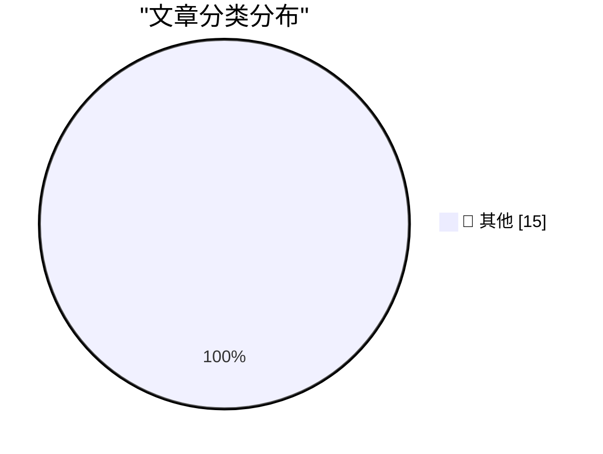

# 📰 AI 博客每日精选 — 2026-03-05

> 来自 Karpathy 推荐的 92 个顶级技术博客，AI 精选 Top 15

## 🏆 今日必读

🥇 **Anti-patterns: things to avoid**

[Anti-patterns: things to avoid](https://simonwillison.net/guides/agentic-engineering-patterns/anti-patterns/#atom-everything) — simonwillison.net · 18 小时前 · 📝 其他

> Anti-patterns: things to avoid

🥈 **Something is afoot in the land of Qwen**

[Something is afoot in the land of Qwen](https://simonwillison.net/2026/Mar/4/qwen/#atom-everything) — simonwillison.net · 20 小时前 · 📝 其他

> Something is afoot in the land of Qwen

🥉 **Quoting Donald Knuth**

[Quoting Donald Knuth](https://simonwillison.net/2026/Mar/3/donald-knuth/#atom-everything) — simonwillison.net · 1 天前 · 📝 其他

> Quoting Donald Knuth

---

## 📊 数据概览

| 扫描源 | 抓取文章 | 时间范围 | 精选 |
|:---:|:---:|:---:|:---:|
| 81/92 | 2368 篇 → 31 篇 | 48h | **15 篇** |

### 分类分布

---

## 📝 其他

### 1. Anti-patterns: things to avoid

[Anti-patterns: things to avoid](https://simonwillison.net/guides/agentic-engineering-patterns/anti-patterns/#atom-everything) — **simonwillison.net** · 18 小时前 · ⭐ 15/30

> Anti-patterns: things to avoid

---

### 2. Something is afoot in the land of Qwen

[Something is afoot in the land of Qwen](https://simonwillison.net/2026/Mar/4/qwen/#atom-everything) — **simonwillison.net** · 20 小时前 · ⭐ 15/30

> Something is afoot in the land of Qwen

---

### 3. Quoting Donald Knuth

[Quoting Donald Knuth](https://simonwillison.net/2026/Mar/3/donald-knuth/#atom-everything) — **simonwillison.net** · 1 天前 · ⭐ 15/30

> Quoting Donald Knuth

---

### 4. Gemini 3.1 Flash-Lite

[Gemini 3.1 Flash-Lite](https://simonwillison.net/2026/Mar/3/gemini-31-flash-lite/#atom-everything) — **simonwillison.net** · 1 天前 · ⭐ 15/30

> Gemini 3.1 Flash-Lite

---

### 5. ★ Thoughts and Observations on the MacBook Neo

[★ Thoughts and Observations on the MacBook Neo](https://daringfireball.net/2026/03/599_not_a_piece_of_junk_macbook_neo) — **daringfireball.net** · 15 小时前 · ⭐ 15/30

> ★ Thoughts and Observations on the MacBook Neo

---

### 6. Studio Display vs. Studio Display XDR

[Studio Display vs. Studio Display XDR](https://www.apple.com/displays/) — **daringfireball.net** · 17 小时前 · ⭐ 15/30

> Studio Display vs. Studio Display XDR

---

### 7. Compatibility Notes on the New Studio Displays

[Compatibility Notes on the New Studio Displays](https://www.macrumors.com/2026/03/03/apple-studio-display-no-intel-mac-support/) — **daringfireball.net** · 19 小时前 · ⭐ 15/30

> Compatibility Notes on the New Studio Displays

---

### 8. ‘In Other Words, Batman Has Become Superman and Robin Has Become Batman’

[‘In Other Words, Batman Has Become Superman and Robin Has Become Batman’](https://sixcolors.com/post/2026/03/apple-gives-in-to-temptation-and-renames-its-cpu-cores/) — **daringfireball.net** · 22 小时前 · ⭐ 15/30

> ‘In Other Words, Batman Has Become Superman and Robin Has Become Batman’

---

### 9. Apple Announces Updated Studio Display and All-New Studio Display XDR

[Apple Announces Updated Studio Display and All-New Studio Display XDR](https://www.apple.com/newsroom/2026/03/apple-unveils-new-studio-display-and-all-new-studio-display-xdr/) — **daringfireball.net** · 1 天前 · ⭐ 15/30

> Apple Announces Updated Studio Display and All-New Studio Display XDR

---

### 10. New MacBook Air With M5

[New MacBook Air With M5](https://www.apple.com/newsroom/2026/03/apple-introduces-the-new-macbook-air-with-m5/) — **daringfireball.net** · 1 天前 · ⭐ 15/30

> New MacBook Air With M5

---

### 11. Apple Might Have Prematurely Leaked the Name ‘MacBook Neo’

[Apple Might Have Prematurely Leaked the Name ‘MacBook Neo’](https://www.macrumors.com/2026/03/03/apple-accidentally-leaks-macbook-neo/) — **daringfireball.net** · 1 天前 · ⭐ 15/30

> Apple Might Have Prematurely Leaked the Name ‘MacBook Neo’

---

### 12. Apple Introduces MacBook Pro Models With M5 Pro and M5 Max Chips

[Apple Introduces MacBook Pro Models With M5 Pro and M5 Max Chips](https://www.apple.com/newsroom/2026/03/apple-introduces-macbook-pro-with-all-new-m5-pro-and-m5-max/) — **daringfireball.net** · 1 天前 · ⭐ 15/30

> Apple Introduces MacBook Pro Models With M5 Pro and M5 Max Chips

---

### 13. Apple Debuts M5 Pro and M5 Max, and Renames Its M-Series CPU Cores

[Apple Debuts M5 Pro and M5 Max, and Renames Its M-Series CPU Cores](https://www.apple.com/newsroom/2026/03/apple-debuts-m5-pro-and-m5-max-to-supercharge-the-most-demanding-pro-workflows/) — **daringfireball.net** · 1 天前 · ⭐ 15/30

> Apple Debuts M5 Pro and M5 Max, and Renames Its M-Series CPU Cores

---

### 14. Interruption-Driven Development

[Interruption-Driven Development](https://idiallo.com/blog/interruption-driven-development?src=feed) — **idiallo.com** · 23 小时前 · ⭐ 15/30

> Interruption-Driven Development

---

### 15. Pluralistic: Supreme Court saves artists from AI (03 Mar 2026)

[Pluralistic: Supreme Court saves artists from AI (03 Mar 2026)](https://pluralistic.net/2026/03/03/its-a-trap-2/) — **pluralistic.net** · 1 天前 · ⭐ 15/30

> Pluralistic: Supreme Court saves artists from AI (03 Mar 2026)

---

*生成于 2026-03-05 11:50 | 扫描 81 源 → 获取 2368 篇 → 精选 15 篇*
*基于 [Hacker News Popularity Contest 2025](https://refactoringenglish.com/tools/hn-popularity/) RSS 源列表，由 [Andrej Karpathy](https://x.com/karpathy) 推荐*
*由「懂点儿AI」制作，欢迎关注同名微信公众号获取更多 AI 实用技巧 💡*
