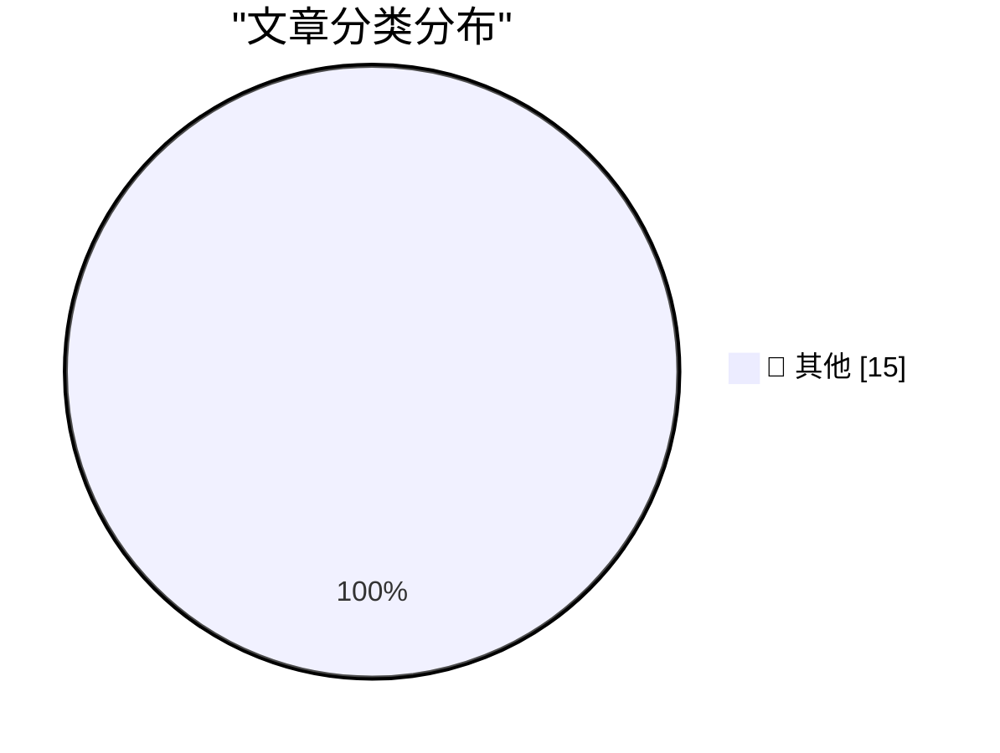

# 📰 AI 博客每日精选 — 2026-04-15

> 来自 Karpathy 推荐的 92 个顶级技术博客，AI 精选 Top 15

## 🏆 今日必读

🥇 **Zig 0.16.0 release notes: "Juicy Main"**

[Zig 0.16.0 release notes: "Juicy Main"](https://simonwillison.net/2026/Apr/15/juicy-main/#atom-everything) — simonwillison.net · 8 小时前 · 📝 其他

> Zig 0.16.0 release notes: "Juicy Main"

🥈 **datasette PR #2689: Replace token-based CSRF with Sec-Fetch-Site header protection**

[datasette PR #2689: Replace token-based CSRF with Sec-Fetch-Site header protection](https://simonwillison.net/2026/Apr/14/replace-token-based-csrf/#atom-everything) — simonwillison.net · 10 小时前 · 📝 其他

> datasette PR #2689: Replace token-based CSRF with Sec-Fetch-Site header protection

🥉 **Trusted access for the next era of cyber defense**

[Trusted access for the next era of cyber defense](https://simonwillison.net/2026/Apr/14/trusted-access-openai/#atom-everything) — simonwillison.net · 13 小时前 · 📝 其他

> Trusted access for the next era of cyber defense

---

## 📊 数据概览

| 扫描源 | 抓取文章 | 时间范围 | 精选 |
|:---:|:---:|:---:|:---:|
| 84/92 | 2449 篇 → 43 篇 | 48h | **15 篇** |

### 分类分布

---

## 📝 其他

### 1. Zig 0.16.0 release notes: "Juicy Main"

[Zig 0.16.0 release notes: "Juicy Main"](https://simonwillison.net/2026/Apr/15/juicy-main/#atom-everything) — **simonwillison.net** · 8 小时前 · ⭐ 15/30

> Zig 0.16.0 release notes: "Juicy Main"

---

### 2. datasette PR #2689: Replace token-based CSRF with Sec-Fetch-Site header protection

[datasette PR #2689: Replace token-based CSRF with Sec-Fetch-Site header protection](https://simonwillison.net/2026/Apr/14/replace-token-based-csrf/#atom-everything) — **simonwillison.net** · 10 小时前 · ⭐ 15/30

> datasette PR #2689: Replace token-based CSRF with Sec-Fetch-Site header protection

---

### 3. Trusted access for the next era of cyber defense

[Trusted access for the next era of cyber defense](https://simonwillison.net/2026/Apr/14/trusted-access-openai/#atom-everything) — **simonwillison.net** · 13 小时前 · ⭐ 15/30

> Trusted access for the next era of cyber defense

---

### 4. Cybersecurity Looks Like Proof of Work Now

[Cybersecurity Looks Like Proof of Work Now](https://simonwillison.net/2026/Apr/14/cybersecurity-proof-of-work/#atom-everything) — **simonwillison.net** · 15 小时前 · ⭐ 15/30

> Cybersecurity Looks Like Proof of Work Now

---

### 5. Steve Yegge

[Steve Yegge](https://simonwillison.net/2026/Apr/13/steve-yegge/#atom-everything) — **simonwillison.net** · 1 天前 · ⭐ 15/30

> Steve Yegge

---

### 6. Exploring the new `servo` crate

[Exploring the new `servo` crate](https://simonwillison.net/2026/Apr/13/servo-crate-exploration/#atom-everything) — **simonwillison.net** · 1 天前 · ⭐ 15/30

> Exploring the new `servo` crate

---

### 7. Patch Tuesday, April 2026 Edition

[Patch Tuesday, April 2026 Edition](https://krebsonsecurity.com/2026/04/patch-tuesday-april-2026-edition/) — **krebsonsecurity.com** · 13 小时前 · ⭐ 15/30

> Patch Tuesday, April 2026 Edition

---

### 8. Fraudulent Cryptocurrency App in Mac App Store Stole $9.5 Million From 50-Some Users

[Fraudulent Cryptocurrency App in Mac App Store Stole $9.5 Million From 50-Some Users](https://www.web3isgoinggreat.com/?id=fake-ledger-app) — **daringfireball.net** · 12 小时前 · ⭐ 15/30

> Fraudulent Cryptocurrency App in Mac App Store Stole $9.5 Million From 50-Some Users

---

### 9. On the Name of Apple’s Foldable iPhone

[On the Name of Apple’s Foldable iPhone](https://www.macrumors.com/2026/04/07/foldable-iphone-fold-iphone-ultra/) — **daringfireball.net** · 13 小时前 · ⭐ 15/30

> On the Name of Apple’s Foldable iPhone

---

### 10. Speaking of Tips

[Speaking of Tips](https://www.houstonchronicle.com/politics/texas/article/kristin-tips-out-texas-funeral-22206178.php) — **daringfireball.net** · 13 小时前 · ⭐ 15/30

> Speaking of Tips

---

### 11. Apple Has Hidden the Pre-Creator-Studio Versions of Keynote, Numbers, and Pages in the Mac App Store

[Apple Has Hidden the Pre-Creator-Studio Versions of Keynote, Numbers, and Pages in the Mac App Store](https://9to5mac.com/2026/04/13/apple-removes-old-pages-keynote-numbers-apps-for-macos/) — **daringfireball.net** · 13 小时前 · ⭐ 15/30

> Apple Has Hidden the Pre-Creator-Studio Versions of Keynote, Numbers, and Pages in the Mac App Store

---

### 12. Google Will Finally Begin Punishing Sites for Back-Button Hijacking in June

[Google Will Finally Begin Punishing Sites for Back-Button Hijacking in June](https://developers.google.com/search/blog/2026/04/back-button-hijacking) — **daringfireball.net** · 14 小时前 · ⭐ 15/30

> Google Will Finally Begin Punishing Sites for Back-Button Hijacking in June

---

### 13. Amazon to Acquire Globalstar, Announces Agreement With Apple to Continue Service for iPhone and Apple Watch

[Amazon to Acquire Globalstar, Announces Agreement With Apple to Continue Service for iPhone and Apple Watch](https://www.aboutamazon.com/news/company-news/amazon-globalstar-apple) — **daringfireball.net** · 15 小时前 · ⭐ 15/30

> Amazon to Acquire Globalstar, Announces Agreement With Apple to Continue Service for iPhone and Apple Watch

---

### 14. John Calhoun on Steve Lemay

[John Calhoun on Steve Lemay](https://news.ycombinator.com/item?id=47297653) — **daringfireball.net** · 15 小时前 · ⭐ 15/30

> John Calhoun on Steve Lemay

---

### 15. Richard Moss’s 2010 Interview With John Calhoun on the Origins of Glider

[Richard Moss’s 2010 Interview With John Calhoun on the Origins of Glider](https://macscene.net/d/4678-interview-john-calhoun-on-the-origins-of-glider-part-1) — **daringfireball.net** · 18 小时前 · ⭐ 15/30

> Richard Moss’s 2010 Interview With John Calhoun on the Origins of Glider

---

*生成于 2026-04-15 10:50 | 扫描 84 源 → 获取 2449 篇 → 精选 15 篇*
*基于 [Hacker News Popularity Contest 2025](https://refactoringenglish.com/tools/hn-popularity/) RSS 源列表，由 [Andrej Karpathy](https://x.com/karpathy) 推荐*
*由「懂点儿AI」制作，欢迎关注同名微信公众号获取更多 AI 实用技巧 💡*
