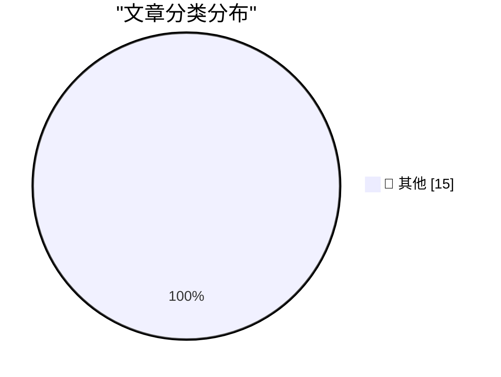

# 📰 AI 博客每日精选 — 2026-03-09

> 来自 Karpathy 推荐的 92 个顶级技术博客，AI 精选 Top 15

## 🏆 今日必读

🥇 **Quoting Joseph Weizenbaum**

[Quoting Joseph Weizenbaum](https://simonwillison.net/2026/Mar/8/joseph-weizenbaum/#atom-everything) — simonwillison.net · 20 小时前 · 📝 其他

> Quoting Joseph Weizenbaum

🥈 **Codex for Open Source**

[Codex for Open Source](https://simonwillison.net/2026/Mar/7/codex-for-open-source/#atom-everything) — simonwillison.net · 1 天前 · 📝 其他

> Codex for Open Source

🥉 **How AI Assistants are Moving the Security Goalposts**

[How AI Assistants are Moving the Security Goalposts](https://krebsonsecurity.com/2026/03/how-ai-assistants-are-moving-the-security-goalposts/) — krebsonsecurity.com · 12 小时前 · 📝 其他

> How AI Assistants are Moving the Security Goalposts

---

## 📊 数据概览

| 扫描源 | 抓取文章 | 时间范围 | 精选 |
|:---:|:---:|:---:|:---:|
| 83/92 | 2393 篇 → 23 篇 | 48h | **15 篇** |

### 分类分布

---

## 📝 其他

### 1. Quoting Joseph Weizenbaum

[Quoting Joseph Weizenbaum](https://simonwillison.net/2026/Mar/8/joseph-weizenbaum/#atom-everything) — **simonwillison.net** · 20 小时前 · ⭐ 15/30

> Quoting Joseph Weizenbaum

---

### 2. Codex for Open Source

[Codex for Open Source](https://simonwillison.net/2026/Mar/7/codex-for-open-source/#atom-everything) — **simonwillison.net** · 1 天前 · ⭐ 15/30

> Codex for Open Source

---

### 3. How AI Assistants are Moving the Security Goalposts

[How AI Assistants are Moving the Security Goalposts](https://krebsonsecurity.com/2026/03/how-ai-assistants-are-moving-the-security-goalposts/) — **krebsonsecurity.com** · 12 小时前 · ⭐ 15/30

> How AI Assistants are Moving the Security Goalposts

---

### 4. Can Coding Agents Relicense Open Source Through a ‘Clean Room’ Implementation of Code?

[Can Coding Agents Relicense Open Source Through a ‘Clean Room’ Implementation of Code?](https://simonwillison.net/2026/Mar/5/chardet/) — **daringfireball.net** · 17 小时前 · ⭐ 15/30

> Can Coding Agents Relicense Open Source Through a ‘Clean Room’ Implementation of Code?

---

### 5. Donald Knuth on Claude Opus Solving a Computer Science Problem

[Donald Knuth on Claude Opus Solving a Computer Science Problem](https://www-cs-faculty.stanford.edu/~knuth/papers/claude-cycles.pdf) — **daringfireball.net** · 18 小时前 · ⭐ 15/30

> Donald Knuth on Claude Opus Solving a Computer Science Problem

---

### 6. Steve Lemay Hits Apple’s Leadership Page

[Steve Lemay Hits Apple’s Leadership Page](https://www.apple.com/leadership/steve-lemay/) — **daringfireball.net** · 20 小时前 · ⭐ 15/30

> Steve Lemay Hits Apple’s Leadership Page

---

### 7. ‘npx workos’

[‘npx workos’](https://workos.com/docs/authkit/cli-installer?utm_source=tldrdev&amp;utm_medium=newsletter&amp;utm_campaign=q12026) — **daringfireball.net** · 1 天前 · ⭐ 15/30

> ‘npx workos’

---

### 8. GNU and the AI reimplementations

[GNU and the AI reimplementations](http://antirez.com/news/162) — **antirez.com** · 19 小时前 · ⭐ 15/30

> GNU and the AI reimplementations

---

### 9. Pluralistic: The web is bearable with RSS (07 Mar 2026)

[Pluralistic: The web is bearable with RSS (07 Mar 2026)](https://pluralistic.net/2026/03/07/reader-mode/) — **pluralistic.net** · 1 天前 · ⭐ 15/30

> Pluralistic: The web is bearable with RSS (07 Mar 2026)

---

### 10. What's the source of Einstein's "citizen of the world" quip?

[What's the source of Einstein's "citizen of the world" quip?](https://shkspr.mobi/blog/2026/03/whats-the-source-of-einsteins-citizen-of-the-world-quip/) — **shkspr.mobi** · 23 小时前 · ⭐ 15/30

> What's the source of Einstein's "citizen of the world" quip?

---

### 11. Book Review: The Electronic Criminals by Robert Farr (1975) ★★★⯪☆

[Book Review: The Electronic Criminals by Robert Farr (1975) ★★★⯪☆](https://shkspr.mobi/blog/2026/03/book-review-the-electronic-criminals-by-robert-farr-1975/) — **shkspr.mobi** · 1 天前 · ⭐ 15/30

> Book Review: The Electronic Criminals by Robert Farr (1975) ★★★⯪☆

---

### 12. Vibe Coding Trip Report: Making a sponsor panel

[Vibe Coding Trip Report: Making a sponsor panel](https://xeiaso.net/blog/2026/vibe-coding-sponsor-panel/) — **xeiaso.net** · 11 小时前 · ⭐ 15/30

> Vibe Coding Trip Report: Making a sponsor panel

---

### 13. Some Thorns Have Roses

[Some Thorns Have Roses](https://xeiaso.net/blog/2026/some-thorns-have-roses/) — **xeiaso.net** · 1 天前 · ⭐ 15/30

> Some Thorns Have Roses

---

### 14. How much certainty is worthwhile?

[How much certainty is worthwhile?](https://www.johndcook.com/blog/2026/03/08/how-much-certainty-is-worthwhile/) — **johndcook.com** · 17 小时前 · ⭐ 15/30

> How much certainty is worthwhile?

---

### 15. Introducing llm-eliza

[Introducing llm-eliza](https://evanhahn.com/llm-eliza/) — **evanhahn.com** · 1 天前 · ⭐ 15/30

> Introducing llm-eliza

---

*生成于 2026-03-09 11:52 | 扫描 83 源 → 获取 2393 篇 → 精选 15 篇*
*基于 [Hacker News Popularity Contest 2025](https://refactoringenglish.com/tools/hn-popularity/) RSS 源列表，由 [Andrej Karpathy](https://x.com/karpathy) 推荐*
*由「懂点儿AI」制作，欢迎关注同名微信公众号获取更多 AI 实用技巧 💡*
