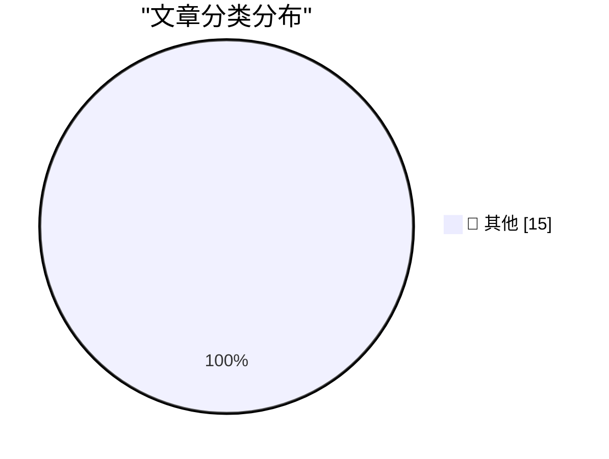

# 📰 AI 博客每日精选 — 2026-03-28

> 来自 Karpathy 推荐的 92 个顶级技术博客，AI 精选 Top 15

## 🏆 今日必读

🥇 **datasette-showboat 0.1a2**

[datasette-showboat 0.1a2](https://simonwillison.net/2026/Mar/27/datasette-showboat/#atom-everything) — simonwillison.net · 10 小时前 · 📝 其他

> datasette-showboat 0.1a2

🥈 **Quoting Richard Fontana**

[Quoting Richard Fontana](https://simonwillison.net/2026/Mar/27/richard-fontana/#atom-everything) — simonwillison.net · 13 小时前 · 📝 其他

> Quoting Richard Fontana

🥉 **Vibe coding SwiftUI apps is a lot of fun**

[Vibe coding SwiftUI apps is a lot of fun](https://simonwillison.net/2026/Mar/27/vibe-coding-swiftui/#atom-everything) — simonwillison.net · 13 小时前 · 📝 其他

> Vibe coding SwiftUI apps is a lot of fun

---

## 📊 数据概览

| 扫描源 | 抓取文章 | 时间范围 | 精选 |
|:---:|:---:|:---:|:---:|
| 85/92 | 2456 篇 → 49 篇 | 48h | **15 篇** |

### 分类分布

---

## 📝 其他

### 1. datasette-showboat 0.1a2

[datasette-showboat 0.1a2](https://simonwillison.net/2026/Mar/27/datasette-showboat/#atom-everything) — **simonwillison.net** · 10 小时前 · ⭐ 15/30

> datasette-showboat 0.1a2

---

### 2. Quoting Richard Fontana

[Quoting Richard Fontana](https://simonwillison.net/2026/Mar/27/richard-fontana/#atom-everything) — **simonwillison.net** · 13 小时前 · ⭐ 15/30

> Quoting Richard Fontana

---

### 3. Vibe coding SwiftUI apps is a lot of fun

[Vibe coding SwiftUI apps is a lot of fun](https://simonwillison.net/2026/Mar/27/vibe-coding-swiftui/#atom-everything) — **simonwillison.net** · 13 小时前 · ⭐ 15/30

> Vibe coding SwiftUI apps is a lot of fun

---

### 4. We Rewrote JSONata with AI in a Day, Saved $500K/Year

[We Rewrote JSONata with AI in a Day, Saved $500K/Year](https://simonwillison.net/2026/Mar/27/vine-porting-jsonata/#atom-everything) — **simonwillison.net** · 1 天前 · ⭐ 15/30

> We Rewrote JSONata with AI in a Day, Saved $500K/Year

---

### 5. My minute-by-minute response to the LiteLLM malware attack

[My minute-by-minute response to the LiteLLM malware attack](https://simonwillison.net/2026/Mar/26/response-to-the-litellm-malware-attack/#atom-everything) — **simonwillison.net** · 1 天前 · ⭐ 15/30

> My minute-by-minute response to the LiteLLM malware attack

---

### 6. Quantization from the ground up

[Quantization from the ground up](https://simonwillison.net/2026/Mar/26/quantization-from-the-ground-up/#atom-everything) — **simonwillison.net** · 1 天前 · ⭐ 15/30

> Quantization from the ground up

---

### 7. Bring back MiniDV with this Raspberry Pi FireWire HAT

[Bring back MiniDV with this Raspberry Pi FireWire HAT](https://www.jeffgeerling.com/blog/2026/minidv-with-raspberry-pi-firewire-hat/) — **jeffgeerling.com** · 20 小时前 · ⭐ 15/30

> Bring back MiniDV with this Raspberry Pi FireWire HAT

---

### 8. Working on products people hate

[Working on products people hate](https://seangoedecke.com/working-on-products-people-hate/) — **seangoedecke.com** · 1 天前 · ⭐ 15/30

> Working on products people hate

---

### 9. Business Insider’s Subscriber Spiral

[Business Insider’s Subscriber Spiral](https://www.status.news/p/business-insider-subscription-decline-data) — **daringfireball.net** · 9 小时前 · ⭐ 15/30

> Business Insider’s Subscriber Spiral

---

### 10. Apple Says It’s Not Aware of Lockdown Mode Ever Having Been Exploited

[Apple Says It’s Not Aware of Lockdown Mode Ever Having Been Exploited](https://techcrunch.com/2026/03/27/apple-says-no-one-using-lockdown-mode-has-been-hacked-with-spyware/) — **daringfireball.net** · 10 小时前 · ⭐ 15/30

> Apple Says It’s Not Aware of Lockdown Mode Ever Having Been Exploited

---

### 11. Apple Announces Ads Are Coming to Apple Maps

[Apple Announces Ads Are Coming to Apple Maps](https://www.apple.com/newsroom/2026/03/introducing-apple-business-a-new-all-in-one-platform-for-businesses-of-all-sizes/) — **daringfireball.net** · 10 小时前 · ⭐ 15/30

> Apple Announces Ads Are Coming to Apple Maps

---

### 12. Netflix Raises Prices Again

[Netflix Raises Prices Again](https://variety.com/2026/tv/news/why-netflix-hiked-prices-explained-chart-1236701365/) — **daringfireball.net** · 10 小时前 · ⭐ 15/30

> Netflix Raises Prices Again

---

### 13. ★ Apple Giveth, Apple Taketh Away

[★ Apple Giveth, Apple Taketh Away](https://daringfireball.net/2026/03/apple_giveth_apple_taketh_away) — **daringfireball.net** · 13 小时前 · ⭐ 15/30

> ★ Apple Giveth, Apple Taketh Away

---

### 14. Apple Discontinues the Mac Pro With No Plans to Bring It Back

[Apple Discontinues the Mac Pro With No Plans to Bring It Back](https://9to5mac.com/2026/03/26/apple-discontinues-the-mac-pro/) — **daringfireball.net** · 1 天前 · ⭐ 15/30

> Apple Discontinues the Mac Pro With No Plans to Bring It Back

---

### 15. The Apple Charging Situation

[The Apple Charging Situation](https://randsinrepose.com/guides/apple-charging-guide.html) — **daringfireball.net** · 1 天前 · ⭐ 15/30

> The Apple Charging Situation

---

*生成于 2026-03-28 10:21 | 扫描 85 源 → 获取 2456 篇 → 精选 15 篇*
*基于 [Hacker News Popularity Contest 2025](https://refactoringenglish.com/tools/hn-popularity/) RSS 源列表，由 [Andrej Karpathy](https://x.com/karpathy) 推荐*
*由「懂点儿AI」制作，欢迎关注同名微信公众号获取更多 AI 实用技巧 💡*
