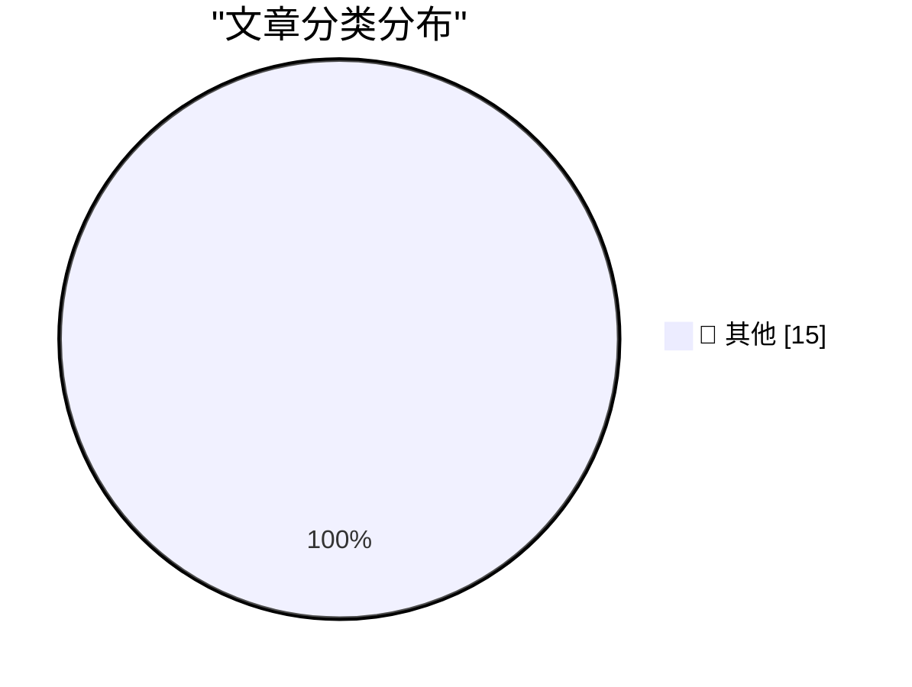

# 📰 AI 博客每日精选 — 2026-04-19

> 来自 Karpathy 推荐的 92 个顶级技术博客，AI 精选 Top 15

## 🏆 今日必读

🥇 **Changes in the system prompt between Claude Opus 4.6 and 4.7**

[Changes in the system prompt between Claude Opus 4.6 and 4.7](https://simonwillison.net/2026/Apr/18/opus-system-prompt/#atom-everything) — simonwillison.net · 10 小时前 · 📝 其他

> Changes in the system prompt between Claude Opus 4.6 and 4.7

🥈 **Claude system prompts as a git timeline**

[Claude system prompts as a git timeline](https://simonwillison.net/2026/Apr/18/extract-system-prompts/#atom-everything) — simonwillison.net · 22 小时前 · 📝 其他

> Claude system prompts as a git timeline

🥉 **Adding a new content type to my blog-to-newsletter tool**

[Adding a new content type to my blog-to-newsletter tool](https://simonwillison.net/guides/agentic-engineering-patterns/adding-a-new-content-type/#atom-everything) — simonwillison.net · 1 天前 · 📝 其他

> Adding a new content type to my blog-to-newsletter tool

---

## 📊 数据概览

| 扫描源 | 抓取文章 | 时间范围 | 精选 |
|:---:|:---:|:---:|:---:|
| 84/92 | 2450 篇 → 27 篇 | 48h | **15 篇** |

### 分类分布

---

## 📝 其他

### 1. Changes in the system prompt between Claude Opus 4.6 and 4.7

[Changes in the system prompt between Claude Opus 4.6 and 4.7](https://simonwillison.net/2026/Apr/18/opus-system-prompt/#atom-everything) — **simonwillison.net** · 10 小时前 · ⭐ 15/30

> Changes in the system prompt between Claude Opus 4.6 and 4.7

---

### 2. Claude system prompts as a git timeline

[Claude system prompts as a git timeline](https://simonwillison.net/2026/Apr/18/extract-system-prompts/#atom-everything) — **simonwillison.net** · 22 小时前 · ⭐ 15/30

> Claude system prompts as a git timeline

---

### 3. Adding a new content type to my blog-to-newsletter tool

[Adding a new content type to my blog-to-newsletter tool](https://simonwillison.net/guides/agentic-engineering-patterns/adding-a-new-content-type/#atom-everything) — **simonwillison.net** · 1 天前 · ⭐ 15/30

> Adding a new content type to my blog-to-newsletter tool

---

### 4. Join us at PyCon US 2026 in Long Beach - we have new AI and security tracks this year

[Join us at PyCon US 2026 in Long Beach - we have new AI and security tracks this year](https://simonwillison.net/2026/Apr/17/pycon-us-2026/#atom-everything) — **simonwillison.net** · 1 天前 · ⭐ 15/30

> Join us at PyCon US 2026 in Long Beach - we have new AI and security tracks this year

---

### 5. Many anti-AI arguments are conservative arguments

[Many anti-AI arguments are conservative arguments](https://seangoedecke.com/many-anti-ai-arguments-are-conservative/) — **seangoedecke.com** · 1 天前 · ⭐ 15/30

> Many anti-AI arguments are conservative arguments

---

### 6. ★ ‘A Reading Room on Wheels, a Lover’s Lane, and, After 11 PM, a Flophouse’

[★ ‘A Reading Room on Wheels, a Lover’s Lane, and, After 11 PM, a Flophouse’](https://daringfireball.net/2026/04/kubrick_new_york_subway) — **daringfireball.net** · 16 小时前 · ⭐ 15/30

> ★ ‘A Reading Room on Wheels, a Lover’s Lane, and, After 11 PM, a Flophouse’

---

### 7. Mac Mini and Mac Studio Supply Shortages

[Mac Mini and Mac Studio Supply Shortages](https://www.wsj.com/tech/personal-tech/apple-mac-mini-supply-3e7a7509?st=fKpr4Q) — **daringfireball.net** · 17 小时前 · ⭐ 15/30

> Mac Mini and Mac Studio Supply Shortages

---

### 8. Apple’s Developer Guidelines for Ratings and Review Prompts

[Apple’s Developer Guidelines for Ratings and Review Prompts](https://developer.apple.com/design/human-interface-guidelines/ratings-and-reviews#Best-practices) — **daringfireball.net** · 1 天前 · ⭐ 15/30

> Apple’s Developer Guidelines for Ratings and Review Prompts

---

### 9. Follow-Up Regarding App Store Reviews, Which Are Definitely Busted

[Follow-Up Regarding App Store Reviews, Which Are Definitely Busted](https://daringfireball.net/linked/2026/04/16/app-store-reviews-are-busted) — **daringfireball.net** · 1 天前 · ⭐ 15/30

> Follow-Up Regarding App Store Reviews, Which Are Definitely Busted

---

### 10. We Are All Playing Politics at Work

[We Are All Playing Politics at Work](https://idiallo.com/blog/we-are-playing-politics?src=feed) — **idiallo.com** · 1 天前 · ⭐ 15/30

> We Are All Playing Politics at Work

---

### 11. 5x5 Pixel font for tiny screens

[5x5 Pixel font for tiny screens](https://maurycyz.com/projects/mcufont/) — **maurycyz.com** · 1 天前 · ⭐ 15/30

> 5x5 Pixel font for tiny screens

---

### 12. Pluralistic: Georgia's voting technology blunder (18 Apr 2026)

[Pluralistic: Georgia's voting technology blunder (18 Apr 2026)](https://pluralistic.net/2026/04/18/dominion-sucks-actually/) — **pluralistic.net** · 21 小时前 · ⭐ 15/30

> Pluralistic: Georgia's voting technology blunder (18 Apr 2026)

---

### 13. Pluralistic: Tiktokification shall set us free (17 Apr 2026)

[Pluralistic: Tiktokification shall set us free (17 Apr 2026)](https://pluralistic.net/2026/04/17/for-youze/) — **pluralistic.net** · 1 天前 · ⭐ 15/30

> Pluralistic: Tiktokification shall set us free (17 Apr 2026)

---

### 14. Book Review: How To Kill A Witch - A Guide For The Patriarchy by Claire Mitchell and Zoe Venditozzi ★★★⯪☆

[Book Review: How To Kill A Witch - A Guide For The Patriarchy by Claire Mitchell and Zoe Venditozzi ★★★⯪☆](https://shkspr.mobi/blog/2026/04/book-review-how-to-kill-a-witch-a-guide-for-the-patriarchy-by-claire-mitchell-and-zoe-venditozzi/) — **shkspr.mobi** · 1 天前 · ⭐ 15/30

> Book Review: How To Kill A Witch - A Guide For The Patriarchy by Claire Mitchell and Zoe Venditozzi ★★★⯪☆

---

### 15. Forgotten message from the past: LB_INIT­STORAGE

[Forgotten message from the past: LB_INIT­STORAGE](https://devblogs.microsoft.com/oldnewthing/20260417-00/?p=112243) — **devblogs.microsoft.com/oldnewthing** · 1 天前 · ⭐ 15/30

> Forgotten message from the past: LB_INIT­STORAGE

---

*生成于 2026-04-19 10:29 | 扫描 84 源 → 获取 2450 篇 → 精选 15 篇*
*基于 [Hacker News Popularity Contest 2025](https://refactoringenglish.com/tools/hn-popularity/) RSS 源列表，由 [Andrej Karpathy](https://x.com/karpathy) 推荐*
*由「懂点儿AI」制作，欢迎关注同名微信公众号获取更多 AI 实用技巧 💡*
