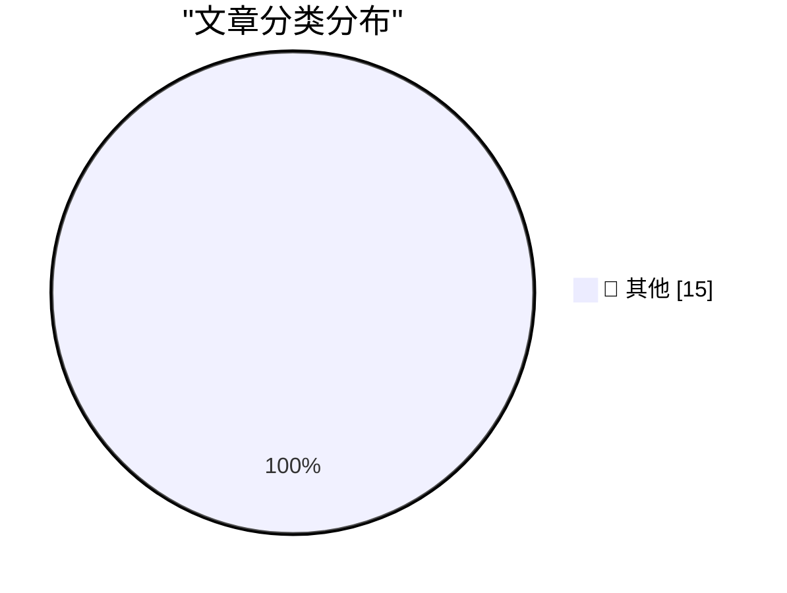

# 📰 AI 博客每日精选 — 2026-03-11

> 来自 Karpathy 推荐的 92 个顶级技术博客，AI 精选 Top 15

## 🏆 今日必读

🥇 **AI should help us produce better code**

[AI should help us produce better code](https://simonwillison.net/guides/agentic-engineering-patterns/better-code/#atom-everything) — simonwillison.net · 13 小时前 · 📝 其他

> AI should help us produce better code

🥈 **Production query plans without production data**

[Production query plans without production data](https://simonwillison.net/2026/Mar/9/production-query-plans-without-production-data/#atom-everything) — simonwillison.net · 1 天前 · 📝 其他

> Production query plans without production data

🥉 **Perhaps not Boring Technology after all**

[Perhaps not Boring Technology after all](https://simonwillison.net/2026/Mar/9/not-so-boring/#atom-everything) — simonwillison.net · 1 天前 · 📝 其他

> Perhaps not Boring Technology after all

---

## 📊 数据概览

| 扫描源 | 抓取文章 | 时间范围 | 精选 |
|:---:|:---:|:---:|:---:|
| 81/92 | 2358 篇 → 35 篇 | 48h | **15 篇** |

### 分类分布

---

## 📝 其他

### 1. AI should help us produce better code

[AI should help us produce better code](https://simonwillison.net/guides/agentic-engineering-patterns/better-code/#atom-everything) — **simonwillison.net** · 13 小时前 · ⭐ 15/30

> AI should help us produce better code

---

### 2. Production query plans without production data

[Production query plans without production data](https://simonwillison.net/2026/Mar/9/production-query-plans-without-production-data/#atom-everything) — **simonwillison.net** · 1 天前 · ⭐ 15/30

> Production query plans without production data

---

### 3. Perhaps not Boring Technology after all

[Perhaps not Boring Technology after all](https://simonwillison.net/2026/Mar/9/not-so-boring/#atom-everything) — **simonwillison.net** · 1 天前 · ⭐ 15/30

> Perhaps not Boring Technology after all

---

### 4. Microsoft Patch Tuesday, March 2026 Edition

[Microsoft Patch Tuesday, March 2026 Edition](https://krebsonsecurity.com/2026/03/microsoft-patch-tuesday-march-2026-edition/) — **krebsonsecurity.com** · 11 小时前 · ⭐ 15/30

> Microsoft Patch Tuesday, March 2026 Edition

---

### 5. ★ The MacBook Neo

[★ The MacBook Neo](https://daringfireball.net/2026/03/the_macbook_neo) — **daringfireball.net** · 13 小时前 · ⭐ 15/30

> ★ The MacBook Neo

---

### 6. [Sponsor] Finalist

[[Sponsor] Finalist](https://www.finalist.works/finalist-36/) — **daringfireball.net** · 1 天前 · ⭐ 15/30

> [Sponsor] Finalist

---

### 7. ★ The iPhone 17e

[★ The iPhone 17e](https://daringfireball.net/2026/03/the_iphone_17e) — **daringfireball.net** · 1 天前 · ⭐ 15/30

> ★ The iPhone 17e

---

### 8. MacBook Neo Wallpapers Now Available for All Macs in MacOS Tahoe

[MacBook Neo Wallpapers Now Available for All Macs in MacOS Tahoe](https://www.macrumors.com/2026/03/09/macos-tahoe-26-4-beta-4-neo-wallpapers/) — **daringfireball.net** · 1 天前 · ⭐ 15/30

> MacBook Neo Wallpapers Now Available for All Macs in MacOS Tahoe

---

### 9. Low-Wage Contractors in Kenya See What Users See While Using Meta’s AI Smart Glasses

[Low-Wage Contractors in Kenya See What Users See While Using Meta’s AI Smart Glasses](https://www.svd.se/a/K8nrV4/metas-ai-smart-glasses-and-data-privacy-concerns-workers-say-we-see-everything) — **daringfireball.net** · 1 天前 · ⭐ 15/30

> Low-Wage Contractors in Kenya See What Users See While Using Meta’s AI Smart Glasses

---

### 10. The Server Older than my Kids!

[The Server Older than my Kids!](https://idiallo.com/byte-size/my-server-is-older-than-my-kids?src=feed) — **idiallo.com** · 10 小时前 · ⭐ 15/30

> The Server Older than my Kids!

---

### 11. I'm Not Lying, I'm Hallucinating

[I'm Not Lying, I'm Hallucinating](https://idiallo.com/byte-size/im-not-lying-im-hallucinating?src=feed) — **idiallo.com** · 15 小时前 · ⭐ 15/30

> I'm Not Lying, I'm Hallucinating

---

### 12. Why Am I Paranoid, You Say?

[Why Am I Paranoid, You Say?](https://idiallo.com/blog/why-am-i-paranoid?src=feed) — **idiallo.com** · 1 天前 · ⭐ 15/30

> Why Am I Paranoid, You Say?

---

### 13. Pluralistic: Ad-tech is fascist tech (10 Mar 2026)

[Pluralistic: Ad-tech is fascist tech (10 Mar 2026)](https://pluralistic.net/2026/03/10/ice-tech/) — **pluralistic.net** · 20 小时前 · ⭐ 15/30

> Pluralistic: Ad-tech is fascist tech (10 Mar 2026)

---

### 14. Pluralistic: Billionaires are a danger to themselves and (especially) us (09 Mar 2026)

[Pluralistic: Billionaires are a danger to themselves and (especially) us (09 Mar 2026)](https://pluralistic.net/2026/03/09/autocrats-of-trade-2/) — **pluralistic.net** · 1 天前 · ⭐ 15/30

> Pluralistic: Billionaires are a danger to themselves and (especially) us (09 Mar 2026)

---

### 15. Unstructured Data and the Joy of having Something Else think for you

[Unstructured Data and the Joy of having Something Else think for you](https://shkspr.mobi/blog/2026/03/unstructured-data-and-the-joy-of-having-something-else-think-for-you/) — **shkspr.mobi** · 23 小时前 · ⭐ 15/30

> Unstructured Data and the Joy of having Something Else think for you

---

*生成于 2026-03-11 11:49 | 扫描 81 源 → 获取 2358 篇 → 精选 15 篇*
*基于 [Hacker News Popularity Contest 2025](https://refactoringenglish.com/tools/hn-popularity/) RSS 源列表，由 [Andrej Karpathy](https://x.com/karpathy) 推荐*
*由「懂点儿AI」制作，欢迎关注同名微信公众号获取更多 AI 实用技巧 💡*
