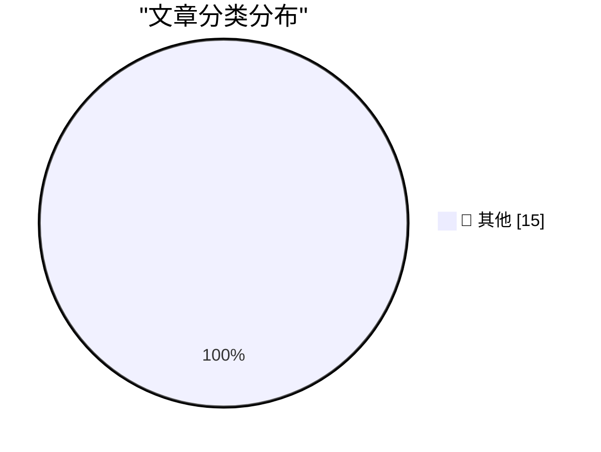

# 📰 AI 博客每日精选 — 2026-04-07

> 来自 Karpathy 推荐的 92 个顶级技术博客，AI 精选 Top 15

## 🏆 今日必读

🥇 **Google AI Edge Gallery**

[Google AI Edge Gallery](https://simonwillison.net/2026/Apr/6/google-ai-edge-gallery/#atom-everything) — simonwillison.net · 1 天前 · 📝 其他

> Google AI Edge Gallery

🥈 **datasette-ports 0.2**

[datasette-ports 0.2](https://simonwillison.net/2026/Apr/6/datasette-ports-2/#atom-everything) — simonwillison.net · 1 天前 · 📝 其他

> datasette-ports 0.2

🥉 **scan-for-secrets 0.3**

[scan-for-secrets 0.3](https://simonwillison.net/2026/Apr/6/scan-for-secrets/#atom-everything) — simonwillison.net · 1 天前 · 📝 其他

> scan-for-secrets 0.3

---

## 📊 数据概览

| 扫描源 | 抓取文章 | 时间范围 | 精选 |
|:---:|:---:|:---:|:---:|
| 83/92 | 2419 篇 → 33 篇 | 48h | **15 篇** |

### 分类分布

---

## 📝 其他

### 1. Google AI Edge Gallery

[Google AI Edge Gallery](https://simonwillison.net/2026/Apr/6/google-ai-edge-gallery/#atom-everything) — **simonwillison.net** · 1 天前 · ⭐ 15/30

> Google AI Edge Gallery

---

### 2. datasette-ports 0.2

[datasette-ports 0.2](https://simonwillison.net/2026/Apr/6/datasette-ports-2/#atom-everything) — **simonwillison.net** · 1 天前 · ⭐ 15/30

> datasette-ports 0.2

---

### 3. scan-for-secrets 0.3

[scan-for-secrets 0.3](https://simonwillison.net/2026/Apr/6/scan-for-secrets/#atom-everything) — **simonwillison.net** · 1 天前 · ⭐ 15/30

> scan-for-secrets 0.3

---

### 4. Cleanup Claude Code Paste

[Cleanup Claude Code Paste](https://simonwillison.net/2026/Apr/6/cleanup-claude-code-paste/#atom-everything) — **simonwillison.net** · 1 天前 · ⭐ 15/30

> Cleanup Claude Code Paste

---

### 5. datasette-ports 0.1

[datasette-ports 0.1](https://simonwillison.net/2026/Apr/6/datasette-ports/#atom-everything) — **simonwillison.net** · 1 天前 · ⭐ 15/30

> datasette-ports 0.1

---

### 6. Eight years of wanting, three months of building with AI

[Eight years of wanting, three months of building with AI](https://simonwillison.net/2026/Apr/5/building-with-ai/#atom-everything) — **simonwillison.net** · 1 天前 · ⭐ 15/30

> Eight years of wanting, three months of building with AI

---

### 7. Quoting Chengpeng Mou

[Quoting Chengpeng Mou](https://simonwillison.net/2026/Apr/5/chengpeng-mou/#atom-everything) — **simonwillison.net** · 1 天前 · ⭐ 15/30

> Quoting Chengpeng Mou

---

### 8. Syntaqlite Playground

[Syntaqlite Playground](https://simonwillison.net/2026/Apr/5/syntaqlite/#atom-everything) — **simonwillison.net** · 1 天前 · ⭐ 15/30

> Syntaqlite Playground

---

### 9. Germany Doxes “UNKN,” Head of RU Ransomware Gangs REvil, GandCrab

[Germany Doxes “UNKN,” Head of RU Ransomware Gangs REvil, GandCrab](https://krebsonsecurity.com/2026/04/germany-doxes-unkn-head-of-ru-ransomware-gangs-revil-gandcrab/) — **krebsonsecurity.com** · 1 天前 · ⭐ 15/30

> Germany Doxes “UNKN,” Head of RU Ransomware Gangs REvil, GandCrab

---

### 10. [Sponsor] Zed, a Font Superfamily

[[Sponsor] Zed, a Font Superfamily](https://www.typotheque.com/blog/zed-a-sans-for-the-needs-of-21century/?utm_source=df) — **daringfireball.net** · 15 小时前 · ⭐ 15/30

> [Sponsor] Zed, a Font Superfamily

---

### 11. Anthropic Accidentally Leaked the Entire Claude Code CLI Source Code

[Anthropic Accidentally Leaked the Entire Claude Code CLI Source Code](https://arstechnica.com/ai/2026/03/entire-claude-code-cli-source-code-leaks-thanks-to-exposed-map-file/) — **daringfireball.net** · 15 小时前 · ⭐ 15/30

> Anthropic Accidentally Leaked the Entire Claude Code CLI Source Code

---

### 12. Little Finder Guy Stars in Nine New Videos on TikTok and YouTube

[Little Finder Guy Stars in Nine New Videos on TikTok and YouTube](https://www.macrumors.com/2026/04/02/little-finder-guy-tiktok-youtube/) — **daringfireball.net** · 18 小时前 · ⭐ 15/30

> Little Finder Guy Stars in Nine New Videos on TikTok and YouTube

---

### 13. An Easter Morning Message of Hope From the Winner of the FIFA Peace Prize

[An Easter Morning Message of Hope From the Winner of the FIFA Peace Prize](https://truthsocial.com/@realDonaldTrump/posts/116351998782539414) — **daringfireball.net** · 1 天前 · ⭐ 15/30

> An Easter Morning Message of Hope From the Winner of the FIFA Peace Prize

---

### 14. AI Did It in 12 Minutes. It Took Me 10 Hours to Fix It

[AI Did It in 12 Minutes. It Took Me 10 Hours to Fix It](https://idiallo.com/blog/it-took-me-10-hours-to-fix-ai-code?src=feed) — **idiallo.com** · 21 小时前 · ⭐ 15/30

> AI Did It in 12 Minutes. It Took Me 10 Hours to Fix It

---

### 15. Pluralistic: Switzerland's Goldilocks fiber (07 Apr 2026)

[Pluralistic: Switzerland's Goldilocks fiber (07 Apr 2026)](https://pluralistic.net/2026/04/07/swisscom/) — **pluralistic.net** · 3 小时前 · ⭐ 15/30

> Pluralistic: Switzerland's Goldilocks fiber (07 Apr 2026)

---

*生成于 2026-04-07 10:45 | 扫描 83 源 → 获取 2419 篇 → 精选 15 篇*
*基于 [Hacker News Popularity Contest 2025](https://refactoringenglish.com/tools/hn-popularity/) RSS 源列表，由 [Andrej Karpathy](https://x.com/karpathy) 推荐*
*由「懂点儿AI」制作，欢迎关注同名微信公众号获取更多 AI 实用技巧 💡*
