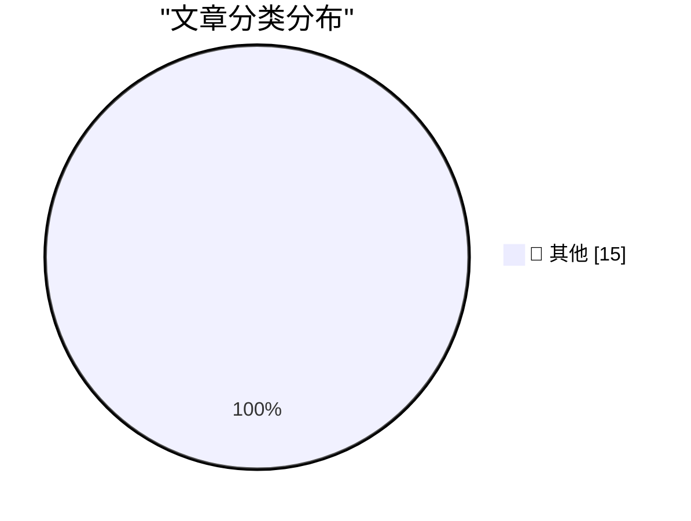

# 📰 AI 博客每日精选 — 2026-04-11

> 来自 Karpathy 推荐的 92 个顶级技术博客，AI 精选 Top 15

## 🏆 今日必读

🥇 **Kākāpō parrots**

[Kākāpō parrots](https://simonwillison.net/2026/Apr/10/kakapo/#atom-everything) — simonwillison.net · 15 小时前 · 📝 其他

> Kākāpō parrots

🥈 **ChatGPT voice mode is a weaker model**

[ChatGPT voice mode is a weaker model](https://simonwillison.net/2026/Apr/10/voice-mode-is-weaker/#atom-everything) — simonwillison.net · 18 小时前 · 📝 其他

> ChatGPT voice mode is a weaker model

🥉 **GitHub Repo Size**

[GitHub Repo Size](https://simonwillison.net/2026/Apr/9/github-repo-size/#atom-everything) — simonwillison.net · 1 天前 · 📝 其他

> GitHub Repo Size

---

## 📊 数据概览

| 扫描源 | 抓取文章 | 时间范围 | 精选 |
|:---:|:---:|:---:|:---:|
| 84/92 | 2447 篇 → 36 篇 | 48h | **15 篇** |

### 分类分布

---

## 📝 其他

### 1. Kākāpō parrots

[Kākāpō parrots](https://simonwillison.net/2026/Apr/10/kakapo/#atom-everything) — **simonwillison.net** · 15 小时前 · ⭐ 15/30

> Kākāpō parrots

---

### 2. ChatGPT voice mode is a weaker model

[ChatGPT voice mode is a weaker model](https://simonwillison.net/2026/Apr/10/voice-mode-is-weaker/#atom-everything) — **simonwillison.net** · 18 小时前 · ⭐ 15/30

> ChatGPT voice mode is a weaker model

---

### 3. GitHub Repo Size

[GitHub Repo Size](https://simonwillison.net/2026/Apr/9/github-repo-size/#atom-everything) — **simonwillison.net** · 1 天前 · ⭐ 15/30

> GitHub Repo Size

---

### 4. ★ Let Us Learn to Show Our Friendship for a Man When He Is Alive and Not After He Is Dead

[★ Let Us Learn to Show Our Friendship for a Man When He Is Alive and Not After He Is Dead](https://daringfireball.net/2026/04/when_he_is_alive_and_not_after_he_is_dead) — **daringfireball.net** · 12 小时前 · ⭐ 15/30

> ★ Let Us Learn to Show Our Friendship for a Man When He Is Alive and Not After He Is Dead

---

### 5. Ed Bindels’s Apple Museum in Utrecht, Netherlands

[Ed Bindels’s Apple Museum in Utrecht, Netherlands](https://applemuseum.nl/) — **daringfireball.net** · 17 小时前 · ⭐ 15/30

> Ed Bindels’s Apple Museum in Utrecht, Netherlands

---

### 6. MacOS Seemingly Crashes After 49 Days of Uptime — a ‘Feature’ Perhaps Exclusive to Tahoe

[MacOS Seemingly Crashes After 49 Days of Uptime — a ‘Feature’ Perhaps Exclusive to Tahoe](https://sixcolors.com/link/2026/04/macs-crash-after-49-days-of-uptime/) — **daringfireball.net** · 1 天前 · ⭐ 15/30

> MacOS Seemingly Crashes After 49 Days of Uptime — a ‘Feature’ Perhaps Exclusive to Tahoe

---

### 7. Adobe Diddles With Your /etc/hosts File

[Adobe Diddles With Your /etc/hosts File](https://old.reddit.com/r/webdev/comments/1sb6hzk/adobe_wrote_to_my_hosts_file_ive_never_had_an_app/oe1ap9h/) — **daringfireball.net** · 1 天前 · ⭐ 15/30

> Adobe Diddles With Your /etc/hosts File

---

### 8. Lickspittle of the Week: Todd Blanche

[Lickspittle of the Week: Todd Blanche](https://politicalwire.com/2026/04/09/extra-bonus-quote-of-the-day-1022/) — **daringfireball.net** · 1 天前 · ⭐ 15/30

> Lickspittle of the Week: Todd Blanche

---

### 9. Your friends are hiding their best ideas from you

[Your friends are hiding their best ideas from you](https://idiallo.com/blog/your-friends-are-hiding-their-ideas?src=feed) — **idiallo.com** · 9 小时前 · ⭐ 15/30

> Your friends are hiding their best ideas from you

---

### 10. What Are You Trying to Say?

[What Are You Trying to Say?](https://idiallo.com/blog/what-are-you-trying-to-say?src=feed) — **idiallo.com** · 1 天前 · ⭐ 15/30

> What Are You Trying to Say?

---

### 11. Pluralistic: Canny Valley and Creative Commons (10 Apr 2026)

[Pluralistic: Canny Valley and Creative Commons (10 Apr 2026)](https://pluralistic.net/2026/04/10/canny-valley/) — **pluralistic.net** · 1 天前 · ⭐ 15/30

> Pluralistic: Canny Valley and Creative Commons (10 Apr 2026)

---

### 12. Pluralistic: Cindy Cohn's "Privacy's Defender" (09 Apr 2026)

[Pluralistic: Cindy Cohn's "Privacy's Defender" (09 Apr 2026)](https://pluralistic.net/2026/04/09/bernstein-2/) — **pluralistic.net** · 1 天前 · ⭐ 15/30

> Pluralistic: Cindy Cohn's "Privacy's Defender" (09 Apr 2026)

---

### 13. [RSS Club] Why do you use RSS rather than Atom?

[[RSS Club] Why do you use RSS rather than Atom?](https://shkspr.mobi/blog/2026/04/rss-club-why-do-you-use-rss-rather-than-atom/) — **shkspr.mobi** · 22 小时前 · ⭐ 15/30

> [RSS Club] Why do you use RSS rather than Atom?

---

### 14. Book Review: Small Comfort by Ia Genberg ★★☆☆☆

[Book Review: Small Comfort by Ia Genberg ★★☆☆☆](https://shkspr.mobi/blog/2026/04/book-review-small-comfort-by-ia-genberg/) — **shkspr.mobi** · 1 天前 · ⭐ 15/30

> Book Review: Small Comfort by Ia Genberg ★★☆☆☆

---

### 15. How do you add or remove a handle from an active Wait­For­Multiple­Objects?, part 2

[How do you add or remove a handle from an active Wait­For­Multiple­Objects?, part 2](https://devblogs.microsoft.com/oldnewthing/20260410-00/?p=112223) — **devblogs.microsoft.com/oldnewthing** · 20 小时前 · ⭐ 15/30

> How do you add or remove a handle from an active Wait­For­Multiple­Objects?, part 2

---

*生成于 2026-04-11 10:22 | 扫描 84 源 → 获取 2447 篇 → 精选 15 篇*
*基于 [Hacker News Popularity Contest 2025](https://refactoringenglish.com/tools/hn-popularity/) RSS 源列表，由 [Andrej Karpathy](https://x.com/karpathy) 推荐*
*由「懂点儿AI」制作，欢迎关注同名微信公众号获取更多 AI 实用技巧 💡*
