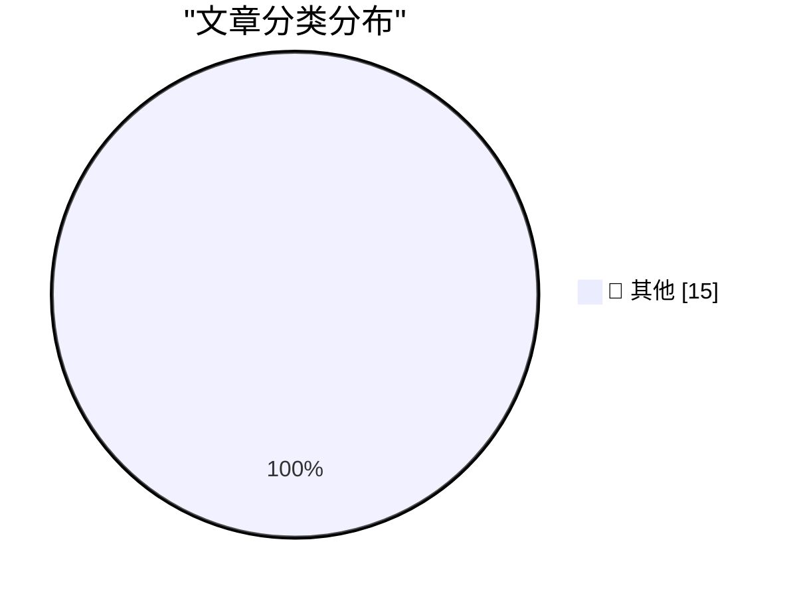

# 📰 AI 博客每日精选 — 2026-08-21

> 来自 Karpathy 推荐的 92 个顶级技术博客，AI 精选 Top 15

## 🏆 今日必读

🥇 **ChatGPT search now uses the site:operator at scale**

[ChatGPT search now uses the site:operator at scale](https://simonwillison.net/2026/Aug/20/chatgpt-search-now-uses-the-siteoperator-at-scale/) — simonwillison.net · 10 小时前 · 📝 其他

> ChatGPT search now uses the site:operator at scale

🥈 **A shot-scraper-style JSON API on Bun 1.4's new Bun.WebView**

[A shot-scraper-style JSON API on Bun 1.4's new Bun.WebView](https://simonwillison.net/2026/Aug/20/bun-webview-json-api/) — simonwillison.net · 18 小时前 · 📝 其他

> A shot-scraper-style JSON API on Bun 1.4's new Bun.WebView

🥉 **smolmachines / smolvm as a sandbox for untrusted Python & JavaScript**

[smolmachines / smolvm as a sandbox for untrusted Python & JavaScript](https://simonwillison.net/2026/Aug/19/smolmachines-untrusted-sandbox/) — simonwillison.net · 1 天前 · 📝 其他

> smolmachines / smolvm as a sandbox for untrusted Python & JavaScript

---

## 📊 数据概览

| 扫描源 | 抓取文章 | 时间范围 | 精选 |
|:---:|:---:|:---:|:---:|
| 81/92 | 2491 篇 → 19 篇 | 48h | **15 篇** |

### 分类分布

```mermaid
pie showData
    title "文章分类分布"
    "📝 其他" : 15
```

---

## 📝 其他

### 1. ChatGPT search now uses the site:operator at scale

[ChatGPT search now uses the site:operator at scale](https://simonwillison.net/2026/Aug/20/chatgpt-search-now-uses-the-siteoperator-at-scale/) — **simonwillison.net** · 10 小时前 · ⭐ 15/30

> ChatGPT search now uses the site:operator at scale

---

### 2. A shot-scraper-style JSON API on Bun 1.4's new Bun.WebView

[A shot-scraper-style JSON API on Bun 1.4's new Bun.WebView](https://simonwillison.net/2026/Aug/20/bun-webview-json-api/) — **simonwillison.net** · 18 小时前 · ⭐ 15/30

> A shot-scraper-style JSON API on Bun 1.4's new Bun.WebView

---

### 3. smolmachines / smolvm as a sandbox for untrusted Python & JavaScript

[smolmachines / smolvm as a sandbox for untrusted Python & JavaScript](https://simonwillison.net/2026/Aug/19/smolmachines-untrusted-sandbox/) — **simonwillison.net** · 1 天前 · ⭐ 15/30

> smolmachines / smolvm as a sandbox for untrusted Python & JavaScript

---

### 4. Quoting Jeremy Morrell

[Quoting Jeremy Morrell](https://simonwillison.net/2026/Aug/19/jeremy-morrell/) — **simonwillison.net** · 1 天前 · ⭐ 15/30

> Quoting Jeremy Morrell

---

### 5. Conceptual integrity and counting lines of code

[Conceptual integrity and counting lines of code](https://simonwillison.net/2026/Aug/19/conceptual-integrity-and-counting-lines-of-code/) — **simonwillison.net** · 1 天前 · ⭐ 15/30

> Conceptual integrity and counting lines of code

---

### 6. Getting the Steam Deck LCD working on a Raspberry Pi

[Getting the Steam Deck LCD working on a Raspberry Pi](https://www.jeffgeerling.com/blog/2026/steam-deck-lcd-pi-hat/) — **jeffgeerling.com** · 20 小时前 · ⭐ 15/30

> Getting the Steam Deck LCD working on a Raspberry Pi

---

### 7. Readers can't identify watermarked AI text

[Readers can't identify watermarked AI text](https://seangoedecke.com/readers-cant-identify-watermarked-ai-text/) — **seangoedecke.com** · 10 小时前 · ⭐ 15/30

> Readers can't identify watermarked AI text

---

### 8. Pluralistic: The actual epistemic crisis (20 Aug 2026)

[Pluralistic: The actual epistemic crisis (20 Aug 2026)](https://pluralistic.net/2026/08/20/epistemic-void/) — **pluralistic.net** · 10 小时前 · ⭐ 15/30

> Pluralistic: The actual epistemic crisis (20 Aug 2026)

---

### 9. Reducing C++ template bloat by factoring out the type-dependent portions of the function

[Reducing C++ template bloat by factoring out the type-dependent portions of the function](https://devblogs.microsoft.com/oldnewthing/20260820-00/?p=112629) — **devblogs.microsoft.com/oldnewthing** · 20 小时前 · ⭐ 15/30

> Reducing C++ template bloat by factoring out the type-dependent portions of the function

---

### 10. On wrapping a callable in a lambda that just calls it with the same parameters

[On wrapping a callable in a lambda that just calls it with the same parameters](https://devblogs.microsoft.com/oldnewthing/20260819-00/?p=112624) — **devblogs.microsoft.com/oldnewthing** · 1 天前 · ⭐ 15/30

> On wrapping a callable in a lambda that just calls it with the same parameters

---

### 11. AI-generated ASCII diagrams

[AI-generated ASCII diagrams](https://www.johndcook.com/blog/2026/08/20/ai-generated-ascii-diagrams/) — **johndcook.com** · 20 小时前 · ⭐ 15/30

> AI-generated ASCII diagrams

---

### 12. Use the built-in GELU, don't roll your own!

[Use the built-in GELU, don't roll your own!](https://www.gilesthomas.com/2026/08/built-in-gelu) — **gilesthomas.com** · 1 天前 · ⭐ 15/30

> Use the built-in GELU, don't roll your own!

---

### 13. Better Batteries

[Better Batteries](https://matklad.github.io/2026/08/20/better-batteries.html) — **matklad.github.io** · 1 天前 · ⭐ 15/30

> Better Batteries

---

### 14. Issues in the Repo

[Issues in the Repo](https://nesbitt.io/2026/08/20/issues-in-the-repo.html) — **nesbitt.io** · 1 天前 · ⭐ 15/30

> Issues in the Repo

---

### 15. Our Servants Will Do That For Us

[Our Servants Will Do That For Us](https://borretti.me/article/our-servants-will-do-that-for-us) — **borretti.me** · 1 天前 · ⭐ 15/30

> Our Servants Will Do That For Us

---

*生成于 2026-08-21 10:17 | 扫描 81 源 → 获取 2491 篇 → 精选 15 篇*
*基于 [Hacker News Popularity Contest 2025](https://refactoringenglish.com/tools/hn-popularity/) RSS 源列表，由 [Andrej Karpathy](https://x.com/karpathy) 推荐*
*由「懂点儿AI」制作，欢迎关注同名微信公众号获取更多 AI 实用技巧 💡*
