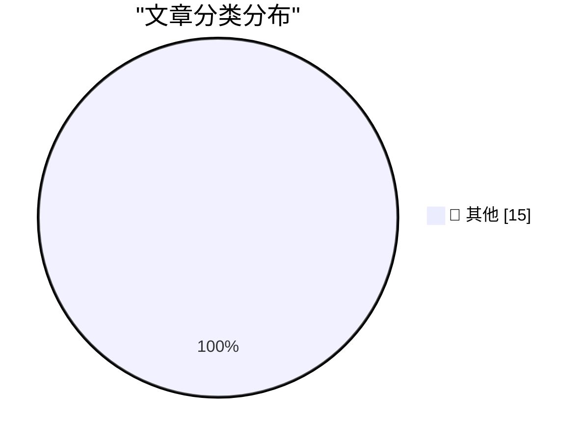

# 📰 AI 博客每日精选 — 2026-06-16

> 来自 Karpathy 推荐的 92 个顶级技术博客，AI 精选 Top 15

## 🏆 今日必读

🥇 **The Fable 5 Export Controls Harm US Cyber Defense**

[The Fable 5 Export Controls Harm US Cyber Defense](https://simonwillison.net/2026/Jun/16/fable-5-export-controls/#atom-everything) — simonwillison.net · 9 小时前 · 📝 其他

> The Fable 5 Export Controls Harm US Cyber Defense

🥈 **Quoting Matteo Wong, The Atlantic**

[Quoting Matteo Wong, The Atlantic](https://simonwillison.net/2026/Jun/16/matteo-wong-the-atlantic/#atom-everything) — simonwillison.net · 11 小时前 · 📝 其他

> Quoting Matteo Wong, The Atlantic

🥉 **Cloudflare CAPTCHA on at least one ampersand**

[Cloudflare CAPTCHA on at least one ampersand](https://simonwillison.net/2026/Jun/16/captcha-on-at-least-one-ampersand/#atom-everything) — simonwillison.net · 14 小时前 · 📝 其他

> Cloudflare CAPTCHA on at least one ampersand

---

## 📊 数据概览

| 扫描源 | 抓取文章 | 时间范围 | 精选 |
|:---:|:---:|:---:|:---:|
| 80/92 | 2429 篇 → 35 篇 | 48h | **15 篇** |

### 分类分布

```mermaid
pie showData
    title "文章分类分布"
    "📝 其他" : 15
```

---

## 📝 其他

### 1. The Fable 5 Export Controls Harm US Cyber Defense

[The Fable 5 Export Controls Harm US Cyber Defense](https://simonwillison.net/2026/Jun/16/fable-5-export-controls/#atom-everything) — **simonwillison.net** · 9 小时前 · ⭐ 15/30

> The Fable 5 Export Controls Harm US Cyber Defense

---

### 2. Quoting Matteo Wong, The Atlantic

[Quoting Matteo Wong, The Atlantic](https://simonwillison.net/2026/Jun/16/matteo-wong-the-atlantic/#atom-everything) — **simonwillison.net** · 11 小时前 · ⭐ 15/30

> Quoting Matteo Wong, The Atlantic

---

### 3. Cloudflare CAPTCHA on at least one ampersand

[Cloudflare CAPTCHA on at least one ampersand](https://simonwillison.net/2026/Jun/16/captcha-on-at-least-one-ampersand/#atom-everything) — **simonwillison.net** · 14 小时前 · ⭐ 15/30

> Cloudflare CAPTCHA on at least one ampersand

---

### 4. datasette-agent 0.3a0

[datasette-agent 0.3a0](https://simonwillison.net/2026/Jun/15/datasette-agent/#atom-everything) — **simonwillison.net** · 21 小时前 · ⭐ 15/30

> datasette-agent 0.3a0

---

### 5. "They screwed us": Personality clashes sent Anthropic's models offline

["They screwed us": Personality clashes sent Anthropic's models offline](https://simonwillison.net/2026/Jun/15/axios-clashes-anthropics/#atom-everything) — **simonwillison.net** · 23 小时前 · ⭐ 15/30

> "They screwed us": Personality clashes sent Anthropic's models offline

---

### 6. Quoting Julia Evans

[Quoting Julia Evans](https://simonwillison.net/2026/Jun/15/julia-evans/#atom-everything) — **simonwillison.net** · 1 天前 · ⭐ 15/30

> Quoting Julia Evans

---

### 7. Why AI hasn’t replaced software engineers, and won’t

[Why AI hasn’t replaced software engineers, and won’t](https://simonwillison.net/2026/Jun/14/why-ai-hasnt-replaced-software-engineers/#atom-everything) — **simonwillison.net** · 1 天前 · ⭐ 15/30

> Why AI hasn’t replaced software engineers, and won’t

---

### 8. [Sponsor] Mux — Video for Developers

[[Sponsor] Mux — Video for Developers](https://www.mux.com/?utm_campaign=fireball&amp;utm_source=DF) — **daringfireball.net** · 12 小时前 · ⭐ 15/30

> [Sponsor] Mux — Video for Developers

---

### 9. The Washington Post on the EU’s DMA Folly

[The Washington Post on the EU’s DMA Folly](https://www.washingtonpost.com/opinions/2026/06/14/apple-withholding-siri-ai-europe-is-another-dma-failure/) — **daringfireball.net** · 12 小时前 · ⭐ 15/30

> The Washington Post on the EU’s DMA Folly

---

### 10. The European Commission Ruled Months Ago That Google’s Integration of Gemini in Android Violates the DMA

[The European Commission Ruled Months Ago That Google’s Integration of Gemini in Android Violates the DMA](https://arstechnica.com/ai/2026/04/europe-could-force-google-to-open-android-to-other-ai-assistants/) — **daringfireball.net** · 19 小时前 · ⭐ 15/30

> The European Commission Ruled Months Ago That Google’s Integration of Gemini in Android Violates the DMA

---

### 11. WorkOS Launches Auth.md — an Open Protocol for Agent Registration

[WorkOS Launches Auth.md — an Open Protocol for Agent Registration](https://workos.com/auth-md?utm_source=daringfireball&amp;utm_medium=newsletter&amp;utm_campaign=q22026) — **daringfireball.net** · 20 小时前 · ⭐ 15/30

> WorkOS Launches Auth.md — an Open Protocol for Agent Registration

---

### 12. ‘Anthropic’s Safety Superpower’

[‘Anthropic’s Safety Superpower’](https://stratechery.com/2026/anthropics-safety-superpower/) — **daringfireball.net** · 21 小时前 · ⭐ 15/30

> ‘Anthropic’s Safety Superpower’

---

### 13. Pluralistic: AI and amateurism (15 Jun 2026)

[Pluralistic: AI and amateurism (15 Jun 2026)](https://pluralistic.net/2026/06/15/vernacular/) — **pluralistic.net** · 23 小时前 · ⭐ 15/30

> Pluralistic: AI and amateurism (15 Jun 2026)

---

### 14. Two Way TV - product photos of 1997's hottest gadget

[Two Way TV - product photos of 1997's hottest gadget](https://shkspr.mobi/blog/2026/06/two-way-tv-product-photos-of-1997s-hottest-gadget/) — **shkspr.mobi** · 3 小时前 · ⭐ 15/30

> Two Way TV - product photos of 1997's hottest gadget

---

### 15. [RSS Club] What happens to old posts?

[[RSS Club] What happens to old posts?](https://shkspr.mobi/blog/2026/06/rss-club-what-happens-to-old-posts/) — **shkspr.mobi** · 1 天前 · ⭐ 15/30

> [RSS Club] What happens to old posts?

---

*生成于 2026-06-16 14:50 | 扫描 80 源 → 获取 2429 篇 → 精选 15 篇*
*基于 [Hacker News Popularity Contest 2025](https://refactoringenglish.com/tools/hn-popularity/) RSS 源列表，由 [Andrej Karpathy](https://x.com/karpathy) 推荐*
*由「懂点儿AI」制作，欢迎关注同名微信公众号获取更多 AI 实用技巧 💡*
