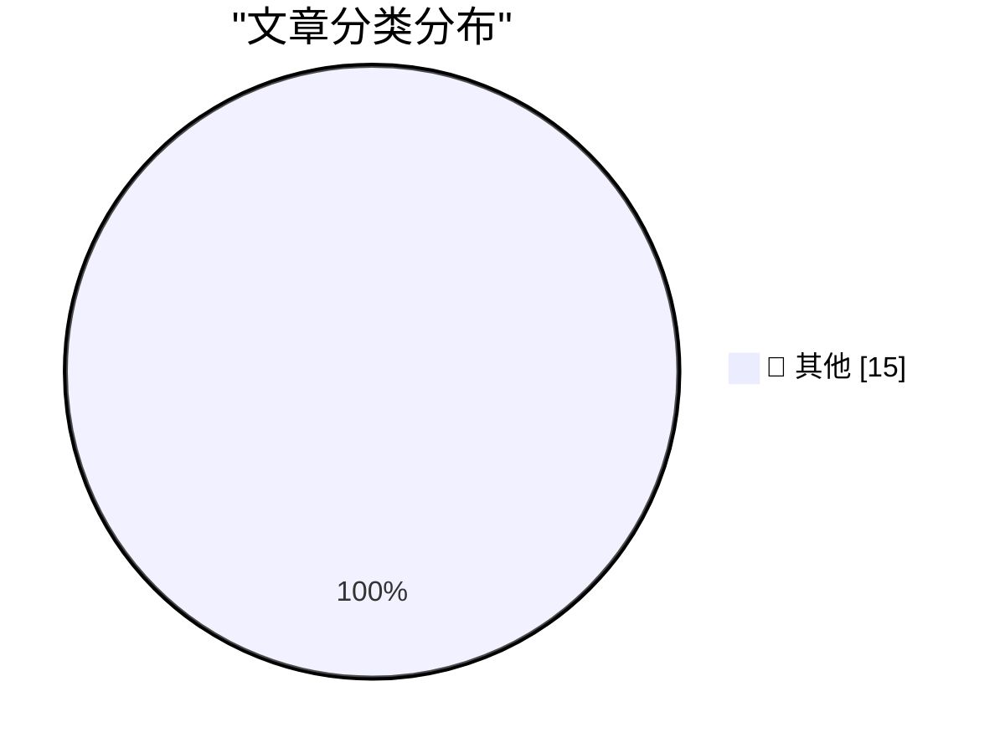

# 📰 AI 博客每日精选 — 2026-06-17

> 来自 Karpathy 推荐的 92 个顶级技术博客，AI 精选 Top 15

## 🏆 今日必读

🥇 **<click-to-play> — a still that plays**

[<click-to-play> — a still that plays](https://simonwillison.net/2026/Jun/17/click-to-play-component/#atom-everything) — simonwillison.net · 9 小时前 · 📝 其他

> <click-to-play> — a still that plays

🥈 **NetNewsWire Status**

[NetNewsWire Status](https://simonwillison.net/2026/Jun/17/netnewswire-status/#atom-everything) — simonwillison.net · 9 小时前 · 📝 其他

> NetNewsWire Status

🥉 **datasette 1.0a34**

[datasette 1.0a34](https://simonwillison.net/2026/Jun/16/datasette/#atom-everything) — simonwillison.net · 16 小时前 · 📝 其他

> datasette 1.0a34

---

## 📊 数据概览

| 扫描源 | 抓取文章 | 时间范围 | 精选 |
|:---:|:---:|:---:|:---:|
| 82/92 | 2473 篇 → 41 篇 | 48h | **15 篇** |

### 分类分布

```mermaid
pie showData
    title "文章分类分布"
    "📝 其他" : 15
```

---

## 📝 其他

### 1. <click-to-play> — a still that plays

[<click-to-play> — a still that plays](https://simonwillison.net/2026/Jun/17/click-to-play-component/#atom-everything) — **simonwillison.net** · 9 小时前 · ⭐ 15/30

> <click-to-play> — a still that plays

---

### 2. NetNewsWire Status

[NetNewsWire Status](https://simonwillison.net/2026/Jun/17/netnewswire-status/#atom-everything) — **simonwillison.net** · 9 小时前 · ⭐ 15/30

> NetNewsWire Status

---

### 3. datasette 1.0a34

[datasette 1.0a34](https://simonwillison.net/2026/Jun/16/datasette/#atom-everything) — **simonwillison.net** · 16 小时前 · ⭐ 15/30

> datasette 1.0a34

---

### 4. datasette-tailscale 0.1a0

[datasette-tailscale 0.1a0](https://simonwillison.net/2026/Jun/16/datasette-tailscale/#atom-everything) — **simonwillison.net** · 21 小时前 · ⭐ 15/30

> datasette-tailscale 0.1a0

---

### 5. Quoting Georgi Gerganov

[Quoting Georgi Gerganov](https://simonwillison.net/2026/Jun/16/georgi-gerganov/#atom-everything) — **simonwillison.net** · 21 小时前 · ⭐ 15/30

> Quoting Georgi Gerganov

---

### 6. The Fable 5 Export Controls Harm US Cyber Defense

[The Fable 5 Export Controls Harm US Cyber Defense](https://simonwillison.net/2026/Jun/16/fable-5-export-controls/#atom-everything) — **simonwillison.net** · 1 天前 · ⭐ 15/30

> The Fable 5 Export Controls Harm US Cyber Defense

---

### 7. Quoting Matteo Wong, The Atlantic

[Quoting Matteo Wong, The Atlantic](https://simonwillison.net/2026/Jun/16/matteo-wong-the-atlantic/#atom-everything) — **simonwillison.net** · 1 天前 · ⭐ 15/30

> Quoting Matteo Wong, The Atlantic

---

### 8. Cloudflare CAPTCHA on at least one ampersand

[Cloudflare CAPTCHA on at least one ampersand](https://simonwillison.net/2026/Jun/16/captcha-on-at-least-one-ampersand/#atom-everything) — **simonwillison.net** · 1 天前 · ⭐ 15/30

> Cloudflare CAPTCHA on at least one ampersand

---

### 9. datasette-agent 0.3a0

[datasette-agent 0.3a0](https://simonwillison.net/2026/Jun/15/datasette-agent/#atom-everything) — **simonwillison.net** · 1 天前 · ⭐ 15/30

> datasette-agent 0.3a0

---

### 10. "They screwed us": Personality clashes sent Anthropic's models offline

["They screwed us": Personality clashes sent Anthropic's models offline](https://simonwillison.net/2026/Jun/15/axios-clashes-anthropics/#atom-everything) — **simonwillison.net** · 1 天前 · ⭐ 15/30

> "They screwed us": Personality clashes sent Anthropic's models offline

---

### 11. Checking In on the iOS Continental Fun-Gap Drift

[Checking In on the iOS Continental Fun-Gap Drift](https://daringfireball.net/2024/09/ios_continental_drift_fun_gap) — **daringfireball.net** · 12 小时前 · ⭐ 15/30

> Checking In on the iOS Continental Fun-Gap Drift

---

### 12. New in the App Store: Personalized Recommendations

[New in the App Store: Personalized Recommendations](https://techcrunch.com/2026/06/09/apples-app-store-rolls-out-personalized-recommendations/) — **daringfireball.net** · 21 小时前 · ⭐ 15/30

> New in the App Store: Personalized Recommendations

---

### 13. [Sponsor] Mux — Video for Developers

[[Sponsor] Mux — Video for Developers](https://www.mux.com/?utm_campaign=fireball&amp;utm_source=DF) — **daringfireball.net** · 1 天前 · ⭐ 15/30

> [Sponsor] Mux — Video for Developers

---

### 14. The Washington Post on the EU’s DMA Folly

[The Washington Post on the EU’s DMA Folly](https://www.washingtonpost.com/opinions/2026/06/14/apple-withholding-siri-ai-europe-is-another-dma-failure/) — **daringfireball.net** · 1 天前 · ⭐ 15/30

> The Washington Post on the EU’s DMA Folly

---

### 15. The European Commission Ruled Months Ago That Google’s Integration of Gemini in Android Violates the DMA

[The European Commission Ruled Months Ago That Google’s Integration of Gemini in Android Violates the DMA](https://arstechnica.com/ai/2026/04/europe-could-force-google-to-open-android-to-other-ai-assistants/) — **daringfireball.net** · 1 天前 · ⭐ 15/30

> The European Commission Ruled Months Ago That Google’s Integration of Gemini in Android Violates the DMA

---

*生成于 2026-06-17 13:35 | 扫描 82 源 → 获取 2473 篇 → 精选 15 篇*
*基于 [Hacker News Popularity Contest 2025](https://refactoringenglish.com/tools/hn-popularity/) RSS 源列表，由 [Andrej Karpathy](https://x.com/karpathy) 推荐*
*由「懂点儿AI」制作，欢迎关注同名微信公众号获取更多 AI 实用技巧 💡*
