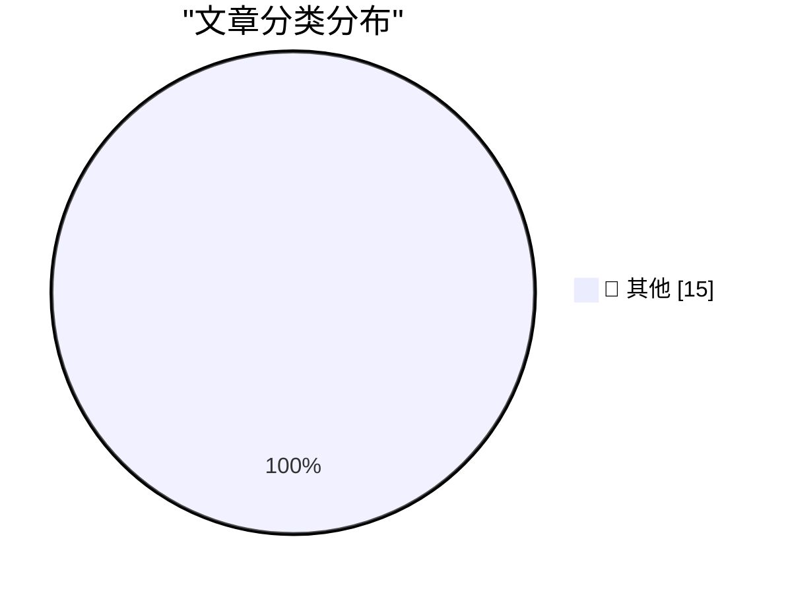

# 📰 AI 博客每日精选 — 2026-09-16

> 来自 Karpathy 推荐的 92 个顶级技术博客，AI 精选 Top 15

## 🏆 今日必读

🥇 **Gemini Live audio**

[Gemini Live audio](https://simonwillison.net/2026/Sep/15/gemini-live/) — simonwillison.net · 15 小时前 · 📝 其他

> Gemini Live audio

🥈 **The contagion of fear**

[The contagion of fear](https://simonwillison.net/2026/Sep/14/the-contagion-of-fear/) — simonwillison.net · 1 天前 · 📝 其他

> The contagion of fear

🥉 **What blog posts influenced your thinking the most?**

[What blog posts influenced your thinking the most?](https://simonwillison.net/2026/Sep/14/influences/) — simonwillison.net · 1 天前 · 📝 其他

> What blog posts influenced your thinking the most?

---

## 📊 数据概览

| 扫描源 | 抓取文章 | 时间范围 | 精选 |
|:---:|:---:|:---:|:---:|
| 83/92 | 2525 篇 → 27 篇 | 48h | **15 篇** |

### 分类分布

```mermaid
pie showData
    title "文章分类分布"
    "📝 其他" : 15
```

---

## 📝 其他

### 1. Gemini Live audio

[Gemini Live audio](https://simonwillison.net/2026/Sep/15/gemini-live/) — **simonwillison.net** · 15 小时前 · ⭐ 15/30

> Gemini Live audio

---

### 2. The contagion of fear

[The contagion of fear](https://simonwillison.net/2026/Sep/14/the-contagion-of-fear/) — **simonwillison.net** · 1 天前 · ⭐ 15/30

> The contagion of fear

---

### 3. What blog posts influenced your thinking the most?

[What blog posts influenced your thinking the most?](https://simonwillison.net/2026/Sep/14/influences/) — **simonwillison.net** · 1 天前 · ⭐ 15/30

> What blog posts influenced your thinking the most?

---

### 4. Quoting Laurie Voss

[Quoting Laurie Voss](https://simonwillison.net/2026/Sep/14/laurie-voss/) — **simonwillison.net** · 1 天前 · ⭐ 15/30

> Quoting Laurie Voss

---

### 5. Jev means structured output is interesting again

[Jev means structured output is interesting again](https://seangoedecke.com/jev-means-structured-output-is-interesting-again/) — **seangoedecke.com** · 14 小时前 · ⭐ 15/30

> Jev means structured output is interesting again

---

### 6. Tell agents the why, not just the how

[Tell agents the why, not just the how](https://seangoedecke.com/tell-agents-the-why/) — **seangoedecke.com** · 1 天前 · ⭐ 15/30

> Tell agents the why, not just the how

---

### 7. ‘Apple Reference Image: A New Approach for Verified Photography’

[‘Apple Reference Image: A New Approach for Verified Photography’](https://security.apple.com/blog/apple-reference-image/) — **daringfireball.net** · 11 小时前 · ⭐ 15/30

> ‘Apple Reference Image: A New Approach for Verified Photography’

---

### 8. FT: ‘Steve Bannon and Bernie Sanders Unite in AI Safety Call’

[FT: ‘Steve Bannon and Bernie Sanders Unite in AI Safety Call’](https://www.ft.com/content/bab5c4c5-5377-4dd0-8b46-d8c4ce9a36d5?syn-25a6b1a6=1) — **daringfireball.net** · 19 小时前 · ⭐ 15/30

> FT: ‘Steve Bannon and Bernie Sanders Unite in AI Safety Call’

---

### 9. ★ Thoughts and Observations on Apple’s ‘Surprise and Shine’ Event; the Announcements of the iPhones 18 Pro, AirPods 5, Apple Watches Series 12 and Ultra 4, and the iPhone Duo; and the Dawn of the Ternus, John Ternus Era at Apple

[★ Thoughts and Observations on Apple’s ‘Surprise and Shine’ Event; the Announcements of the iPhones 18 Pro, AirPods 5, Apple Watches Series 12 and Ultra 4, and the iPhone Duo; and the Dawn of the Ternus, John Ternus Era at Apple](https://daringfireball.net/2026/09/thoughts_and_observations_on_apples_surprise_and_shine_event) — **daringfireball.net** · 20 小时前 · ⭐ 15/30

> ★ Thoughts and Observations on Apple’s ‘Surprise and Shine’ Event; the Announcements of the iPhones 18 Pro, AirPods 5, Apple Watches Series 12 and Ultra 4, and the iPhone Duo; and the Dawn of the Ternus, John Ternus Era at Apple

---

### 10. [Sponsor] WorkOS: How SSO Works and the Fastest Way to Add It

[[Sponsor] WorkOS: How SSO Works and the Fastest Way to Add It](https://workos.com/guide/the-developers-guide-to-sso?utm_source=daringfireball&amp;utm_medium=newsletter&amp;utm_campaign=q32026) — **daringfireball.net** · 22 小时前 · ⭐ 15/30

> [Sponsor] WorkOS: How SSO Works and the Fastest Way to Add It

---

### 11. Apple’s 27.0 OS Updates

[Apple’s 27.0 OS Updates](https://scriptingosx.com/2026/09/apple-27-platform-updates-september-2026/) — **daringfireball.net** · 1 天前 · ⭐ 15/30

> Apple’s 27.0 OS Updates

---

### 12. Dumpster Fire – Litterbox-Inspired Extension for Firefox

[Dumpster Fire – Litterbox-Inspired Extension for Firefox](https://addons.mozilla.org/en-US/firefox/addon/dumpster-fire/) — **daringfireball.net** · 1 天前 · ⭐ 15/30

> Dumpster Fire – Litterbox-Inspired Extension for Firefox

---

### 13. Pluralistic: How an AI moratorium can save AI bosses (16 Sep 2026)

[Pluralistic: How an AI moratorium can save AI bosses (16 Sep 2026)](https://pluralistic.net/2026/09/16/beggar-thy-neighbor/) — **pluralistic.net** · 6 小时前 · ⭐ 15/30

> Pluralistic: How an AI moratorium can save AI bosses (16 Sep 2026)

---

### 14. Pluralistic: Everybody pees (15 Sep 2026)

[Pluralistic: Everybody pees (15 Sep 2026)](https://pluralistic.net/2026/09/15/bitter-lemon-energy-drink/) — **pluralistic.net** · 1 天前 · ⭐ 15/30

> Pluralistic: Everybody pees (15 Sep 2026)

---

### 15. How to get a DOI for your blog posts

[How to get a DOI for your blog posts](https://shkspr.mobi/blog/2026/09/how-to-get-a-doi-for-your-blog-posts/) — **shkspr.mobi** · 2 小时前 · ⭐ 15/30

> How to get a DOI for your blog posts

---

*生成于 2026-09-16 14:25 | 扫描 83 源 → 获取 2525 篇 → 精选 15 篇*
*基于 [Hacker News Popularity Contest 2025](https://refactoringenglish.com/tools/hn-popularity/) RSS 源列表，由 [Andrej Karpathy](https://x.com/karpathy) 推荐*
*由「懂点儿AI」制作，欢迎关注同名微信公众号获取更多 AI 实用技巧 💡*
