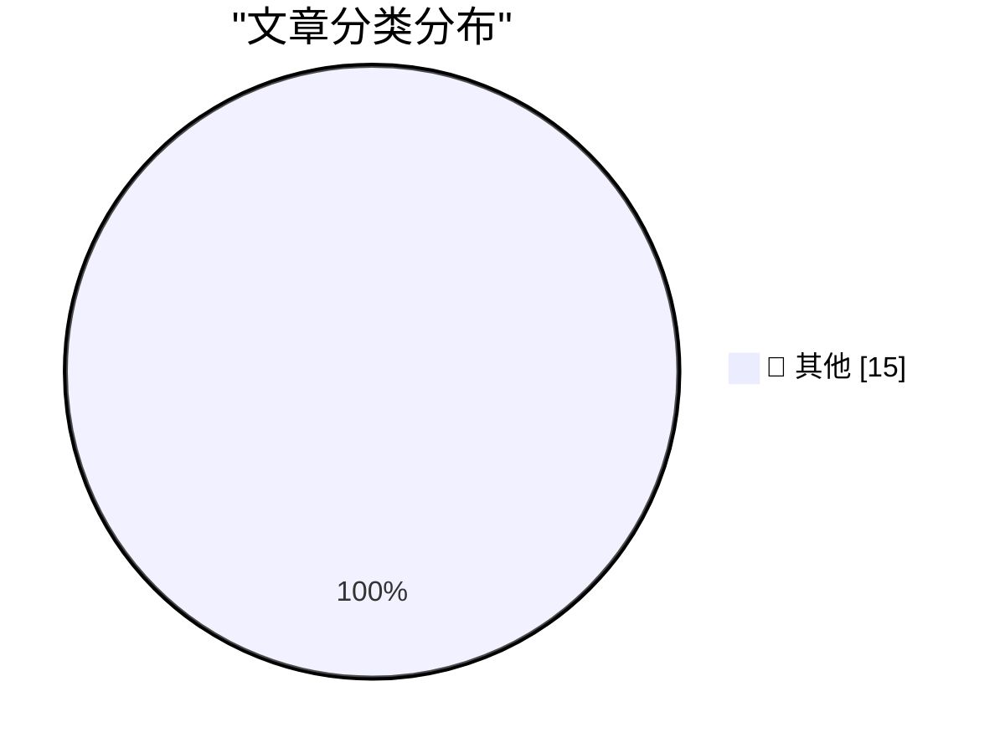

# 📰 AI 博客每日精选 — 2026-08-24

> 来自 Karpathy 推荐的 92 个顶级技术博客，AI 精选 Top 15

## 🏆 今日必读

🥇 **Anthropic’s best AI model struggles to attract users as cheaper tools thrive**

[Anthropic’s best AI model struggles to attract users as cheaper tools thrive](https://simonwillison.net/2026/Aug/23/anthropics-best-ai-model-struggles-to-attract-users-as-cheaper-t/) — simonwillison.net · 14 小时前 · 📝 其他

> Anthropic’s best AI model struggles to attract users as cheaper tools thrive

🥈 **Quoting Drew Breunig**

[Quoting Drew Breunig](https://simonwillison.net/2026/Aug/23/drew-breunig/) — simonwillison.net · 14 小时前 · 📝 其他

> Quoting Drew Breunig

🥉 **Quoting Linus Torvalds**

[Quoting Linus Torvalds](https://simonwillison.net/2026/Aug/22/linus-torvalds/) — simonwillison.net · 1 天前 · 📝 其他

> Quoting Linus Torvalds

---

## 📊 数据概览

| 扫描源 | 抓取文章 | 时间范围 | 精选 |
|:---:|:---:|:---:|:---:|
| 83/92 | 2525 篇 → 23 篇 | 48h | **15 篇** |

### 分类分布

```mermaid
pie showData
    title "文章分类分布"
    "📝 其他" : 15
```

---

## 📝 其他

### 1. Anthropic’s best AI model struggles to attract users as cheaper tools thrive

[Anthropic’s best AI model struggles to attract users as cheaper tools thrive](https://simonwillison.net/2026/Aug/23/anthropics-best-ai-model-struggles-to-attract-users-as-cheaper-t/) — **simonwillison.net** · 14 小时前 · ⭐ 15/30

> Anthropic’s best AI model struggles to attract users as cheaper tools thrive

---

### 2. Quoting Drew Breunig

[Quoting Drew Breunig](https://simonwillison.net/2026/Aug/23/drew-breunig/) — **simonwillison.net** · 14 小时前 · ⭐ 15/30

> Quoting Drew Breunig

---

### 3. Quoting Linus Torvalds

[Quoting Linus Torvalds](https://simonwillison.net/2026/Aug/22/linus-torvalds/) — **simonwillison.net** · 1 天前 · ⭐ 15/30

> Quoting Linus Torvalds

---

### 4. llm 0.33

[llm 0.33](https://simonwillison.net/2026/Aug/22/llm/) — **simonwillison.net** · 1 天前 · ⭐ 15/30

> llm 0.33

---

### 5. More than just code review

[More than just code review](https://simonwillison.net/2026/Aug/22/more-than-just-code-review/) — **simonwillison.net** · 1 天前 · ⭐ 15/30

> More than just code review

---

### 6. Cooper Sharp Proves That American Cheese Can Be Great Cheese

[Cooper Sharp Proves That American Cheese Can Be Great Cheese](https://sixcolors.com/member/2026/08/this-week-in-apple-lets-fight/) — **daringfireball.net** · 16 小时前 · ⭐ 15/30

> Cooper Sharp Proves That American Cheese Can Be Great Cheese

---

### 7. Mark Carney on the U.S. Under Trump: ‘Sometimes, Its Signature Is Written in Pencil’

[Mark Carney on the U.S. Under Trump: ‘Sometimes, Its Signature Is Written in Pencil’](https://www.nytimes.com/2026/08/22/world/canada/carney-tariffs-trade-trump.html?unlocked_article_code=1.7VA.r3Ue.GTc_tOhX0qSn) — **daringfireball.net** · 1 天前 · ⭐ 15/30

> Mark Carney on the U.S. Under Trump: ‘Sometimes, Its Signature Is Written in Pencil’

---

### 8. WorkOS: Agents Can Now Sign Up for Your App

[WorkOS: Agents Can Now Sign Up for Your App](https://workos.com/auth-md?utm_source=daringfireball&amp;utm_medium=newsletter&amp;utm_campaign=q32026) — **daringfireball.net** · 1 天前 · ⭐ 15/30

> WorkOS: Agents Can Now Sign Up for Your App

---

### 9. Dutch Regulator Fines Uber $1 Billion for Suspending Dishonest Drivers

[Dutch Regulator Fines Uber $1 Billion for Suspending Dishonest Drivers](https://www.reuters.com/world/dutch-regulator-fines-uber-966-million-automating-driver-suspensions-document-2026-08-21/) — **daringfireball.net** · 1 天前 · ⭐ 15/30

> Dutch Regulator Fines Uber $1 Billion for Suspending Dishonest Drivers

---

### 10. Death to px, long live ch!

[Death to px, long live ch!](https://shkspr.mobi/blog/2026/08/death-to-px-long-live-ch/) — **shkspr.mobi** · 22 小时前 · ⭐ 15/30

> Death to px, long live ch!

---

### 11. Anger, Anxiety and Agency

[Anger, Anxiety and Agency](https://lucumr.pocoo.org/2026/8/24/anger-anxiety-agency/) — **lucumr.pocoo.org** · 10 小时前 · ⭐ 15/30

> Anger, Anxiety and Agency

---

### 12. What exactly is modified about a modified Bessel function?

[What exactly is modified about a modified Bessel function?](https://www.johndcook.com/blog/2026/08/23/modified-bessel-function/) — **johndcook.com** · 15 小时前 · ⭐ 15/30

> What exactly is modified about a modified Bessel function?

---

### 13. Why special function terminology is arcane

[Why special function terminology is arcane](https://www.johndcook.com/blog/2026/08/23/arcane-terminology/) — **johndcook.com** · 16 小时前 · ⭐ 15/30

> Why special function terminology is arcane

---

### 14. The difference orbit inclination makes

[The difference orbit inclination makes](https://www.johndcook.com/blog/2026/08/22/inclination/) — **johndcook.com** · 1 天前 · ⭐ 15/30

> The difference orbit inclination makes

---

### 15. Coming soon

[Coming soon](https://www.johndcook.com/blog/2026/08/22/coming-soon/) — **johndcook.com** · 1 天前 · ⭐ 15/30

> Coming soon

---

*生成于 2026-08-24 10:25 | 扫描 83 源 → 获取 2525 篇 → 精选 15 篇*
*基于 [Hacker News Popularity Contest 2025](https://refactoringenglish.com/tools/hn-popularity/) RSS 源列表，由 [Andrej Karpathy](https://x.com/karpathy) 推荐*
*由「懂点儿AI」制作，欢迎关注同名微信公众号获取更多 AI 实用技巧 💡*
